# Comfyui

### 关于提示词

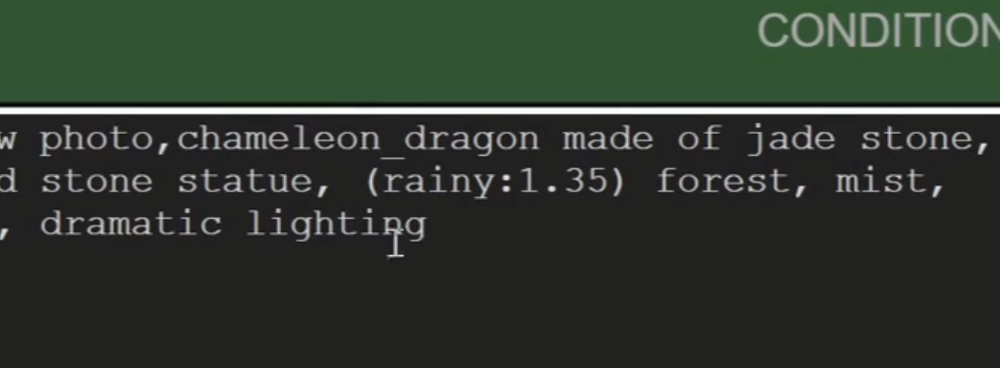

* (rainy：1.35)  这样可以控制图片中的权重
* aaaa_bbbb   这样描述它可以理解这是一个关联的词汇

### 合并提示词

* 两个提示词

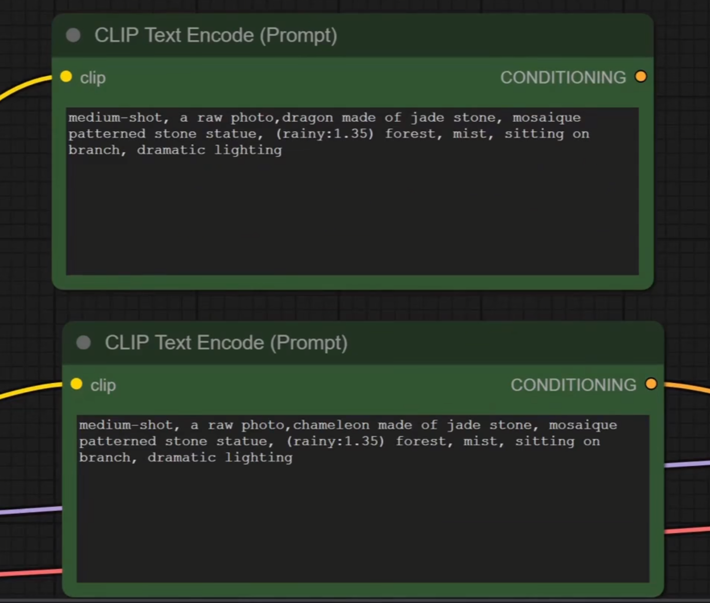

* 不同结合方式

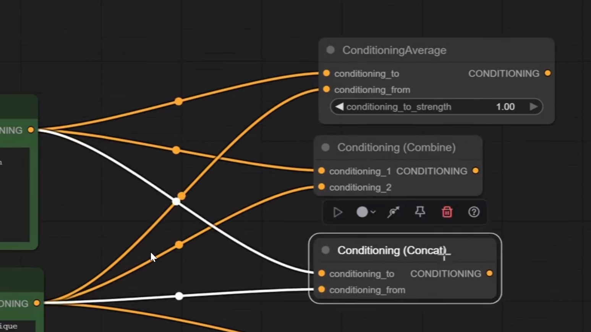

* 结果

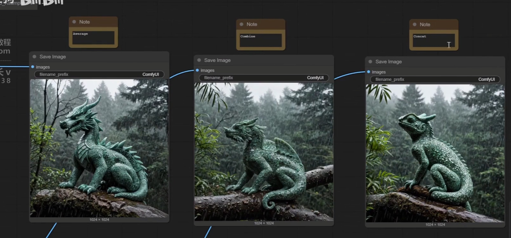

### 流程

* 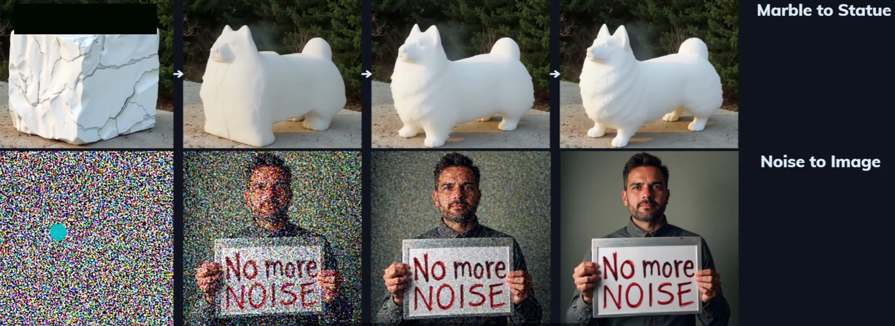

* 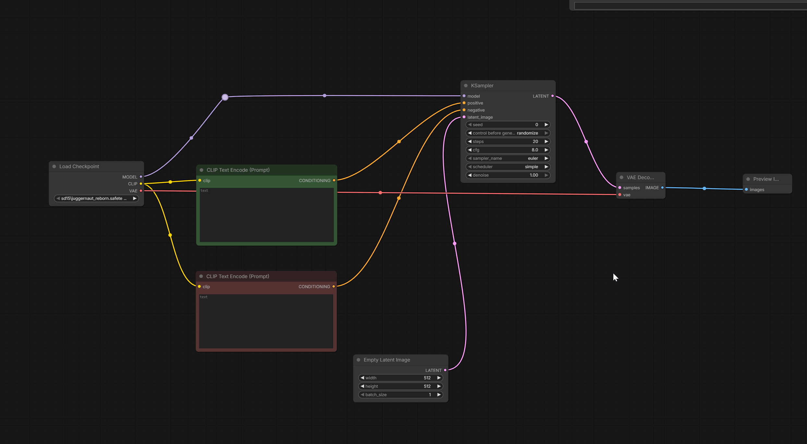

* control  before  generate 

* 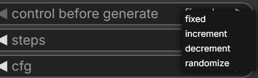 

* * fixed  人为修改了他才变
* * increment 递增
* * decrement 递减
* * randomize 随机
* * 生成的时候你可以让他random 但是结束之后应该改为fixed防止乱变

### 放大图片

* 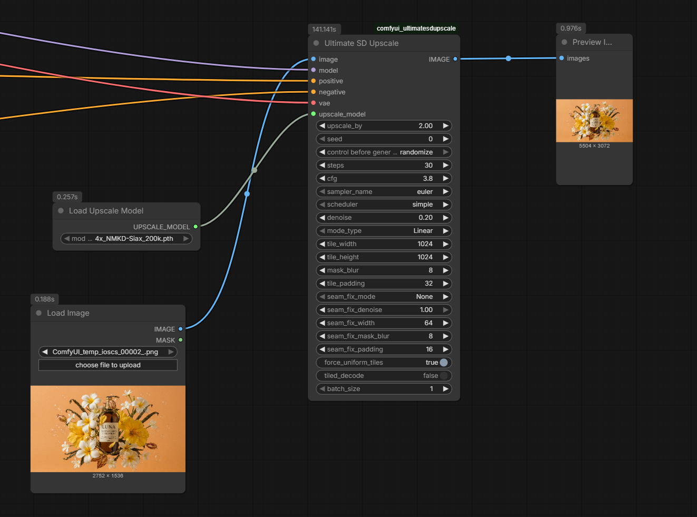 

* 需要的一些下载

* 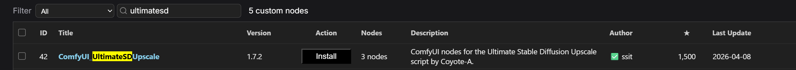 

* 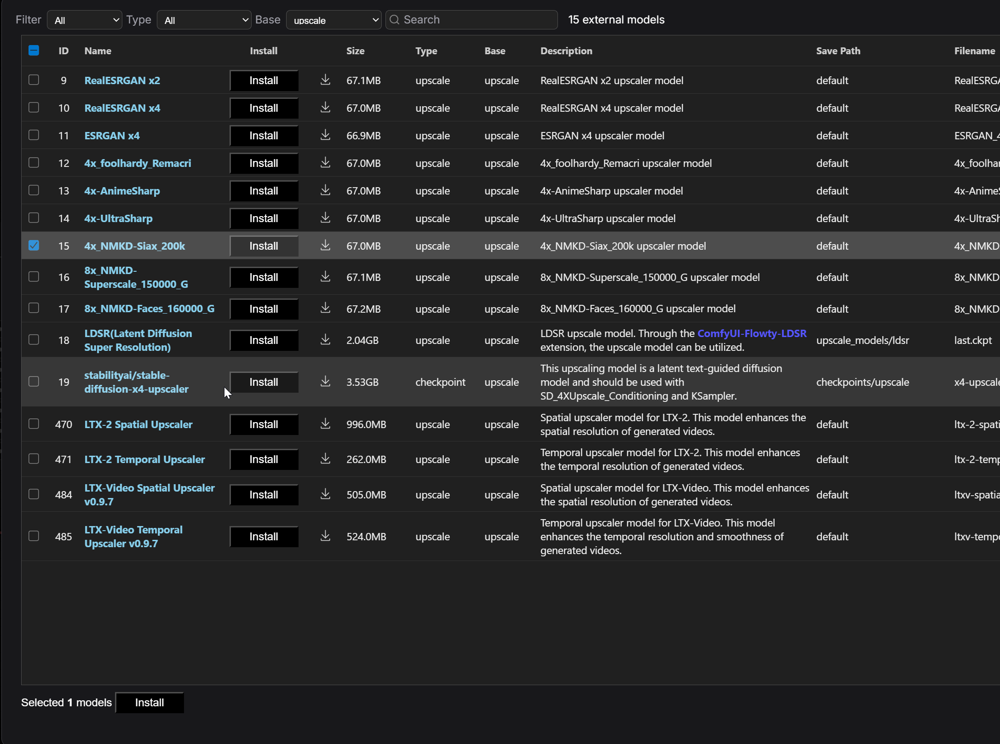 

* 介绍

* 默认的计算原理是，一块一块的计算

* 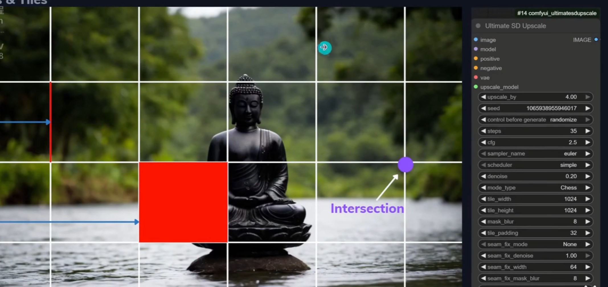 

* denoise -越大 -机器创造更强 —— 越小 - 越贴近原图

* 直接放大我们会发现，图片接缝是没处理好的

*  

* 修改了下数值 step 30 - 35   mode type linear - chess

* 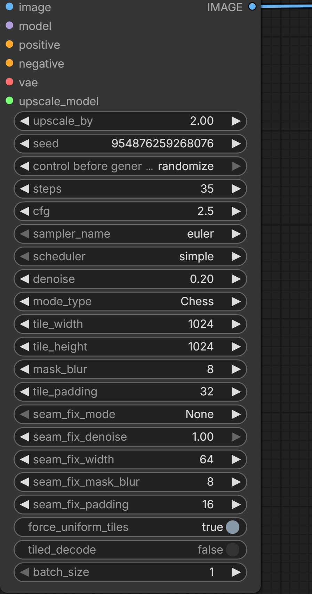 

*  

* 一般情况下就可以， 要是还是不行我们就得修改 fix mode 方式了

* 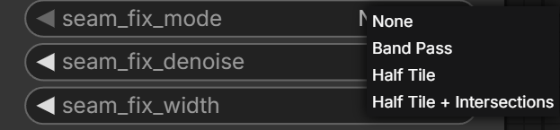 

### ControlNet

* 流程

* 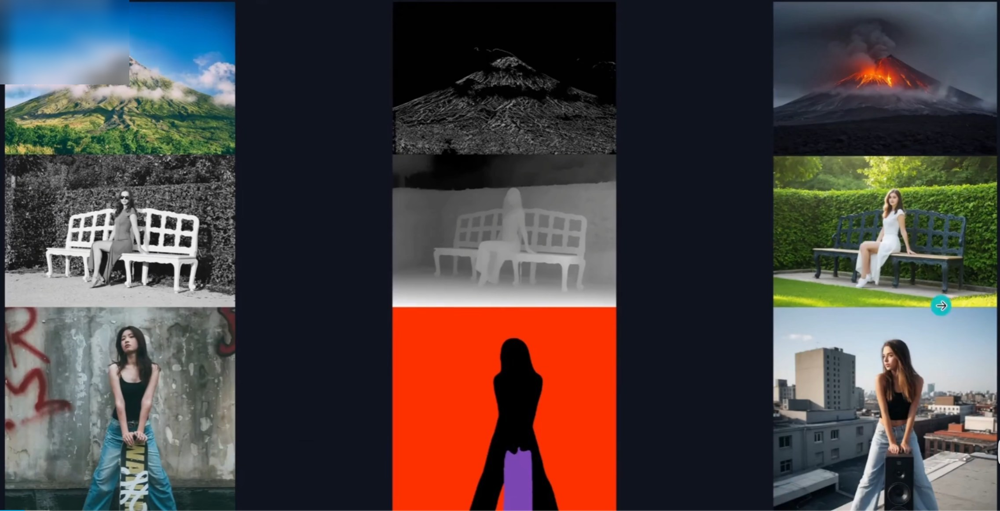 

* 测试流程

* 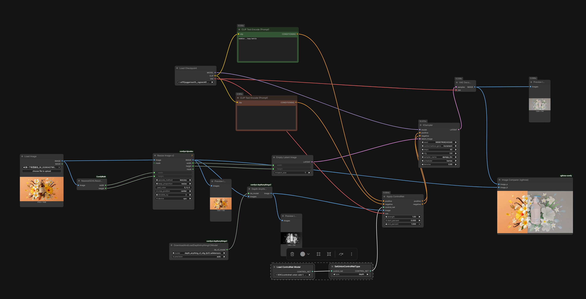 

* 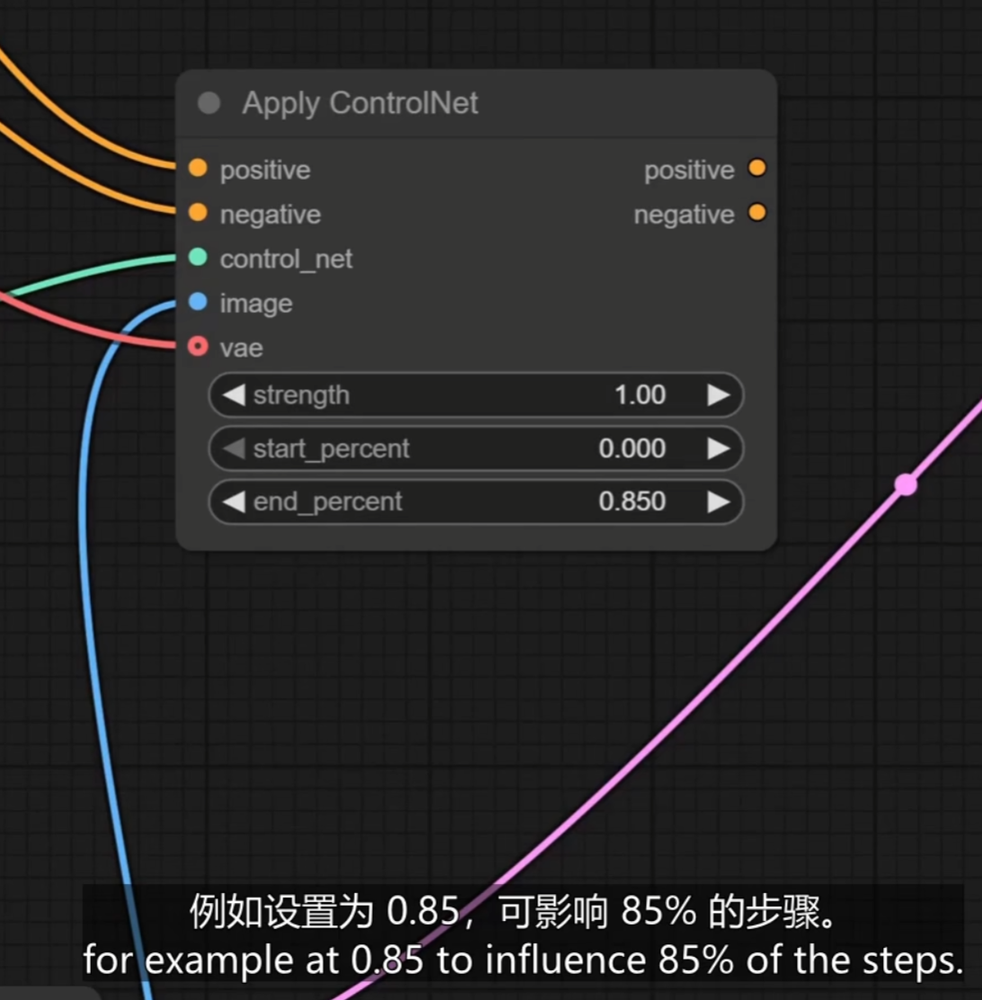 

* 对应的null节点

*  

* cfg什么意思

* 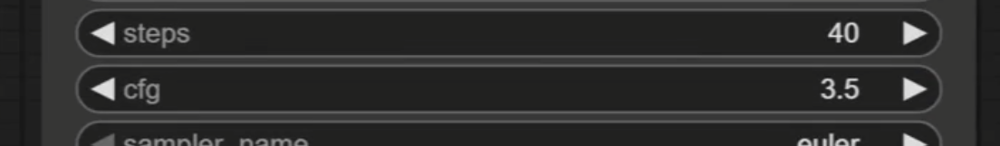 

* 🎛️ CFG 数值高低有什么区别？
    * 数值偏低（比如1 - 4）：AI比较“放飞自我”

        * 它不太严格遵守你的提示词，可能会忽略掉你写的一些细节。

        * 优点：画面通常看起来更柔和、更自然、更具艺术感。

        * 缺点：可能会跑题，画出你不想要的东西。

    * 数值平均值 (比如 5 - 8)：黄金平衡点

        * 这是传统稳定扩散模型最常用的区间（默认通常为7.0）。

        * AI既能很好地听懂你的指令，又很容易崩溃。

    * 数值偏高 (比如 9 - 15+)：AI 极大“死板听话”

        * AI会拼命地把你提示词里的每个字都画出来。

        * 缺失（极易翻车）：当CFG太高时，画面非常容易“烤焦”——色彩变得过度饱和、达到极高、边缘锐化刺眼，甚至出现大量的染色噪点和画面崩坏。

* 局部控制

*  

* 下载这张图可以获得工作流程
    * 核心是 通过contol net获取照片的depth和人物骨骼

    * 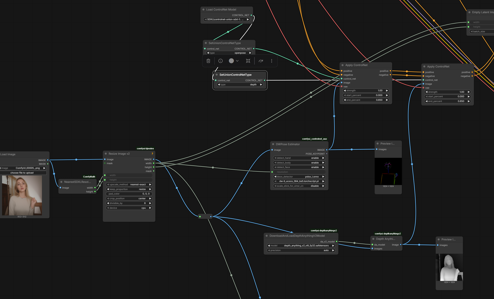 

    * facedeailer 配合模型控制局部

    * 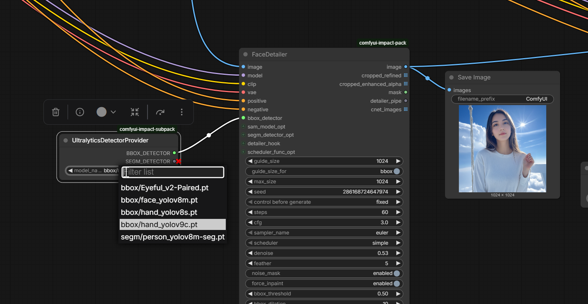 

* 在houdini中出obj 导入comfyui 编辑
    * 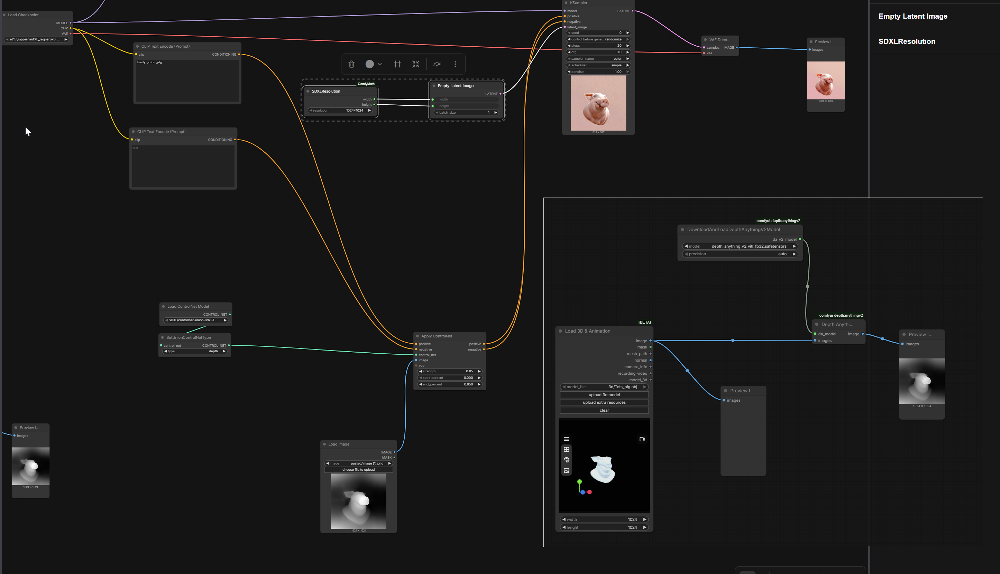 
     