# 《经济机器是怎样运行的》核心知识点全景梳理
> **主讲人**：瑞·达利欧（Ray Dalio，桥水对冲基金创始人）  
> **原片链接**：[YouTube - How The Economic Machine Works](https://www.youtube.com/watch?v=rFV7wdEX-Mo)  
> **适用目标**：建立宏观经济、货币信用、利率流动性以及股票投资底层逻辑认知。

---

## 目录
1. [核心模型：驱动经济的三大动力](#一核心模型驱动经济的三大动力)
2. [微观基石：交易驱动整个经济](#二微观基石交易驱动整个经济)
3. [周期的发动机：信贷（Credit）的双刃剑](#三周期的发动机信贷credit的双刃剑)
4. [短期债务周期（5～8年）：央行调控的主战场](#四短期债务周期58年央行调控的主战场)
5. [长期债务周期与去杠杆（75～100年）](#五长期债务周期与去杠杆75100年)
6. [达利欧的三条经验法则（投资与财富底线）](#六达利欧的三条经验法则投资与财富底线)
7. [股票投资者的实战落地启示](#七股票投资者的实战落地启示)

---
## 一、核心模型：驱动经济的三大动力

达利欧将看似高深莫测的宏观经济，抽象为一个由无数齿轮组成的精密机械系统。经济并不是由随机事件构成的，而是由**三股主要力量**共同驱动：

```text
┌─────────────────────────────────────────────────────────┐
│                     经济运行总轨迹                      │
└────────────────────────────┬────────────────────────────┘
                             │
        ┌────────────────────┼────────────────────┐
        ▼                    ▼                    ▼
┌────────────────┐   ┌────────────────┐   ┌────────────────┐
│ 1. 生产率提升  │   │ 2. 短期债务周期│   │ 3. 长期债务周期│
│  长期持续向上  │   │   5 ~ 8 年     │   │  75 ~ 100 年   │
│  斜率稳定平缓  │   │  央行利率调节  │   │ 债务见顶去杠杆 │
└────────────────┘   └────────────────┘   └────────────────┘
```

1. **生产率的提高（Productivity Growth）**：人类创新、劳动和积累的过程，长期看是缓慢且稳定向上的基线。
2. **短期债务周期（Short-Term Debt Cycle）**：通常持续 5～8 年，主要由央行的**加息/降息**调控推动。
3. **长期债务周期（Long-Term Debt Cycle）**：通常持续 75～100 年，由短期周期的长期债务积累演化而来，直到利率降至 0% 且债务不可持续，进入大出清阶段。
- 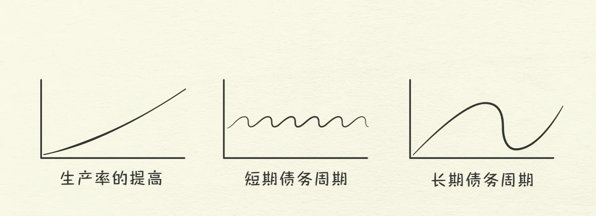
---

## 二、微观基石：交易驱动整个经济

整个庞大的经济体，本质上不过是**无数笔交易的集合**。

### 1. 交易核心公式
$$\text{支出总额 (Total Spending)} = \text{货币 (Money)} + \text{信贷 (Credit)}$$

* 支出总额除以产出总量，就决定了**价格（Price）**。
- 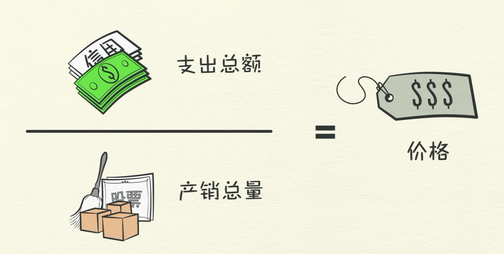

* **一个人的支出，是另一个人的收入**：
  * 如果你花得更多，另一个人的收入就会增加；
  * 另一个人的收入增加，他在银行眼中的信用度就变高，就能借到更多钱；
  * 他借了更多钱，就能花更多钱，从而推动整个社会的经济齿轮旋转。

---

## 三、周期的发动机：信贷（Credit）的双刃剑
- 买卖方 = 借贷方 
- 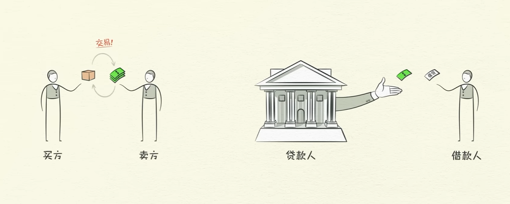

- 借贷利率直接影响借款人的多少 （中央银行可以直接调控利率和货币发行后续会提到）
- 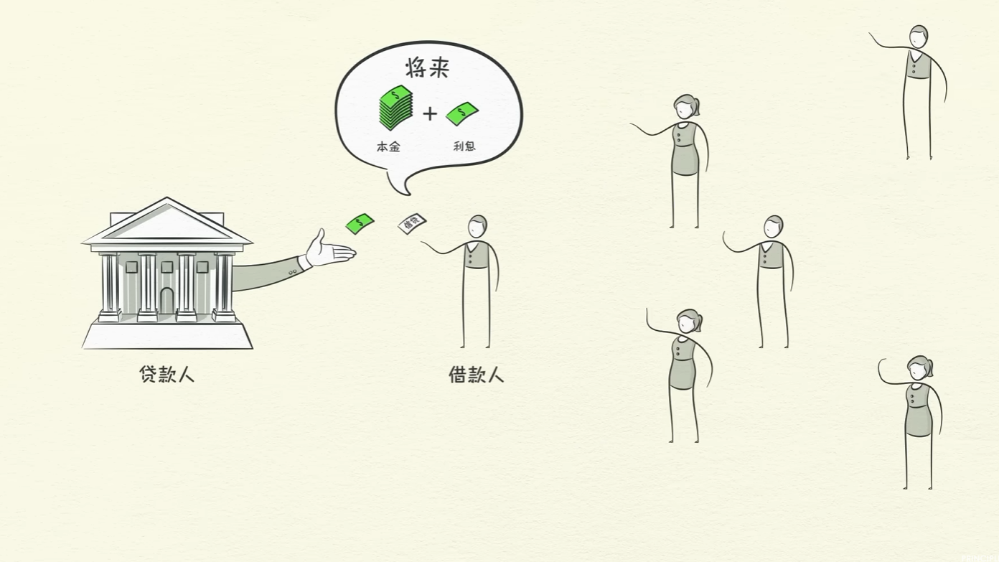

- 如果借款人保证偿还，而且贷款人相信这个承诺 那么信贷就产生了
- 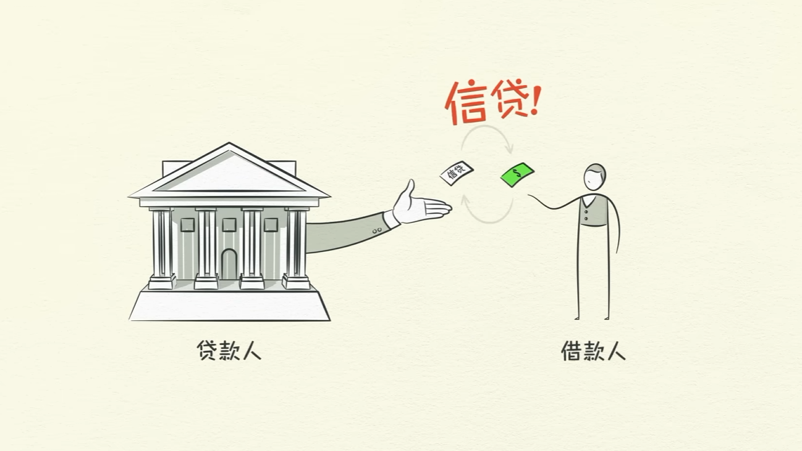

- 信贷一旦产生就出现债务
- 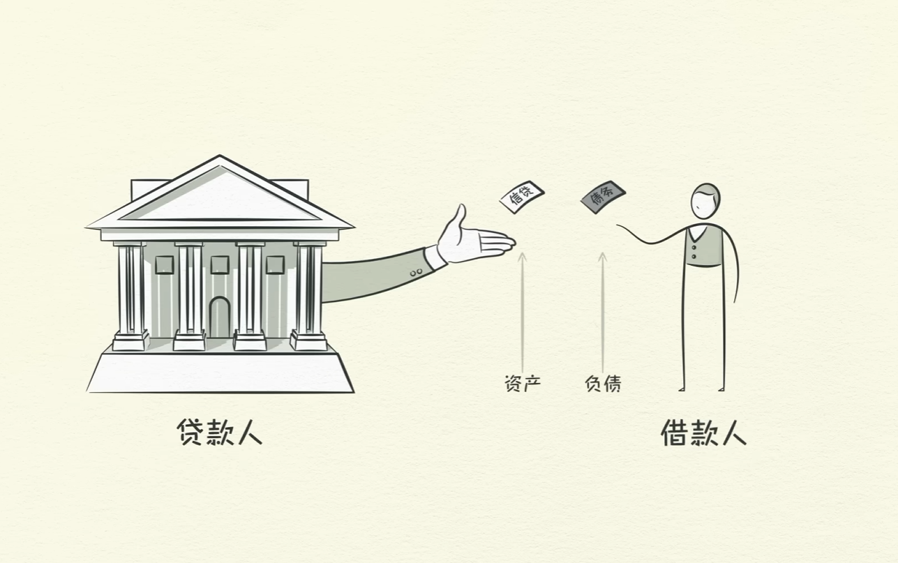


信贷是经济中最重要、最易波动、也最容易被误解的部分。

* **为什么会存在周期？**
  * 如果世界**没有信贷**：唯一的增长方式是提高生产率（多干活、多生产）。那么经济增长线就是一条平稳向上的直线，不存在大繁荣和大萧条。
  * **但有了信贷，就必然产生周期**：
    * **借钱本质上是向“未来的自己”借钱**。
    * **借钱消费时**：你当前的支出 > 你的收入 $\rightarrow$ 经济繁荣、需求旺盛；
    * **未来还钱时**：你的支出必须 < 你的收入 $\rightarrow$ 紧缩、需求低迷。
* **良性信贷 vs 恶性信贷**：
  * **良性信贷**：借钱买入能产生现金流、提高生产率的资产（例如农民贷款买拖拉机，增产粮食偿还本息还有盈余）。
  * **恶性信贷**：过度借钱购买不产生生产力回报的消费品或资产泡沫（例如借高利贷买大电视、炒高价泡沫房）。

- 良好的借贷人 具备两个条件
- 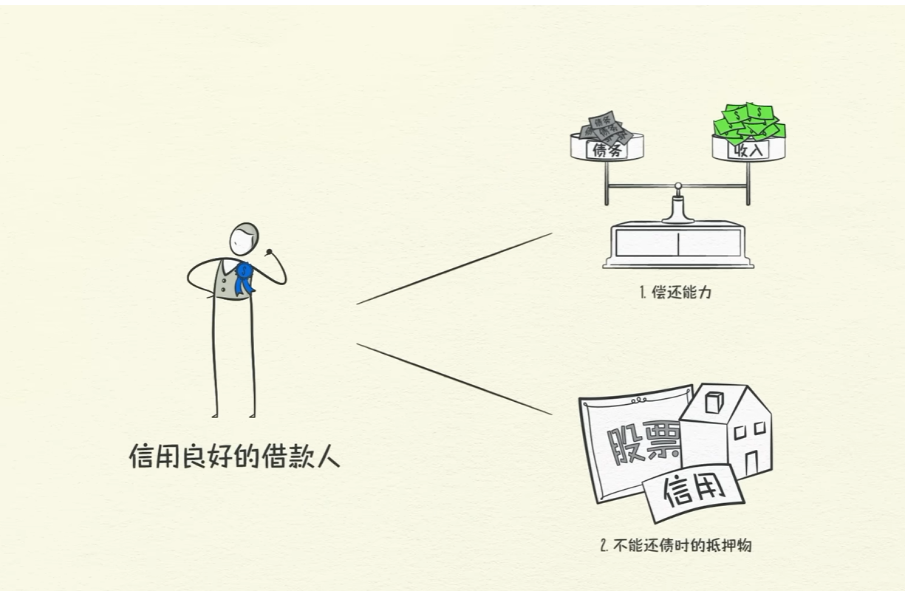
- 良性信贷 
- 收入增加 - 借贷增加 - 增加支出 （你的支出等于人家的收入）-收入增加 。自我循环 - 经济向上
- 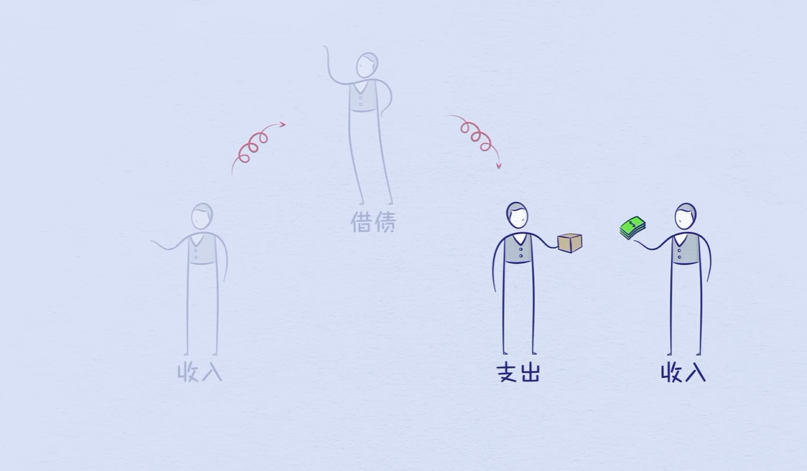
- 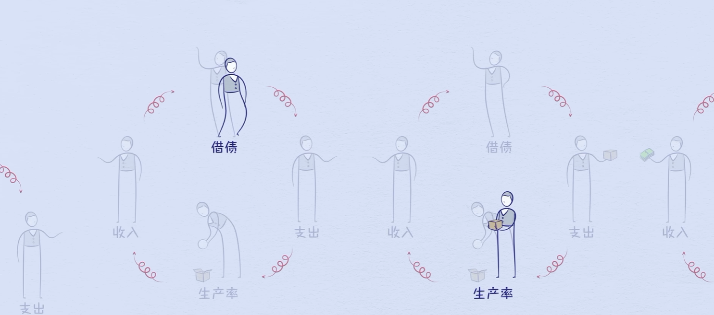
- 生产率在长期内最关键 （长期来看他是稳步向上的）  
- 信贷在短期内最重要 （债务会影响消费。借的时候 超出产出，还的时候 低于产出了）
- 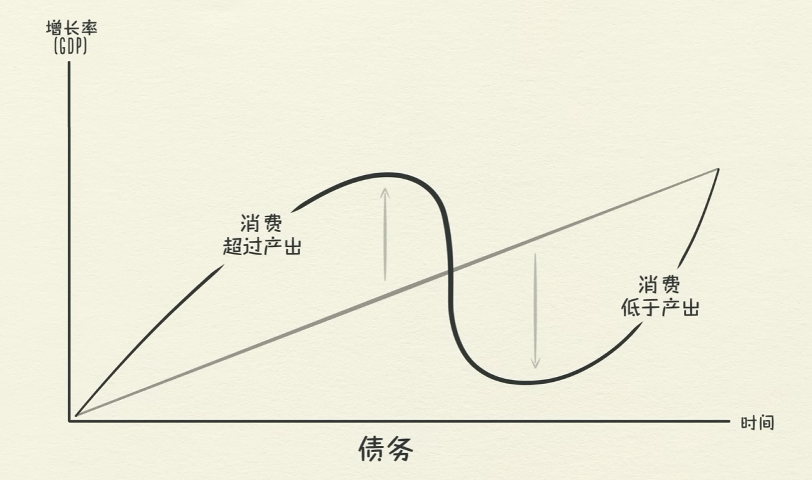
- 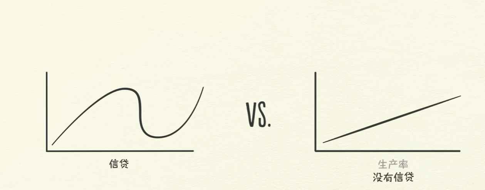

- 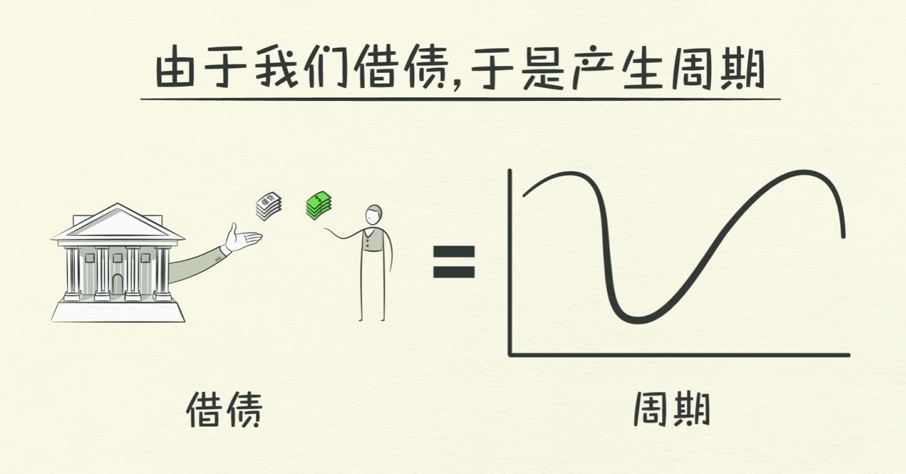
* 人的天性就会导致借债周期的产生 
- 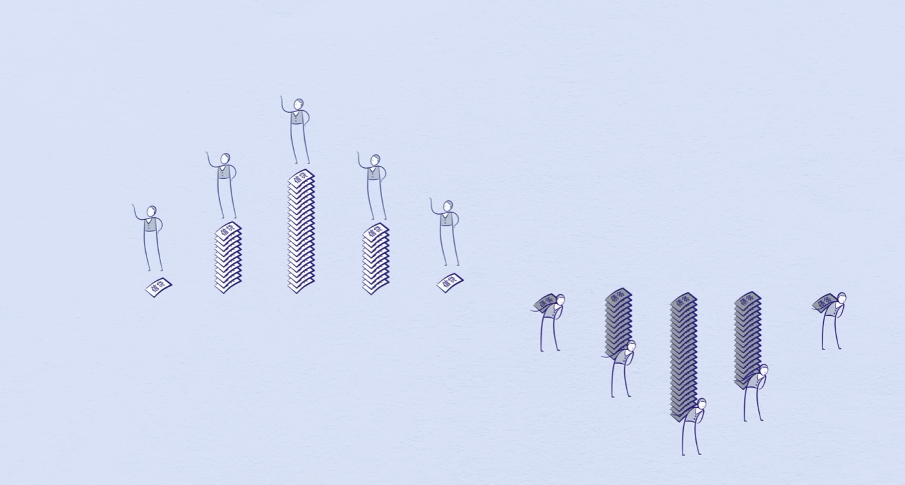

* 你去酒吧用信用买啤酒 - 你活得了啤酒的同时背上了负债，酒店老板获得了资产（赊账）-就这人为产生了信贷 - 当你后面偿还了，这个负债和资产才会解除。交易才会完成。
- 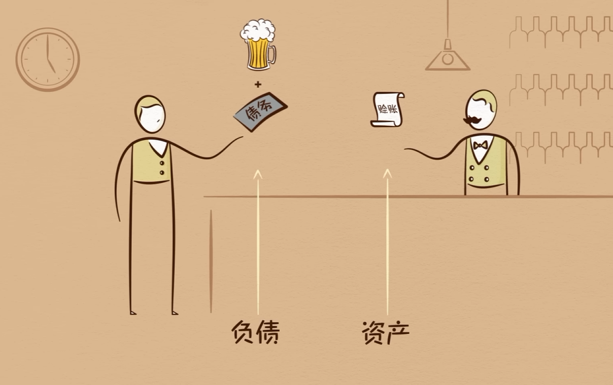

- 现实生活中大部分的钱其实是信贷 
- 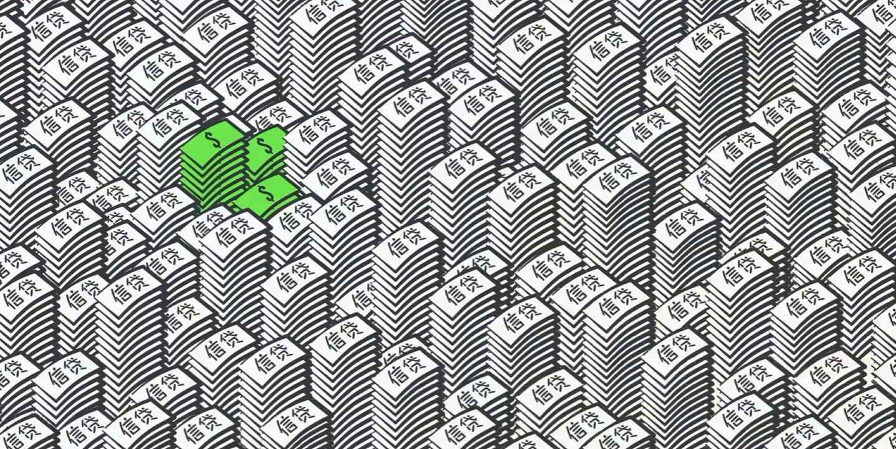

- 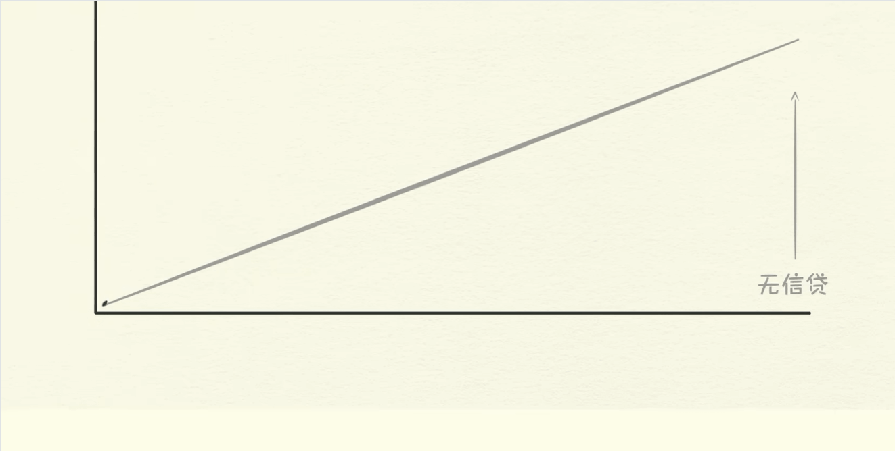

---

## 四、短期债务周期（5～8年）：央行调控的主战场

普通股民和投资者在日常投资中经常经历的即为短期债务周期：

### 1. 阶段演化路径
1. **繁荣与扩张期（信贷易得）**：
   * 信贷成本低、获取容易 $\rightarrow$ 支出增加 $\rightarrow$ 需求大于供给 $\rightarrow$ 物价和资产价格上涨（**通货膨胀**）。
2. **紧缩与降温期（央行加息）**：
   * 央行看到通胀走高，开始**提高利率（加息）**；
   * 借贷成本上升，老百姓和企业减少借款，转而存钱、还贷；
   * 支出减少 $\rightarrow$ 别人的收入下降 $\rightarrow$ 资产价格下跌、消费疲软（**通货紧缩与衰退**）。
3. **触底反弹期（央行降息）**：
   * 经济陷入衰退，央行降息释放流动性，借贷成本降低，重新激活经济，进入下一个循环。

* 收入和信贷的增加超出商品，那么商品就会涨价
- 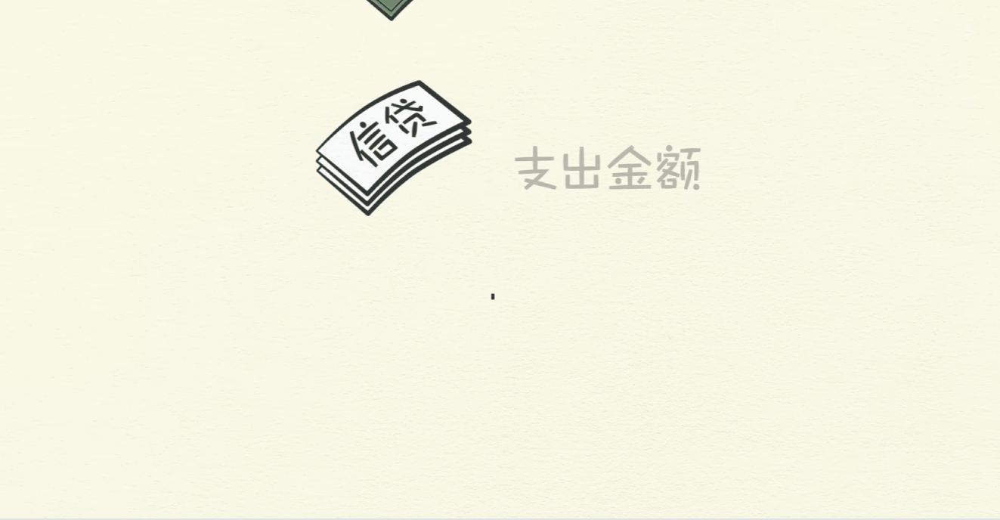

* 央行不希望 通胀 就会调控利率
- 

* 这会迎来经济的衰退，后续到达一定范围后，政府又会出面刺激经济
- 

### 2. 为什么会叠加上行？
* **人性是贪婪且追求即时满足的**：在繁荣期，大家都倾向于借更多的钱享受扩张；而在衰退期，政府和央行通常会全力救市。
* 结果是：**每一个周期的波峰和波谷，累积的总债务都高于上一个周期**，债务堆积如滚雪球。

---

## 五、长期债务周期与去杠杆（75～100年）

当经过几十年的短期周期叠加，**债务总额的增长长期大幅快于收入增长**，整个经济的债务负担将达到极限：

* **临界点到来**：
  * 偿债成本甚至超过了总收入，老百姓和企业再也没有能力借新还旧。
  * **此时央行利率已经降到了 0%**，传统货币政策彻底失效（无法再通过降息刺激借贷）。
  * 典型历史事件：1929 年美国大萧条、1990 年代日本泡沫破裂、2008 年全球次贷金融危机。

### 1. 去杠杆的四大手段对比

去杠杆必须减轻债务负担，达利欧总结了化解危机的四种方法：

| 手段 | 方式 | 性质 | 后果与痛点 |
| :--- | :--- | :--- | :--- |
| **1. 削减支出** | 政府、企业、个人紧缩节约 | **通缩性** | 导致全社会总支出骤降，收入下降得比债务削减还快，**债务负担比率反而恶化**。 |
| **2. 债务重组** | 债务违约、展期、本金减免 | **通缩性** | 大量资产蒸发，银行坏账剧增，引发恐慌、银行挤兑与经济萧条。 |
| **3. 财富再分配** | 向富人加税，补贴困难群体 | **中性/博弈** | 容易激发阶层矛盾甚至政治对立、资本外逃。 |
| **4. 央行印钞** | 发行货币，买入国债和资产 | **通胀性** | 增加货币供给与流动性，但若失控会导致恶性通胀或汇率崩溃。 |

### 2. 核心精髓：和谐的去杠杆（Beautiful Deleveraging）

* 仅仅使用前三种通缩性手段，经济会痛苦不堪甚至崩溃；仅仅使用印钞手段，又可能引发魏玛共和国或津巴布韦式的恶性通胀。
* **“和谐的去杠杆”的秘诀在于平衡**：
  * 通缩性手段与通胀性手段相互配合，保持通胀温和。
  * 最关键的经济指标公式：
    $$\text{名义经济增长率 (Growth)} > \text{名义利率 (Interest Rate)}$$
  * 只要经济增长的速度高于债务利息累积的速度，债务占收入的比重（杠杆率）就会平稳下降，实现经济软着陆。

---

## 六、达利欧的三条经验法则（投资与财富底线）

在视频结尾，达利欧给普通人和政策制定者留下了三条极具穿透力的法则：

1. **不要让债务的增长速度超过你的收入**  
   * *理由*：否则债务本息最终会把你拖垮。
2. **不要让收入的增长速度超过你的生产率**  
   * *理由*：如果不创造真实价值而拿了超额报酬，你最终一定会丧失竞争力并被市场出清。
3. **尽一切努力提高你的生产率**  
   * *理由*：无论短期周期如何大起大落，从几十年乃至百年的长期视角看，**生产率才是决定全社会生活水平和实际财富的最关键因素**。

---

## 七、股票投资者的实战落地启示

把达利欧的模型映射到股市操作中，可以提炼出三大实战思维：

| 核心实战维度 | 关键观察指标 | 周期应对策略 |
| :--- | :--- | :--- |
| **1. 宏观择时**<br>（流动性拐点） | • 央行基准利率、降准降息<br>• 社融规模与信贷扩张速度 | • **降息 / 宽信用**：处于估值扩张期，顺应流动性积极做多<br>• **加息 / 紧信用**：处于估值挤泡沫期，控制仓位、注重防守 |
| **2. 微观选股**<br>（资产负债表） | • 经营活动现金流量净额<br>• 资产负债率、短债规模 | • **坚决回避**：靠借新还旧、高杠杆伪造虚假繁荣的公司<br>• **优先挑选**：自由现金流充裕、具备深厚护城河的行业龙头 |
| **3. 周期敬畏**<br>（经济钟摆） | • 市场整体历史估值分位数<br>• 全民情绪（极度贪婪 vs 恐慌） | • **恐慌谷底**：在去杠杆出清、资产被错杀时逆向捡便宜<br>• **狂欢高点**：在全社会加杠杆炒股的狂热顶部果断控仓降杠杆 |

1. **“水多股票涨，水少股票跌”——盯紧宏观流动性**：
   * 股票市场短期是投票机（由流动性和情绪驱动），长期是称重机（由盈利和生产率驱动）。
   * 当央行处于降准降息、社会融资规模扩张时，市场往往水涨船高；当央行开始收紧银根以抑通胀时，高估值资产往往率先承压。
2. **看穿财报里的“真钱”与“假账”**：
   * 警惕那些利润账面漂亮，但经营现金流为负、应收账款高企、靠频繁发债借新还旧的公司。在信贷紧缩期，这类公司最容易发生资金链断裂暴雷。
3. **认清身处的周期位置，不做周期的牺牲品**：
   * 在人人贪婪借钱炒股、加杠杆的高峰期保持克制；在长期去杠杆或深度萧条、资产被过度抛售的底部，耐心地去寻找真正具备长期生产率壁垒的伟大公司。
