## Chop

学习地址：

[https://www.bilibili.com/video/BV1EJ4m1j77C/?vd_source=044ee2998086c02fedb124921a28c963](https://www.bilibili.com/video/BV1EJ4m1j77C/?vd_source=044ee2998086c02fedb124921a28c963)

- 1. #### class Flow
主要节点: 

 chopnet     channel   geometry

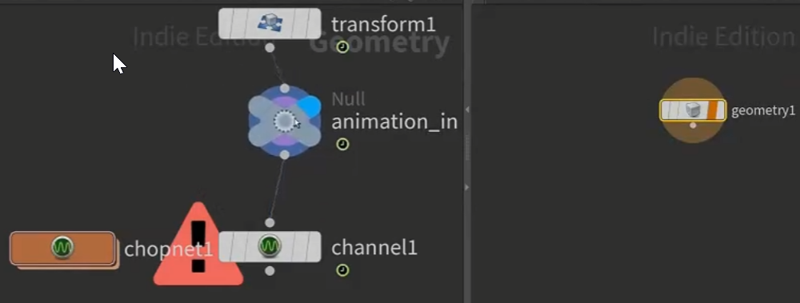

geometry ：                                                                                 

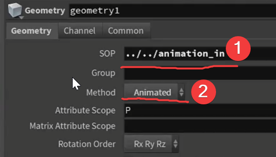

channel：

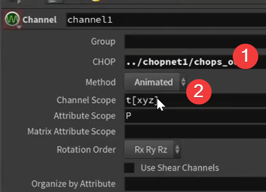

+载入   ×删除  动画曲线

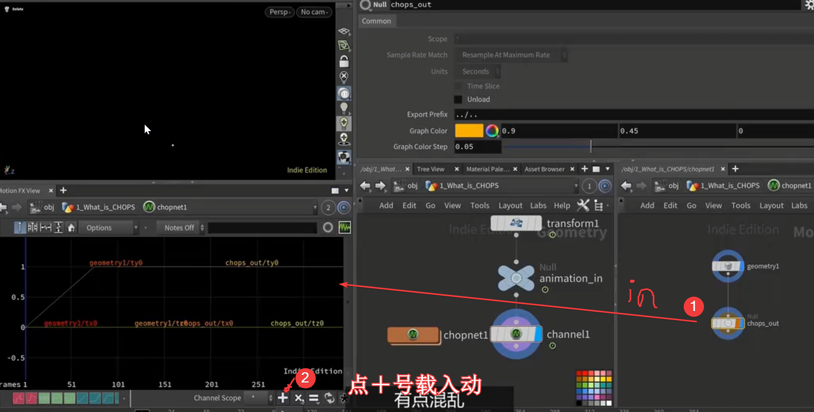

***做循环动画非常好用***

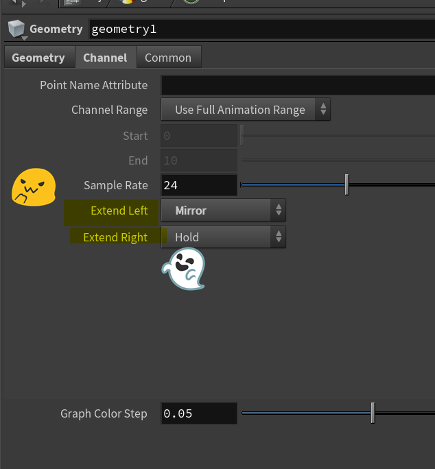

有趣的ani

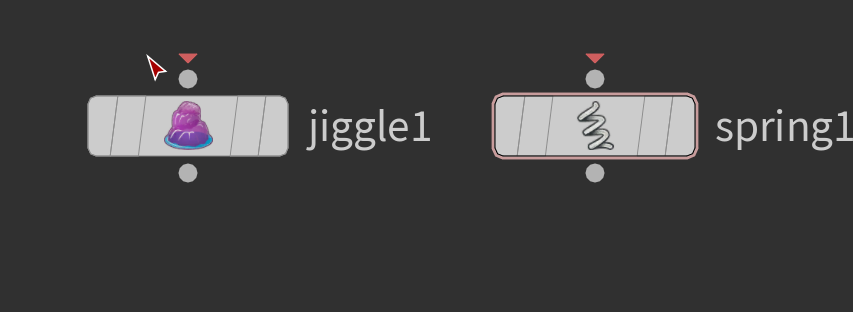

控制属性的ani
eg:设置glow

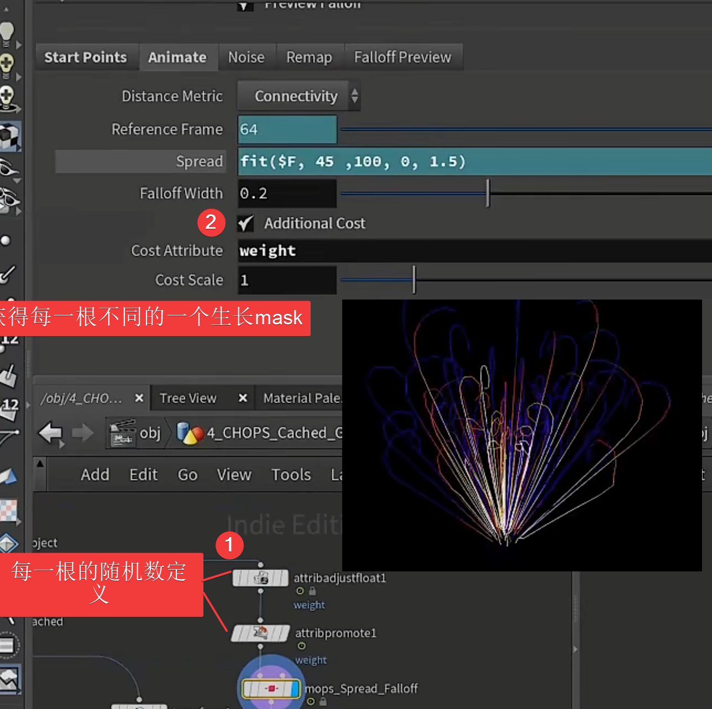
读取glow
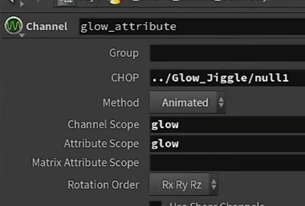

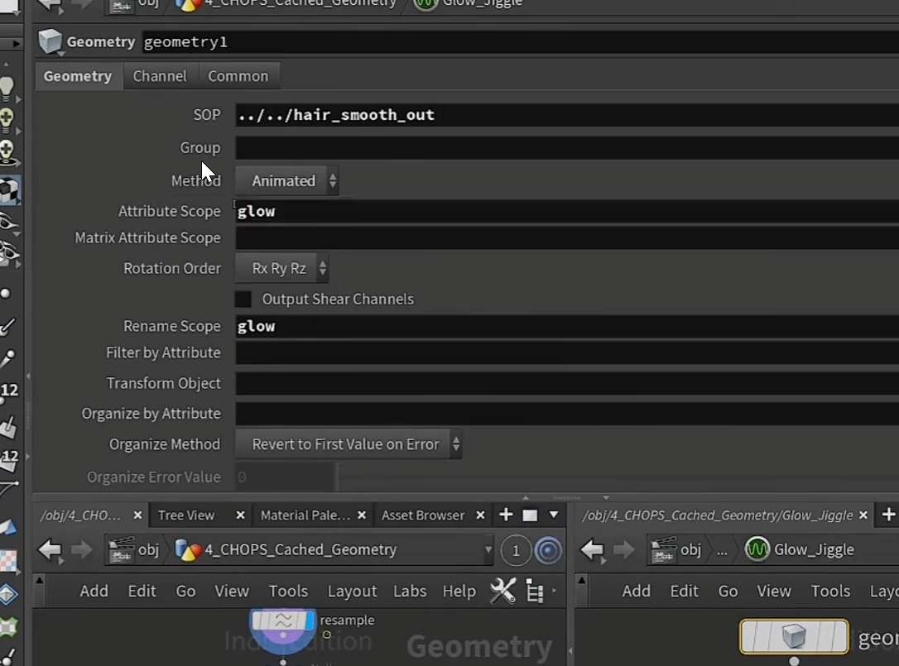

<mark>tip ：jiggle 是无法针对属性的 只能对物体</mark>

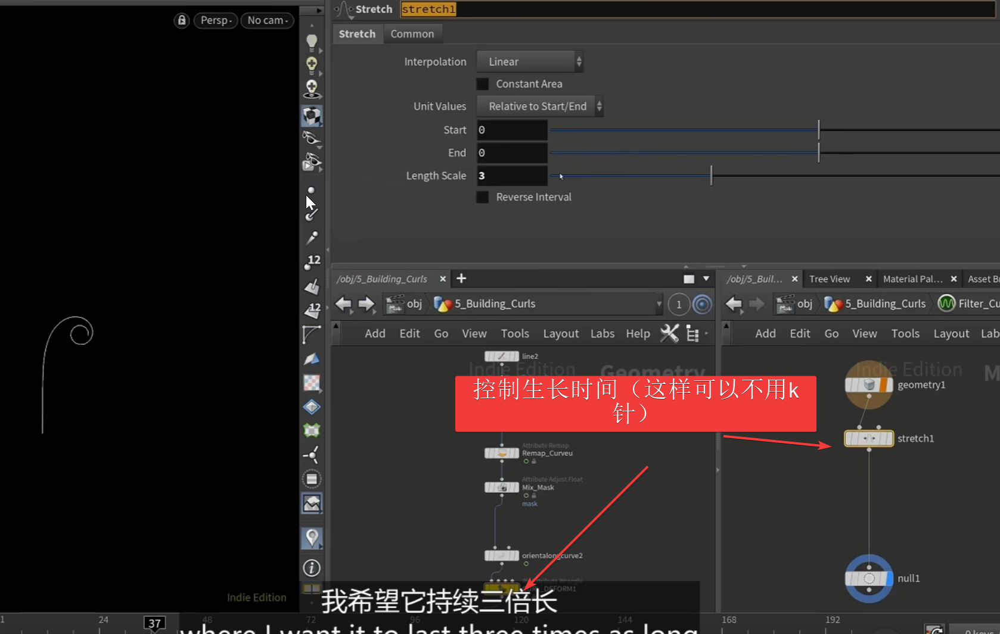
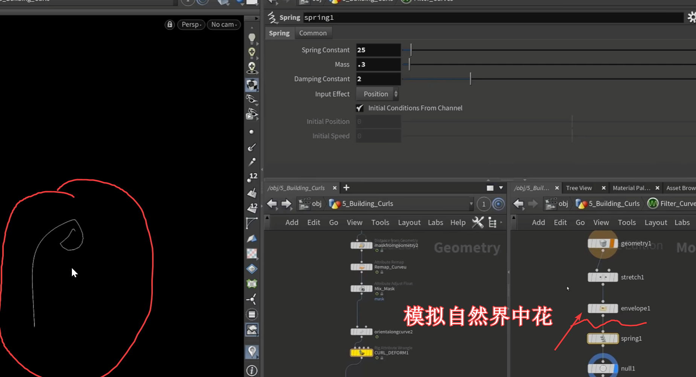
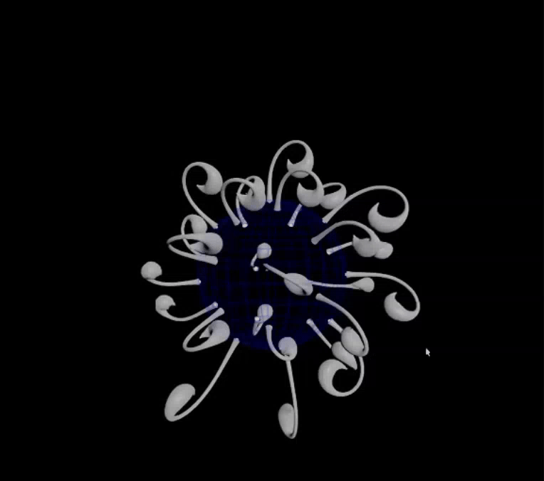

<a href="/hip_files/HS_EXPERIMENTAL MOTION_SESSION1_MASTER_01.hiplc" target="_blank" download>📦 下载MOTION_SESSION1_MASTER_01.hiplc</a>

- 2. #### Extend ani
- - 方法1：chop：
1.extractcentroid 获得物体中心(因为直接进入chop,每个点动画都会进入)

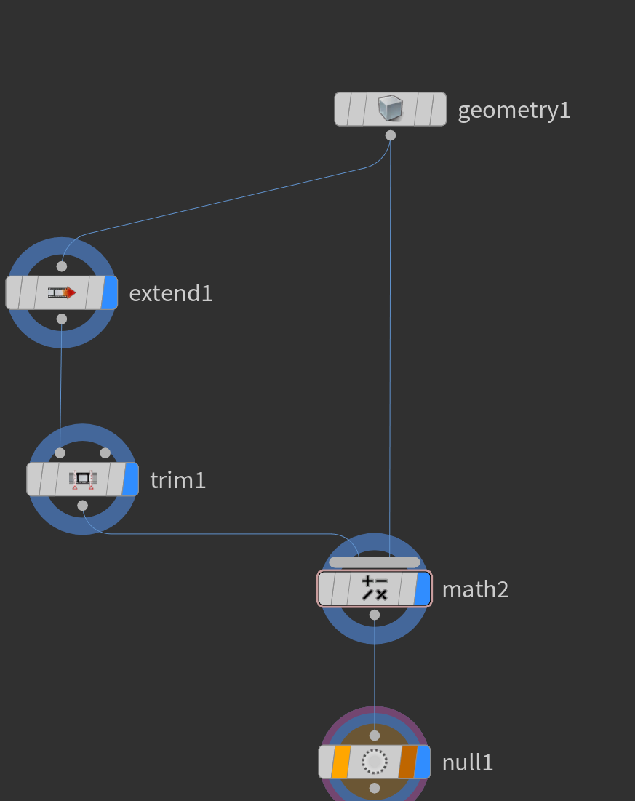
extend——slop 动画

<mark>trim：往前搓一点帧数 因为直接slop它只是曲线slop数值并没有获得</mark>

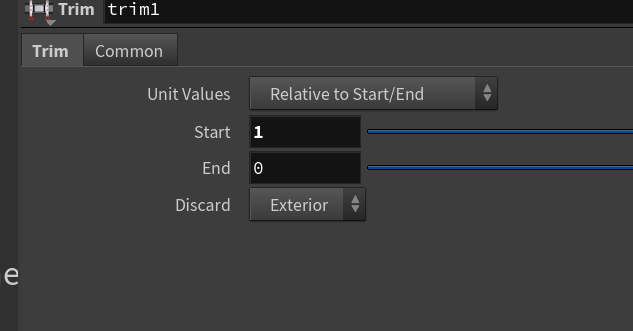

不是channels模式(他会合并输出的)

加上动画

chop("/obj/FX/chopnet1/null1/tx0")

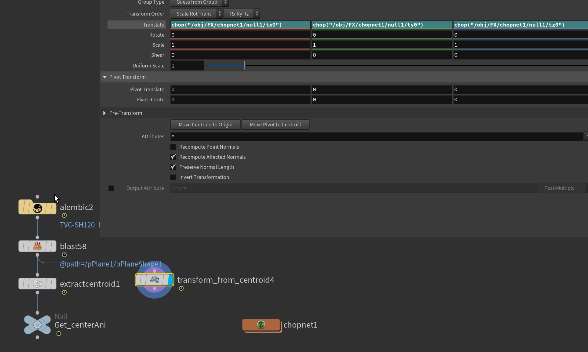

- - 方法2
abc这样输出出来是带动画数据的
他是带动画数据的 只需要在下面加个cam bake出来就可以获得

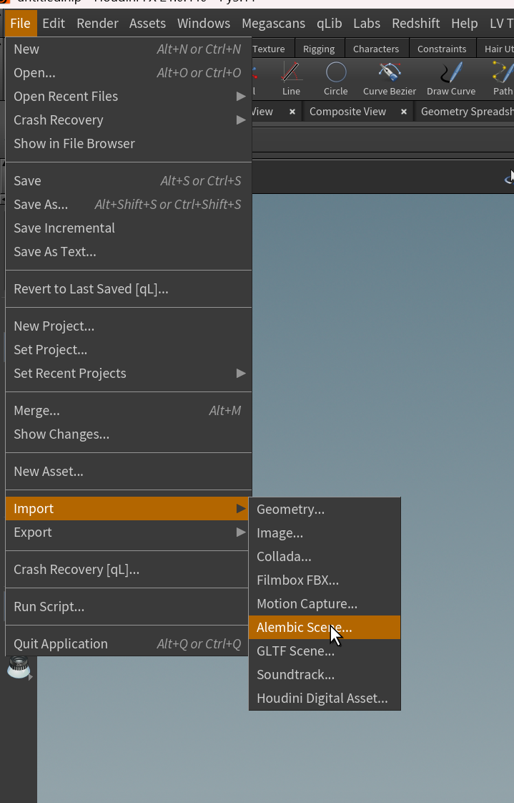
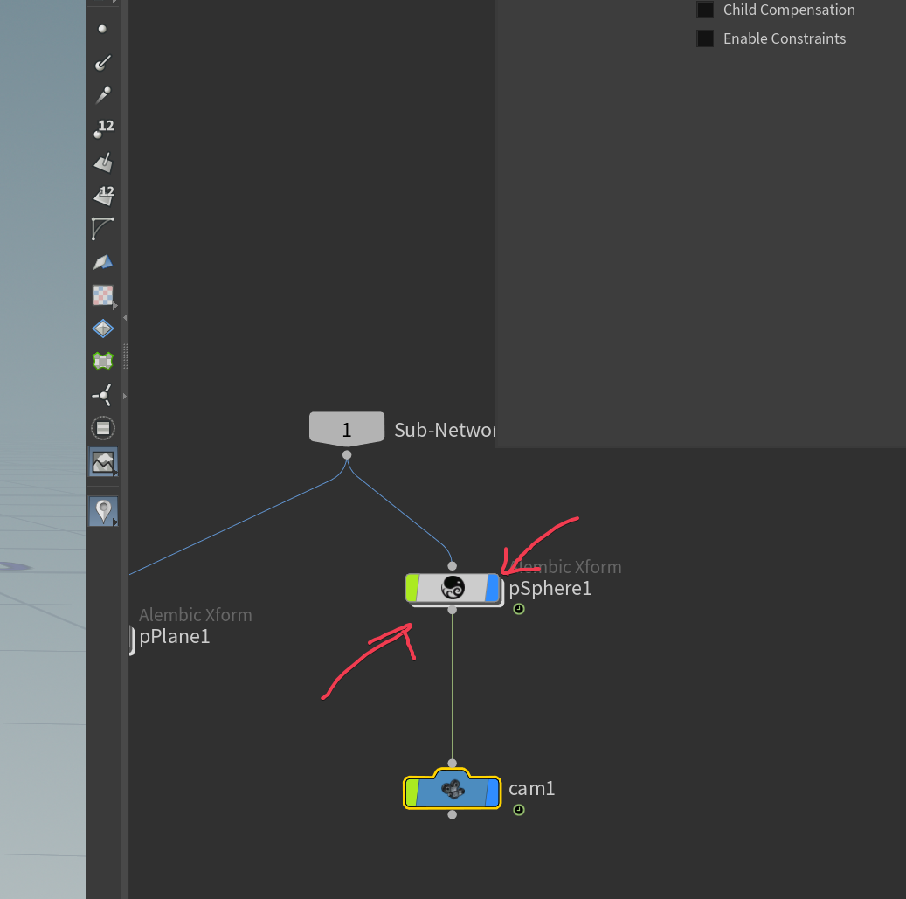
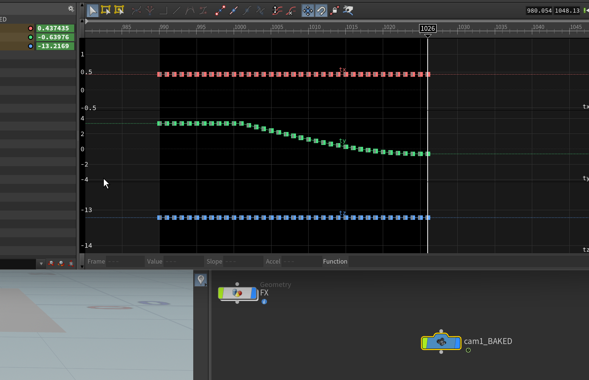

<a href="/hip_files/2026206.rar" target="_blank" download>📦 下载2026206.rar</a>