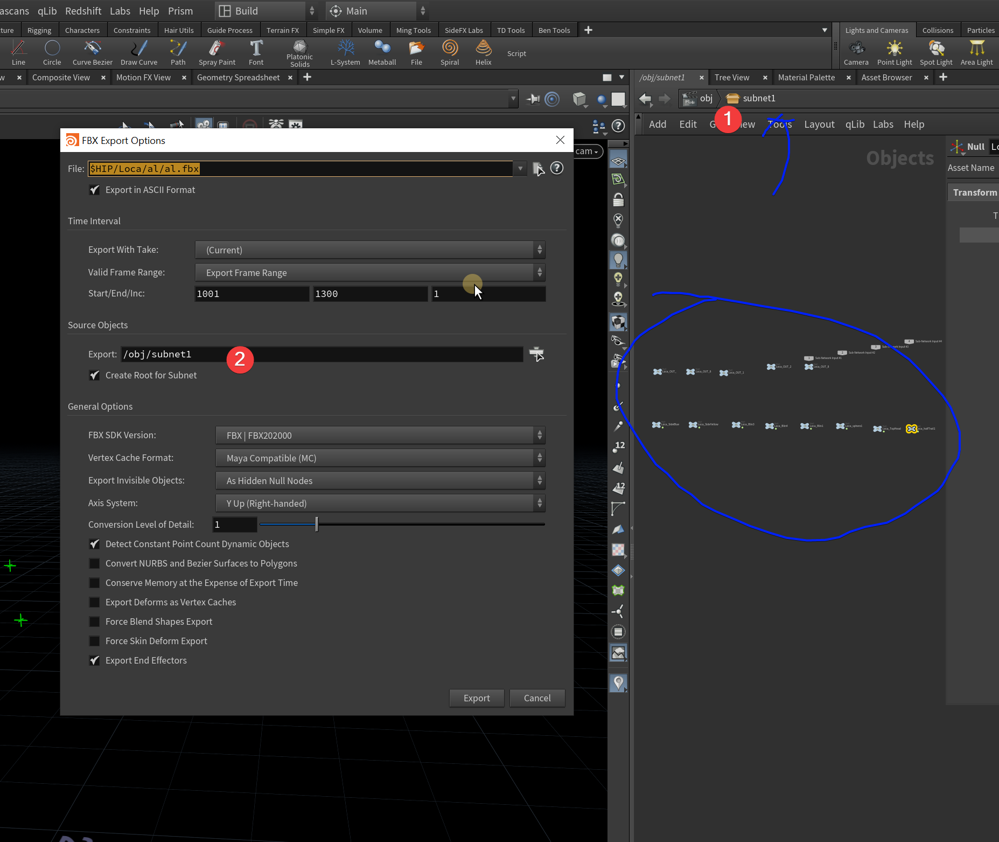
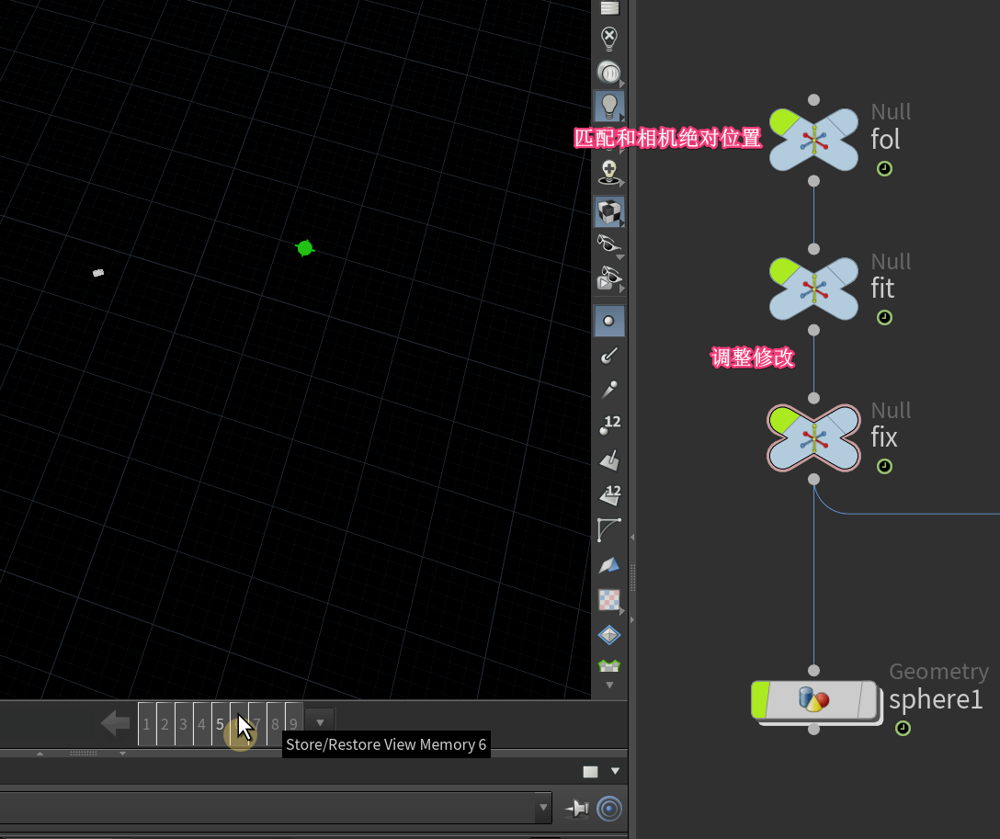
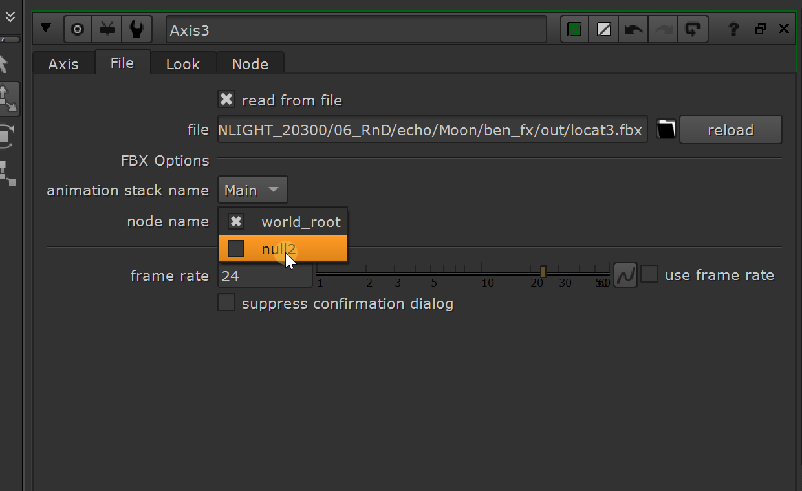
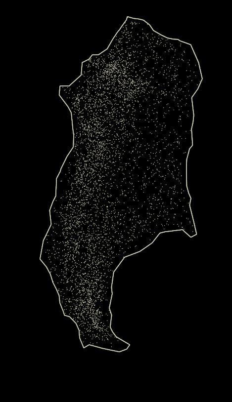

#### 1.获取粒子第几帧出身的   

```vex
f@f=int(((@Time+@Timeinc)-(@age-@Timeinc))/@Timeinc);
```
#### 2.locat 输出
输出多个locat的时候,需要把所有的<mark>打包</mark>在输出,
输出要<mark>显示</mark>


eg：给合成做月亮位置匹配

- 1.出fbx的时候,需要subnet打包,在输出,需要东西的话可以再下面连接个小球
- 2.把3个null的信息归到一个上，最下面连接一个点(geo2——objectmerge读点(一定要 into object 不然没信息))(可选)
- 3.abc就不用打包
- 4.nuke读取的时候切记去切node name


#### 3.如何取得凹面体（不规则） 


<mark>cmd中提前安装库：</mark>

"C:\Program Files\Side Effects Software\Houdini 20.5.487\python311\python.exe" -m pip install alphashape

python节点下
```python
import hou
import alphashape
import numpy as np
from shapely.geometry import Polygon, MultiPolygon
# 获取当前 Python SOP 的 Geometry
node = hou.pwd()
geo = node.geometry()
# 获取点云数据 (修正 Vector3 获取方式)
points = np.array([(p.position().x(), p.position().y()) for p in geo.points()])
# 确保点云不为空
if len(points) < 3:
    raise ValueError("点云数据不足，至少需要 3 个点来计算凹包")
# 计算凹包
alpha = 12  # 调整 alpha 值
concave_hull = alphashape.alphashape(points, alpha)
# 清空现有几何体
geo.clear()
# 处理返回的凹包几何
polygons = []
if isinstance(concave_hull, Polygon):
    polygons = [concave_hull]
elif isinstance(concave_hull, MultiPolygon):
    polygons = list(concave_hull.geoms)
# 创建 Houdini 形状
for poly in polygons:
    coords = list(poly.exterior.coords)  # 获取边界点坐标
    if len(coords) < 3:
        continue  # 跳过无效多边形
    # 创建 Houdini 点
    houdini_points = [geo.createPoint() for _ in coords]
    # 设置点的位置 (保持 2D，Z 设为 0)
    for i, pt in enumerate(houdini_points):
        pt.setPosition(hou.Vector3(coords[i][0], coords[i][1], 0))
    # 连接点形成多边形
    poly_prim = geo.createPolygon()
    for pt in houdini_points:
        poly_prim.addVertex(pt)
```