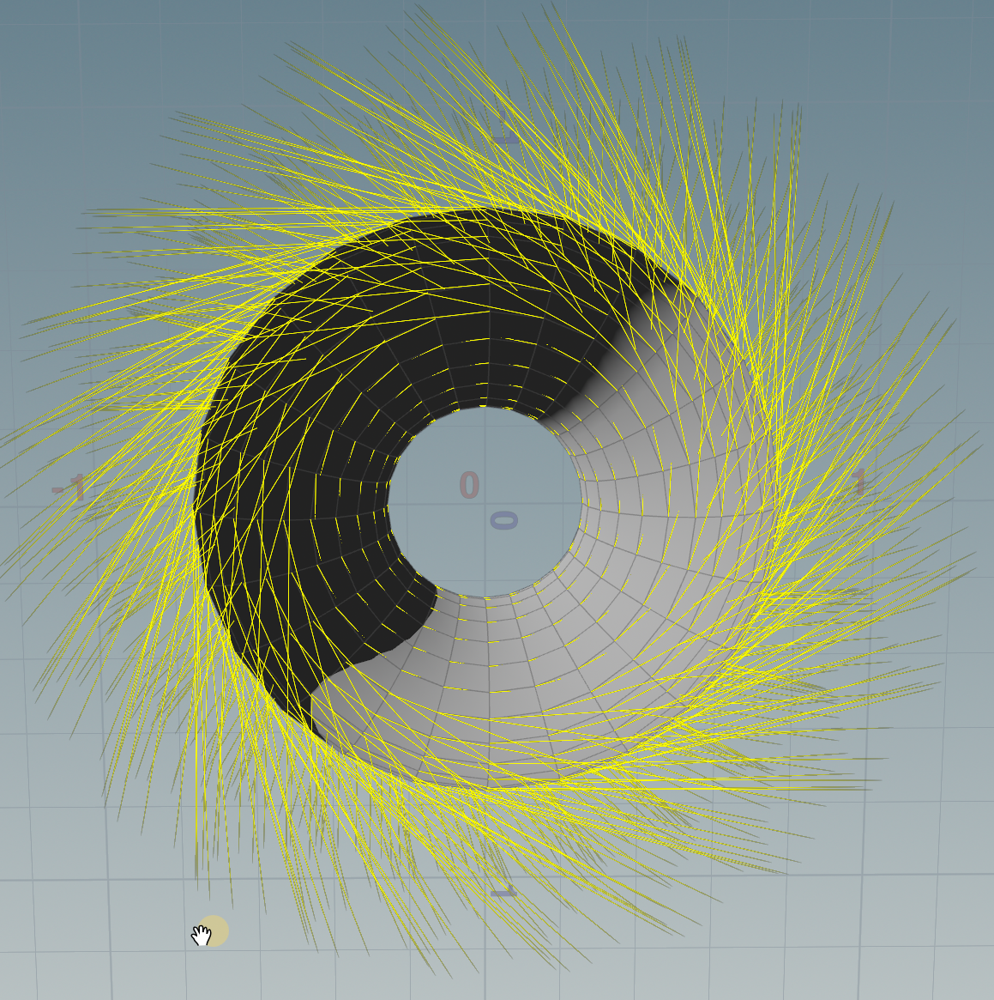

```python
// 让方向 dir = 投影到水平面的 @P 方向
//旋转 90°（绕 Y 轴）
//根据噪声再做额外旋转（绕法线 N）
//最后把方向写进 @N


vector dir=normalize(@P);
dir.y=0;

matrix mat =ident();
rotate(mat,$PI*.5,set(0,1,0));

dir*=mat;


dir =normalize(dir);


float noiseangle=noise(@P*ch("noiseAngle"))-.5;

noiseangle*=$PI*ch('ang');


matrix mat2=ident();

rotate(mat2,noiseangle,@N);

dir*=mat2;


@N=dir;


```



add noise ani

```python
vector dir=normalize(@P);
dir.y=0;

matrix mat =ident();
rotate(mat,$PI*.5,set(0,1,0));

dir*=mat;


dir =normalize(dir);


vector4 seed =@P*chf('sc');
seed.w=@Time*chf('speed');


float noiseangle=noise(seed)-.5;

noiseangle*=$PI*ch('ang');


matrix mat2=ident();

rotate(mat2,noiseangle,@N);

dir*=mat2;


v@dir=dir;


```