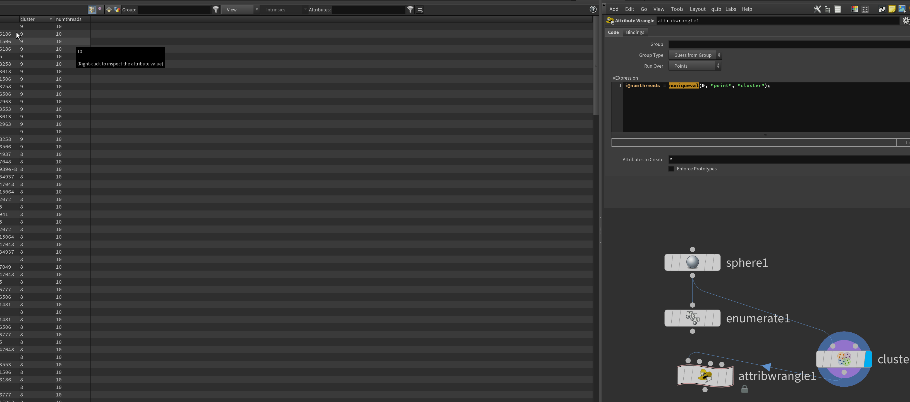

i@numthreads = nuniqueval(0, "point", "cluster");

# nuniqueval VEX function

Returns the number of unique values from an integer or string attribute.

*返回整数或字符串属性中唯一值的数量。*

int 

返回属性的所有值中[uniqueval](https://www.sidefx.com/docs/houdini/vex/functions/uniqueval.html)来迭代唯一值集。

`<geometry>`

When running in the context of a node (such as a wrangle SOP), this argument can be an integer representing the input number (starting at 0) to read the geometry from.

Alternatively, the argument can be a string specifying a geometry file (for example, a 

attribclass

One of 

You can also use [read from groups](https://www.sidefx.com/docs/houdini/vex/groups.html).