## 讲讲数据优化
#### 1.数据类型及其优化
* (attribcast)
* 可以缓存前优化数据

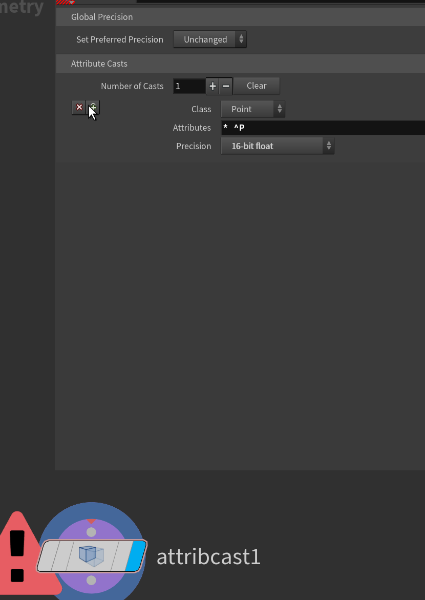

*  模型超级远或者大,会出现渲染,显示bug也可以用attribcast,改到64显示

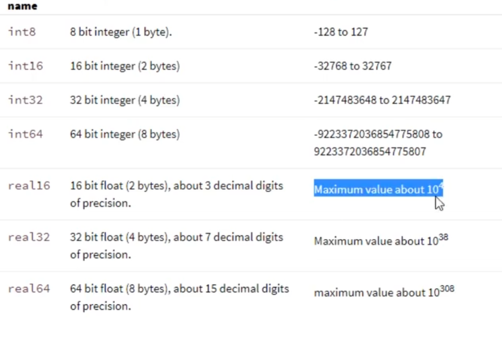
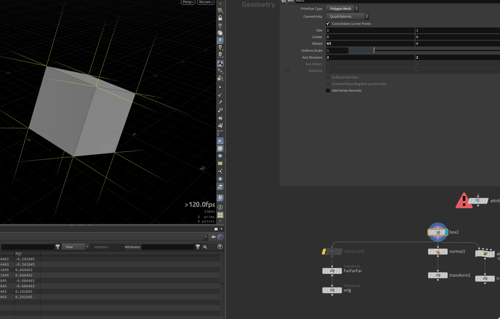

#### 2.属性
* 定义N(自带默认类型是Nml)和定义 `v@s`自定义没指定数据类型  
* 不同数据类型旋转影响也不同的

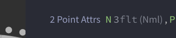

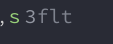


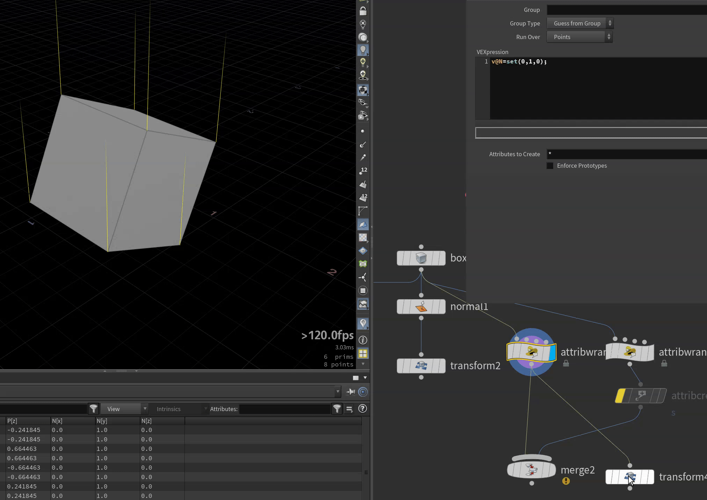


#### 3.retime
* tip：测试感觉19+版本retime没下面的问题了
* 需要把数据类型矫正
* vex sop都可
* 修改前(旋转错误)
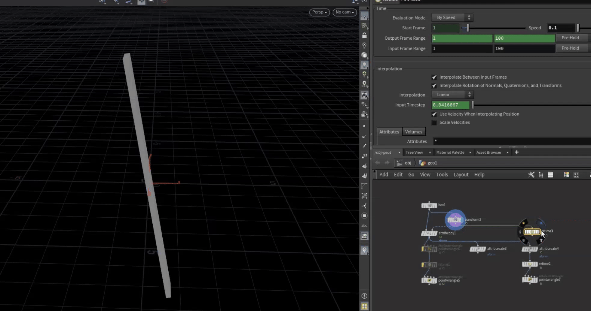

* 修改完后(正确了)
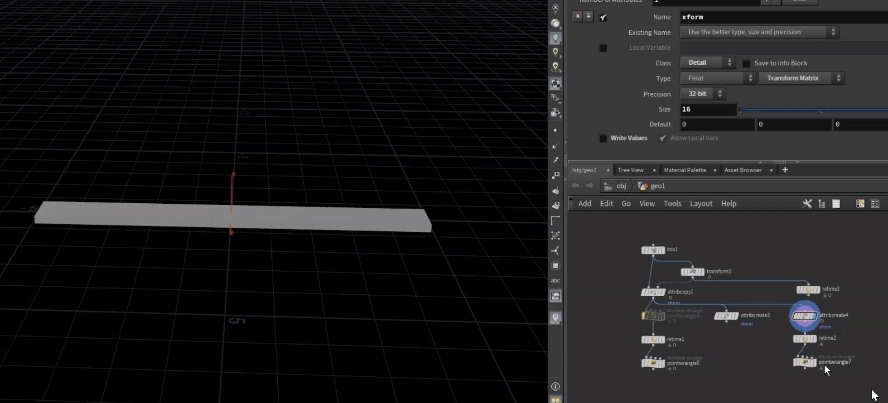                                                          
                                       
* 方法一

```vex
setattribtypeinfo(0,'detail','xform','matrix');
```
```vex
matrix mat =detail(0,'xform',0);
@P*=mat;
```
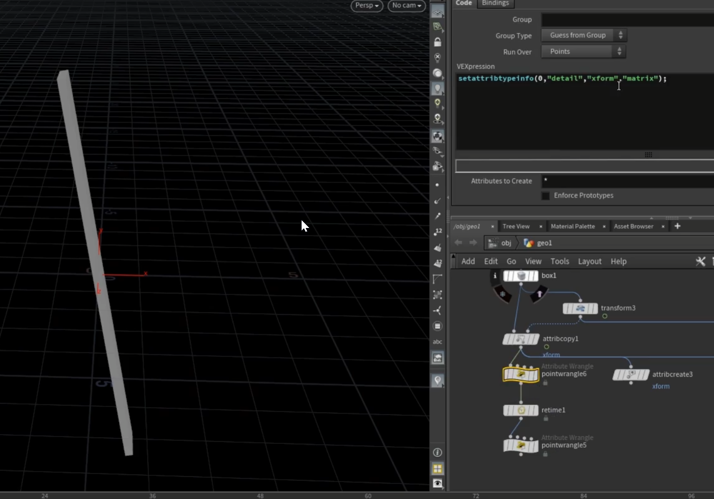

* 方法二

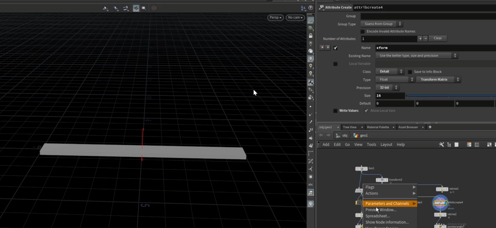

* 要告诉houdini 这个16f是Matrix矩阵

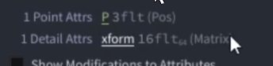