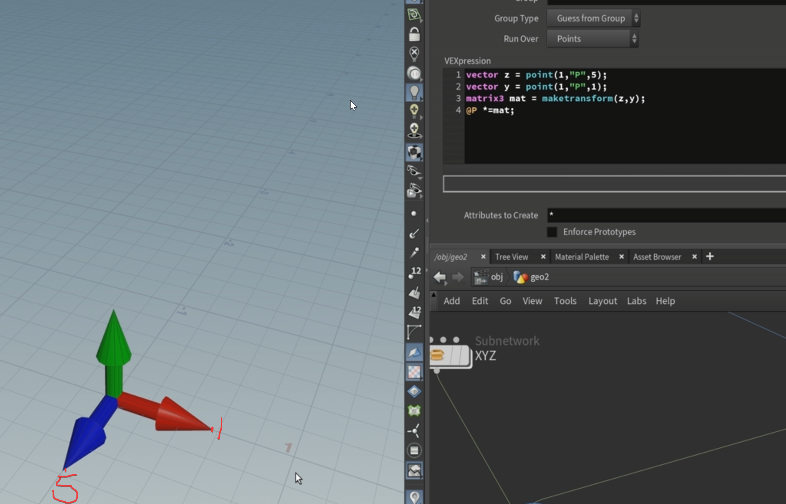
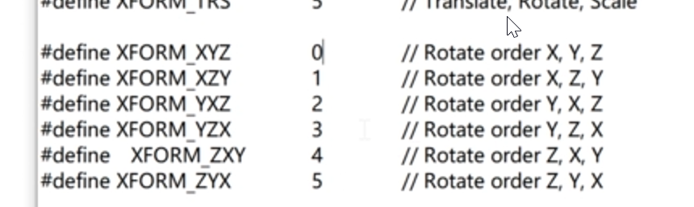
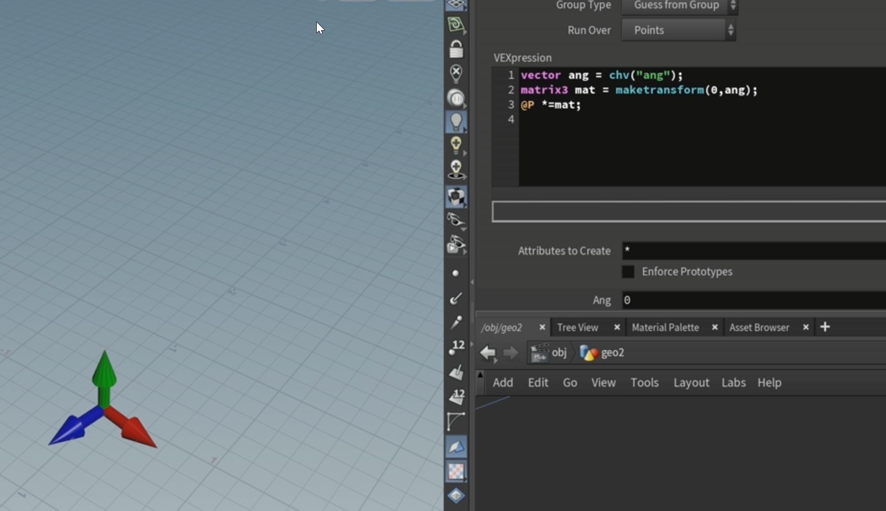
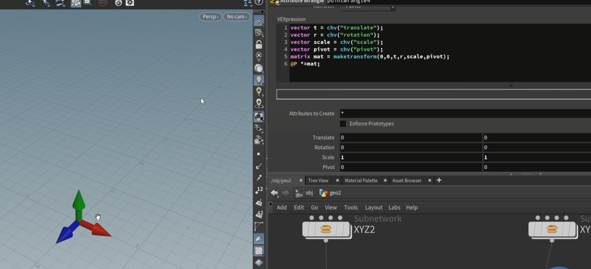
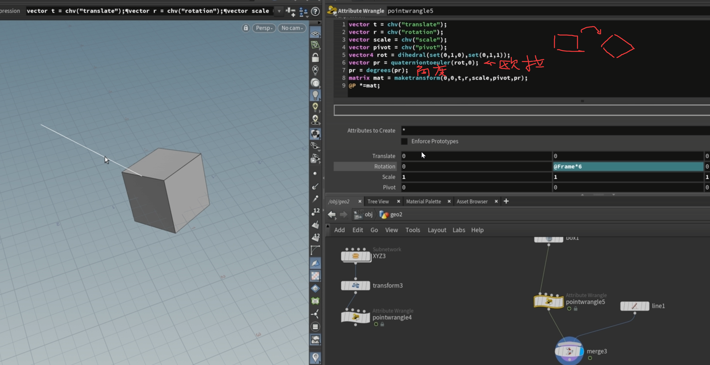
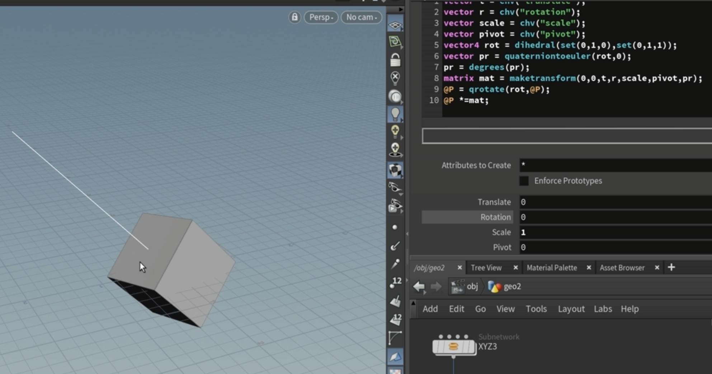
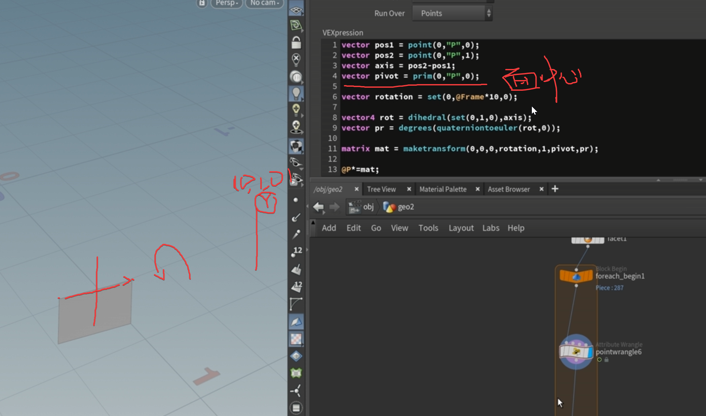
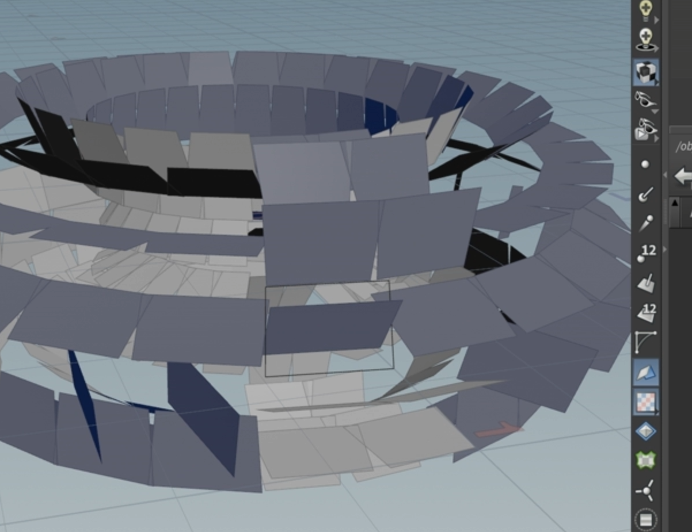
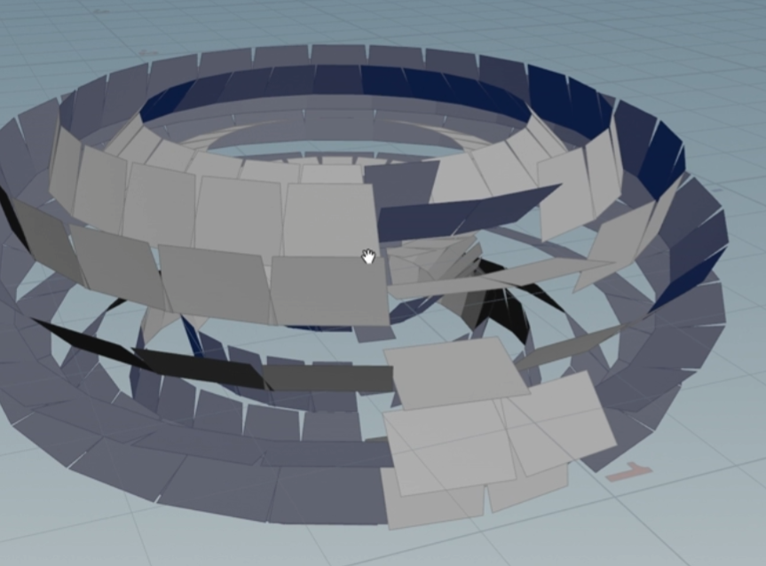
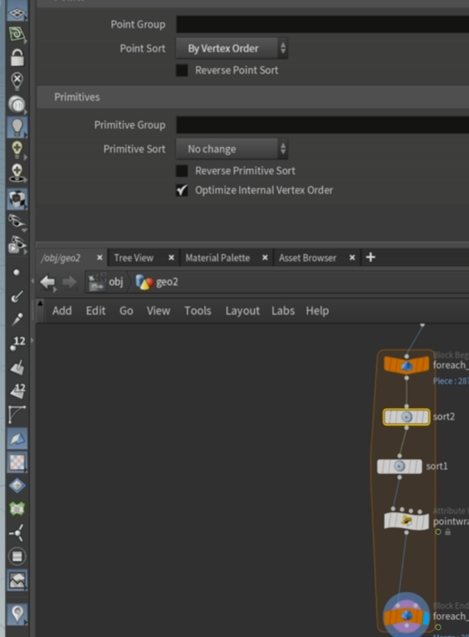

matrix3 

matrix3 

matrix 

matrix 

matrix 

matrix 

matrix 

matrix 

1.3*3    

 2.

matrix 

多个tran    4*4

3.

xyz 顺序 默认就是0

4.

初始位置需要和轴心位置 一样否则不会自转

5.  matrix 

 需要欧拉角基于xyz   >>>>> 但是实际运用中 不一定是在xyz轴

让物体 向011转》》》》 rot 四元数转欧拉角  

maketransform 需要角度

基于轴心的 所以并不会改变物体 》》》 如果需要绕着0 1 0朝上旋转手动转下物体   @P=qrotate（rot,@P);

圆环效果

旋转是错误的

重新排序  

