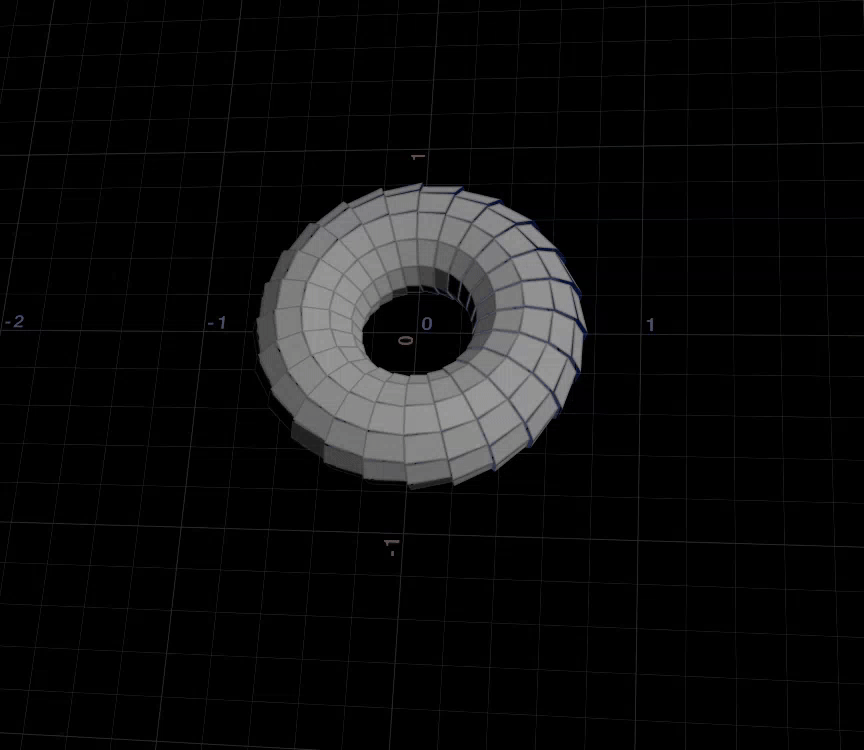

学习视频地址：[https://www.bilibili.com/video/BV1kY4119716/?spm_id_from=333.788&vd_source=044ee2998086c02fedb124921a28c963](https://www.bilibili.com/video/BV1kY4119716/?spm_id_from=333.788&vd_source=044ee2998086c02fedb124921a28c963)

```python
// quaternion(matrix3)
// quaternion(angle,axis)
// quaternion(angleaxis)

//dihedral(vectora,vectorb)   ##向量a  转换 到向量b（对齐）得到的是四元数或旋转矩阵所以还要qrotate到p ##面对齐需要个up向量

##  eg:1.transform 物体  用aw读取物体xform驱动物体（应该效果一样）
matrix m =detail(1,'xform');
matrix3 m3=matrix3(m);
vector4 rot=quaternion(m3);

@P=qrotate(rot,@P);
## 四元数只记录旋转，不记录位移（3*3转换的嘛）


##  2.绕旋转轴转圈
float angle=radians(ch('angle')); ##转为角度制
vector axis =normalize(chv('axis'));
##不归一化会出问题

vector4 rot =quaternion(angle,axis); 
@P=qrotate(rot,@P);                 #最后2句话都固定的  所以只要定义前面参数即可


##   3.同理
float angle=radians(ch('angle')); ##转为角度制
vector axis =normalize(chv('axis'));
##不归一化会出问题

vector4 rot =quaternion(angle*axis); 
@P=qrotate(rot,@P);                 #最后2句话都固定的  所以只要定义前面参数即可


## 4.向量a  转换 到向量b（对齐）
vector a =point(0,'P',0)-point(0,'P',1);
vector b =point(1,'P',0)-point(1,'P',1);

vector4 rot =dihedral(a,b);

@P=qrotate(rot,@P);


```

# 3*3 四元数 轴心都在世界中心（0,0,0）  所以需要先归圆心在处理 在加回去

vector pos =point(0,'P',0);  //基于那个点归圆心

@P-=pos;

@P=qrotate(rot,@P);

@P+=pos;

需要转面所以在prim层级处理


```python
int pnum[]=primpoints(0,@primnum);
vector a=point(0,'P',pnum[0]);
vector b=point(0,'P',pnum[1]);
vector axis=normalize(a-b);
float angle=radians(ch('angle')); //@Frame

vector4 rot=quaternion(angle,axis);


for(int i=0;i<len(pnum);i++){
vector pos =point(0,'P',pnum[i]); 
//循环每个面获取轴开始转的点
pos-=@P;    
pos=qrotate(rot,pos);    
pos+=@P;    
setpointattrib(0,'P',pnum[i],pos);
//返回到点属性上    
}
```



```python
int pnum[]=primpoints(0,@primnum);
vector a=point(0,'P',pnum[0]);
vector b=point(0,'P',pnum[3]);
vector axis=normalize(a-b);
float angle=radians(ch('angle'));  //@Frame

vector4 rot=quaternion(angle,axis);
@P=qrotate(rot,@P);

for(int i=0;i<len(pnum);i++){
    vector pos =point(0,'P',pnum[i]); 
    
pos-=@P;    
pos=qrotate(rot,pos);    
pos+=@P;    
setpointattrib(0,'P',pnum[i],pos);
    
}
//很酷的变样效果
```

frac 取小数部分  eg frac(@Frame/30)  30帧一个循环