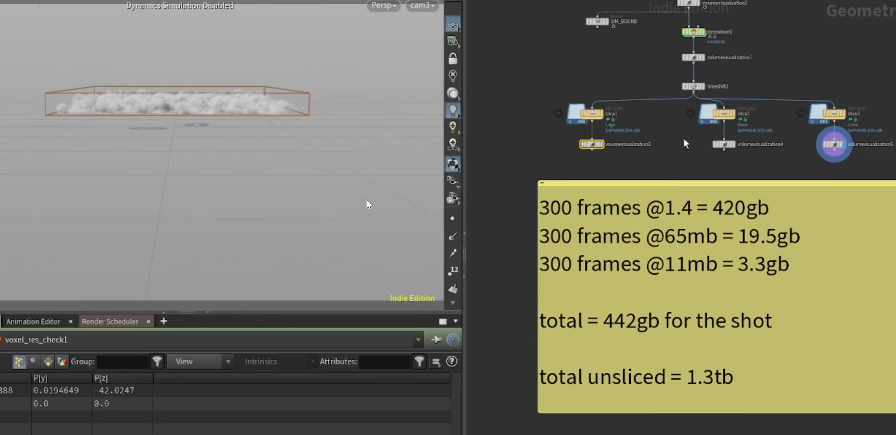
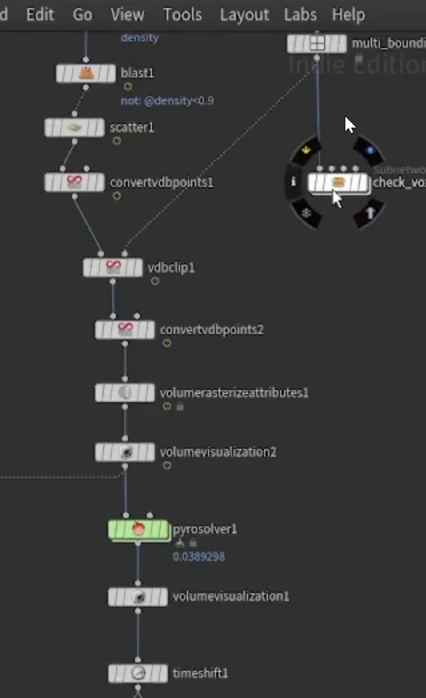
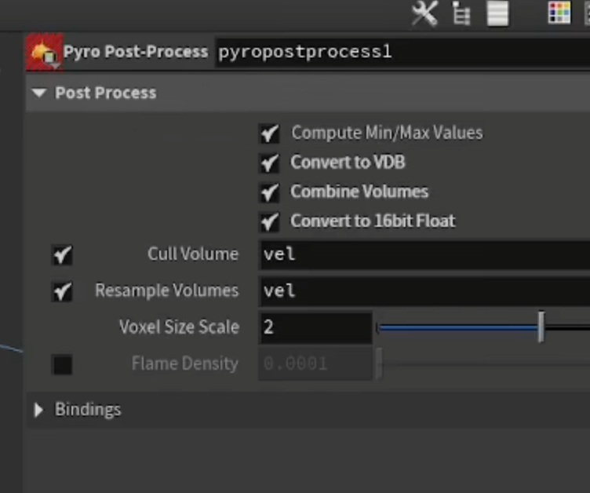
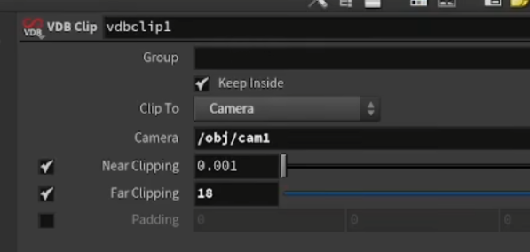
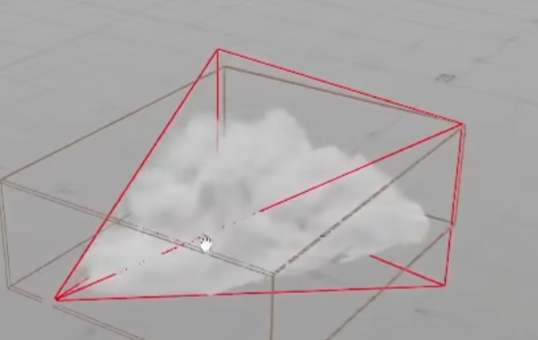
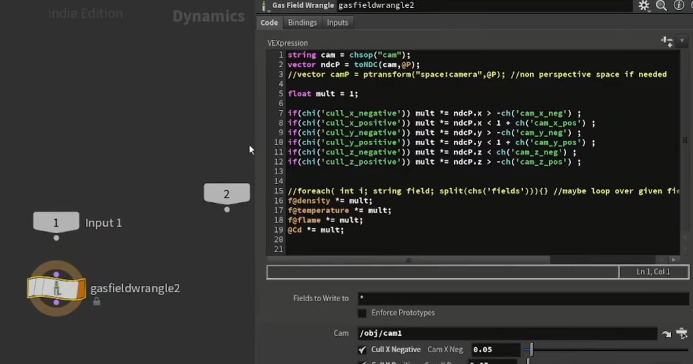
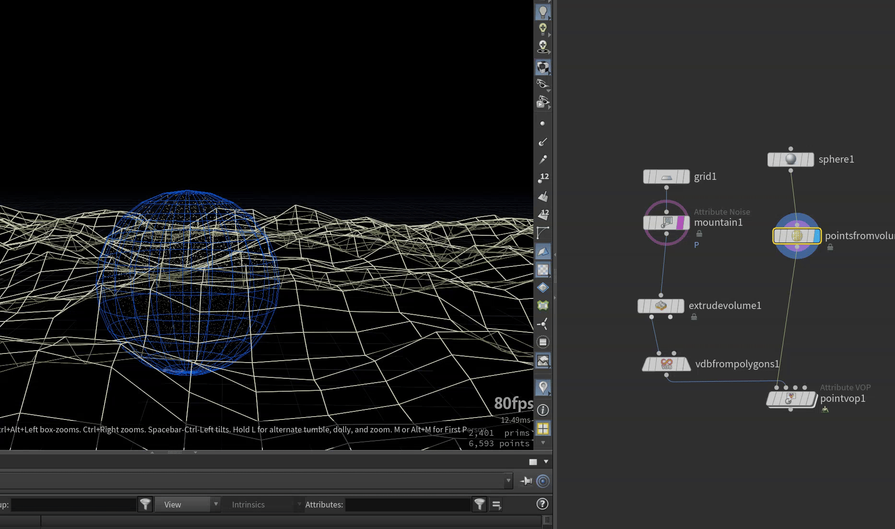

# Volume

* ### 1.volume的优化
    * 1.volume的压缩对版本迭代,储存都是很有必要的
    * eg:一块面发射烟,我们可以把他分层3套弄,既远中近
    * 
    * 
    * 可以用multi_bounding_box工具分开(需要搭配bound用)
    * 2.优化数据储存
    * 
    * 3.后期通过cam裁切体素
    * 
    * 
    * 4.解算中裁切
    * 注意是gaswrangle
    *     
    *   ```python
        string cam=chsop("can");
        vector ndcP=toNDC(cam,@P);
        float mult =1;
        if(chi('cull_x_negative')) mult *=ndcP.x> -ch('cam_x_neg');
        if(chi('cull_x_positive')) mult *=ndcP.x< 1+ch('cam_x_pos');
        if(chi('cull_y_negative')) mult *=ndcP.y> -ch('cam_y_neg');
        if(chi('cull_y_positive')) mult *=ndcP.y< 1+ch('cam_y_pos');
        if(chi('cull_z_negative')) mult *=ndcP.z> ch('cam_z_neg');
        if(chi('cull_z_positive')) mult *=ndcP.z< -ch('cam_z_pos');
        f@density*=mult;
        f@temperature*=mult;
        f@flame =mult;
        f@Cd=mult;
        ```
* ### 2.volumeSample && volumeGradient     
    * 1.volumeSample
    * exp: 判断点是否在体积内
    * vex ：f@a=volumesample(1,'density',v@P);这里1和density对应的
    * vop：volumesamplefile
    * 实战:修改粒子穿插
    *    

* ### 3.class
    * 1.Pyro_fire
    * class:[https://www.bilibili.com/video/BV12Z421m7DD/?spm_id_from=333.788&vd_source=044ee2998086c02fedb124921a28c963](https://www.bilibili.com/video/BV12Z421m7DD/?spm_id_from=333.788&vd_source=044ee2998086c02fedb124921a28c963)

    * pyrosolver_sparse:
        - advection-reflection 中选项表示结算质量高低
        - Double—Proj  0湍流更加直-1更加弯曲(细节多)(方向更加不稳定)
        - turb >>>>> Pulse Len湍流停留时间长短
        - collision >>>>iop iteration 碰撞迭代作用(迭代太低烟雾容易被吃掉,导致细节减少 可以提高3-5)
    *   collision 碰撞设置  
        - volume source>>>scalar collision//collison -1 vector v//collisionvel   
    * 假影响光,思路   
        - 发光物>>scatter属性传递过去>>vdbformparticle>>vdbconvert（volume）
        - 大致意思就是模糊发光物传递到物体上，在材质里调佣数据 做个颜色
