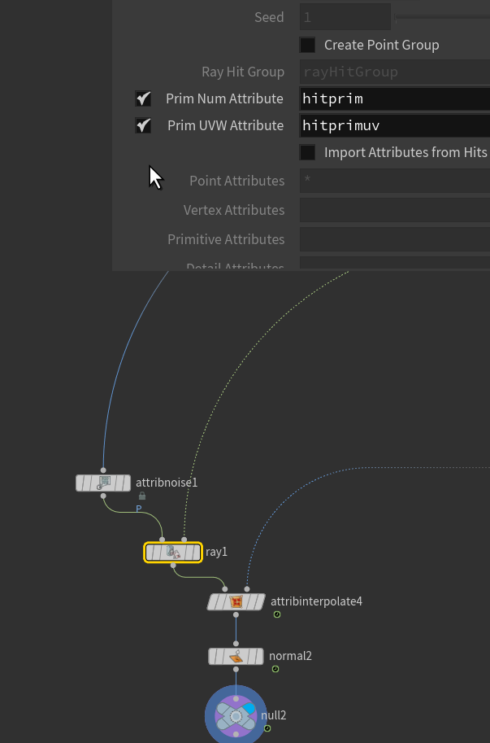
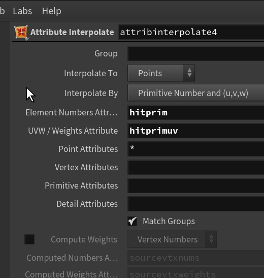
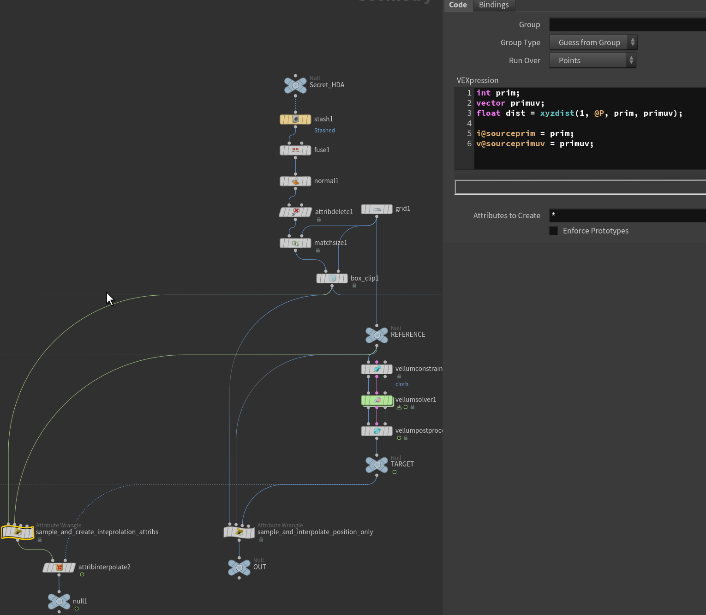
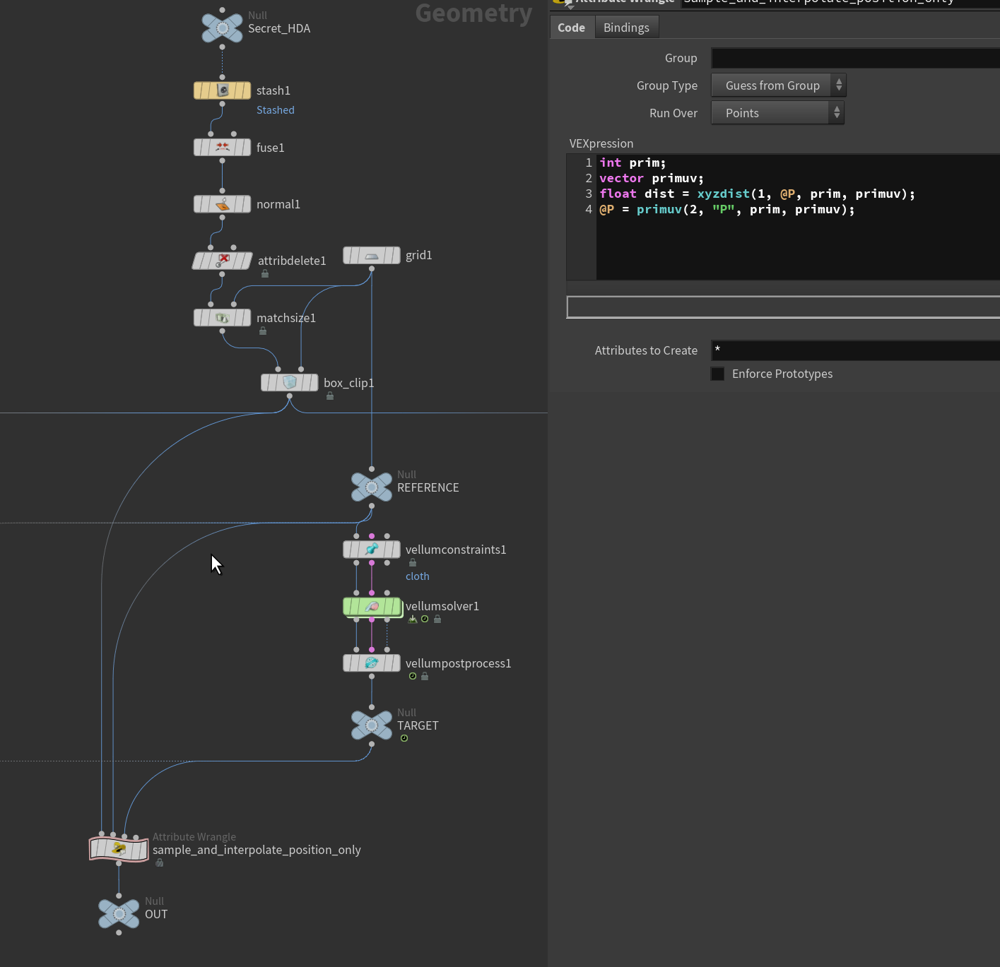
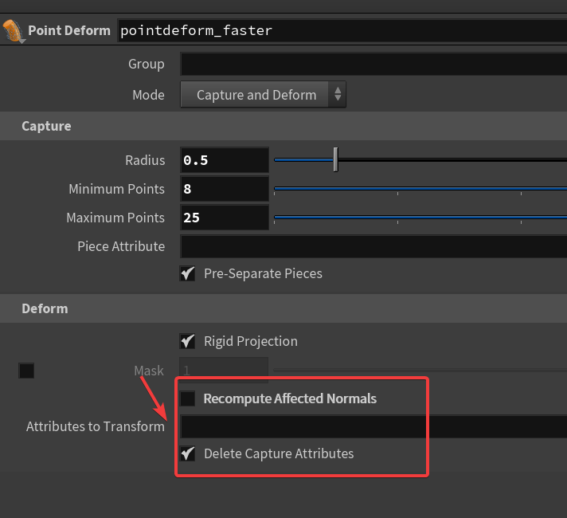
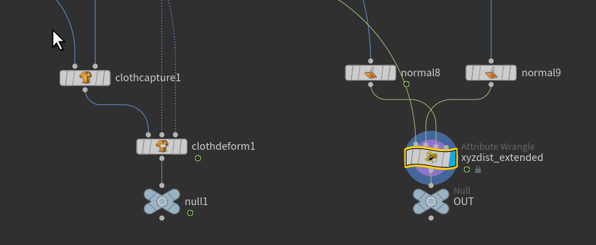

这篇是直接搬人家的
[https://www.nicholas-taylor.com/blog/deforms](https://www.nicholas-taylor.com/blog/deforms)

### 1. 概括
* 对于所有变形，我们的目标是匹配目标形状，同时最小化所应用的变形。有时您可以以零扭曲的方式使几何体变形。如果目标地理是刚性的或接近“刚性”（运动仅包含平移和旋转），您可以提取单个变换矩阵，该矩阵可以直接应用于源地理，无需加权或近似。
* Extract Transform SOP可用于此目的
1. * 它计算参考地理和目标地理之间的位置和旋转偏移，并输出一个使用[实例属性](https://www.sidefx.com/docs/houdini/copy/instanceattrs)

2. * 描述这些偏移的点。将此点输入到复制到点 SOP 中，源地理位于左侧以复制转换。 Extract Transform 上的参数还允许它使用名称属性处理多个对象（hip 文件中有一个演示），这比在 for 循环中执行类似的操作要高效得多。如果您从外部源（例如 Alembic 字符）提取几何图形并且无法访问原始变换数据，则提取变换特别有用。

<a href="/hip_files/Deforms.hip" target="_blank" download>📦 下载Deforms.hip</a>

### 2.精确
* 通常我们希望将源几何体直接附加到参考几何体上的点、边或面。
* `xyzdist()`函数最常用于此目的。
它输出一个“primnum”整数和“primuv”向量来完全定义网格表面上的位置。
这通常与primuv()配对以查找位置,或与属性插值SOP配对,后者可以查找任意数量的属性。
* Ray SOP还可以输出 primnum/primuv，Scatter SOP 也可以。
Ray获得的 
可以搭配`attribinterpolate`



* prim uv同理




* `uvdist()` VEX函数是 `xyzdist()`的一个鲜为人知的近亲，它通过在 UV 空间中完成的查找输出相同的 primnum/primuv 数据。通过函数，即使两者之间没有空间一致性，您也可以将几何图形映射到参考上。Creep SOP 做了类似的事情，但这个节点相当旧！*
* 最后，用于修饰的 Guide Deform SOP 是精确附着与刚性变换相结合的示例。引导头发的根点固定到动画皮肤，并构建刚性旋转矩阵来定向曲线的其余部分（至少在默认设置中）。*

### 3.加权插值/特定形式
* 如果源几何图形不直接位于参考地理图形上，则创建映射会更加复杂，并且需要针对参考图形上的多个点进行加权/采样。点变形 SOP 通常是这里的第一个端口。这是一个令人惊叹的节点，速度很快，并且有多个参数可以调整以优化形状转移。“piece attribute”参数允许节点捕获和变形匹配的命名片段，而不会影响 for 循环的性能。
如果您关心的只是变形 P，


### 4.表面
* 如果我们的参考几何体是像单面布这样的表面，则有一些选项可以提供比点变形更好的质量。明显值得尝试的一个是
另一种选择是使用上面讨论的.


```python
int hitprim;
vector hituv;

// capture
float dist = xyzdist( 1, @P, hitprim, hituv);  
setpointattrib( 0, 'hitPrim', @ptnum, hitprim);
setpointattrib( 0, 'hitUV', @ptnum, hituv);

// get the reference and target normal at our captured position
// and the captured positions
vector restN = primuv( 1, "N", hitprim, hituv);
vector animN = primuv( 2, "N", hitprim, hituv); 
vector restP = primuv( 1, "P", hitprim, hituv);
vector animP = primuv( 2, "P", hitprim, hituv);

// deform
// uses the nearest surface position and offset from the reference normal 
vector diff = @P - restP;    
float side = dot(diff, restN);    
@P = animP + (animN * side);
```