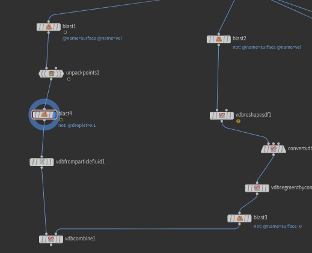
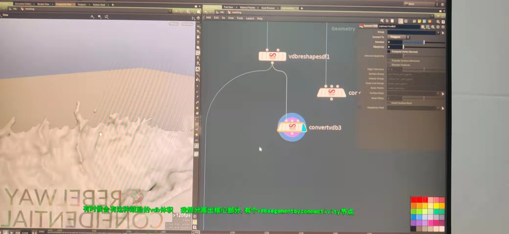
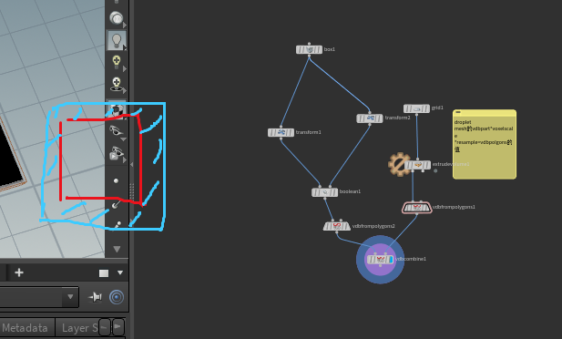

mesh方式——默认particlefluidsurface

1.ParticleFluidSurface_____mesh——final smooth（Gaussian）！

particle Fluid----regions---flattening flattenGeometry(边缘展平)用于衔接

Flatten Distance 往里缩进展平的距离。

2.第二种方式 blast                    surface+vel——droplet>0.3——vdbfromparticlefluid。

分成droplet和surface   2个来包mesh  

---

想要隔离除核心部分 eg：空中的小点  可以通过vdbconnectivity。

自定义mesh：             通过v和cur提取spary出来     单独smooth   invertAlphaMask  其他区域

怎么扩展mesh的面来和海面融合————————

通过box宽+.2    -0.2   vbd unifor   

在提取最边缘一圈的点 polyexturb