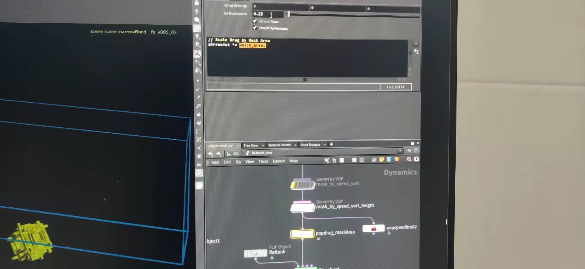
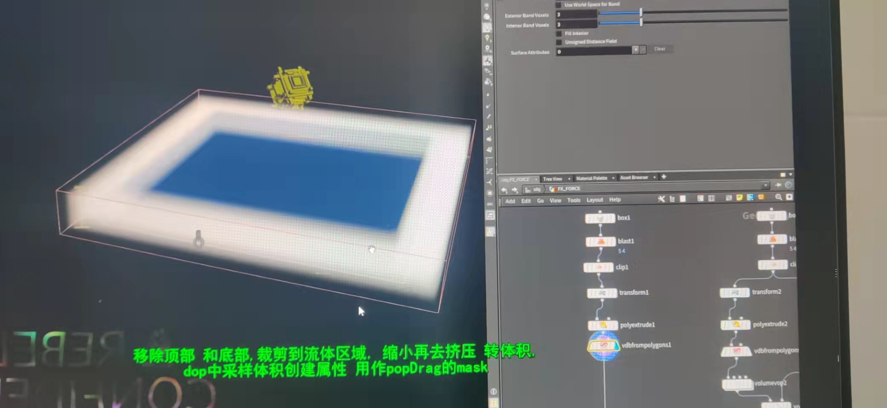
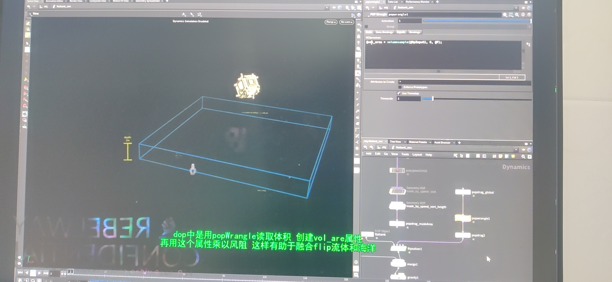
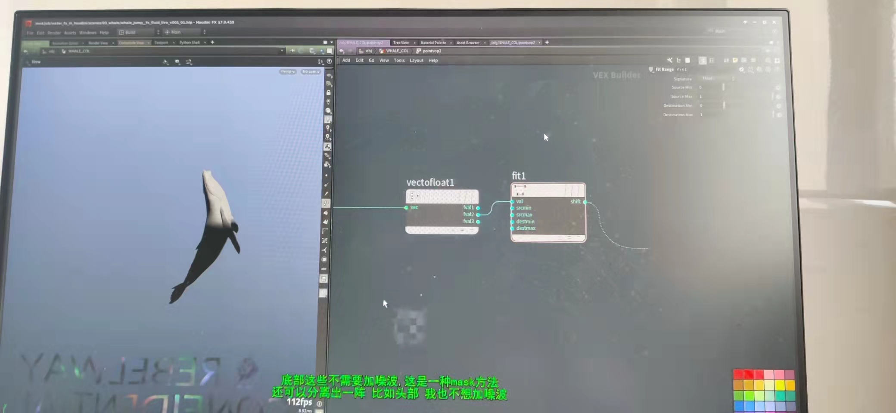
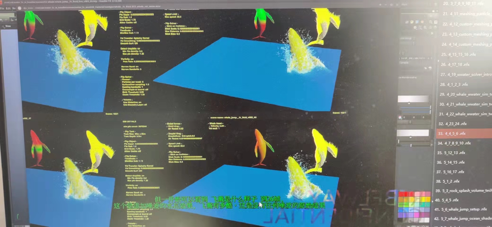

# Flip

###  1.flip
准备阶段：绑定各类参数和dop中的关联，最重要的一点是结算时候的参数测试，wedge方式 一般是一个个参数测试，第一步eg1.精度的测试（0.1，0.08，0.05，0.04）中等精度开始找出问题，解决问题。
* 1.Narrow Band

窄宽，默认3
* * 1.加大到5 优点：流体运动过快的话有助于结算的稳定  
            缺点：加大了结算时间，加大了内存

    2.结算器的深浅

        影响：溅起水花的高低

* 2.use water line

    waterline on 粒子飞出框外会被删除

* 3. use boundary layer

    Both off  边界会有反弹  导致后续很难和海洋融合

* 4.surface sampling  （1，2，4，8测试）

    每帧通过surface sdf 在流体内撒点（1.加大粒子量）

    值越大得到的点越多,但是太多了导致絮状流体反而不真实

* 5.birth   death （也是参数测试）

    death值越高 ——流体存活越久——结束是粒子在表面存留的时间也越久。

* 6.velocity smoothing  

* * 直接影响水花的形态 

* * 高值   高的值平滑大水花呈现絮状
* * 低值   低的值粒子更加随机

* 7.droplets  

* * 密度在范围内的标记为droplets粒子
* * 一旦被定义为droplets粒子  那么这个粒子会改变方向和速度
* * 区间太小:粒子不容易被标记为droplets
* * 太大：只要是分散开的粒子就会被标记为droplets粒子  导致模拟结果会很糊

* 8. global ——popdrag+droplet drag

* * 用阻尼来模拟自然中风的阻力，eg波涛汹涌的海洋 海浪会接管水花大概持续1-2s
* * 同理  droplet >0.3/0.5   drag0.5 0.3.....多参数测试
* 9.speed limit

* * 由于粒子spary还是飞的很高我们引入speed limit 取限制他的速度最大多少,超过多少速度的给他限制。

* 10.Stickcollision  
    
* * 参考中鲸鱼出水身上有带着水，为了做到这个 我们k了stickcollision的值让鲸鱼出水是带着水花。

* 11 .可以通过mask取做drag场的大小。结算完一版在外部调整颜色查看,然后调入内部

* * 边界通过mask加大drag 做sdf场读取施加drag

* * 为了让水花平稳一点，我们给鲸鱼速度设置倍增。trail*n ——出水速度k帧,影响水花溅起的大小。
* * eg:出水k*1  入水k*0.5，这样入水时候水花就小了,速度加噪波(进阶)出水的加噪波 

* * 设置了不同的v结果是 ：出水的spary ，扰乱程度结果不同。