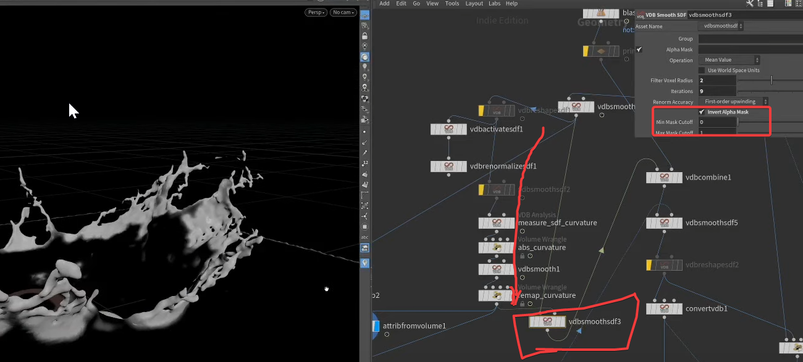
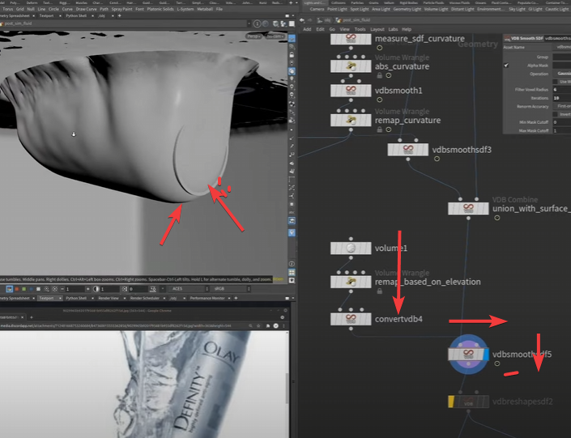
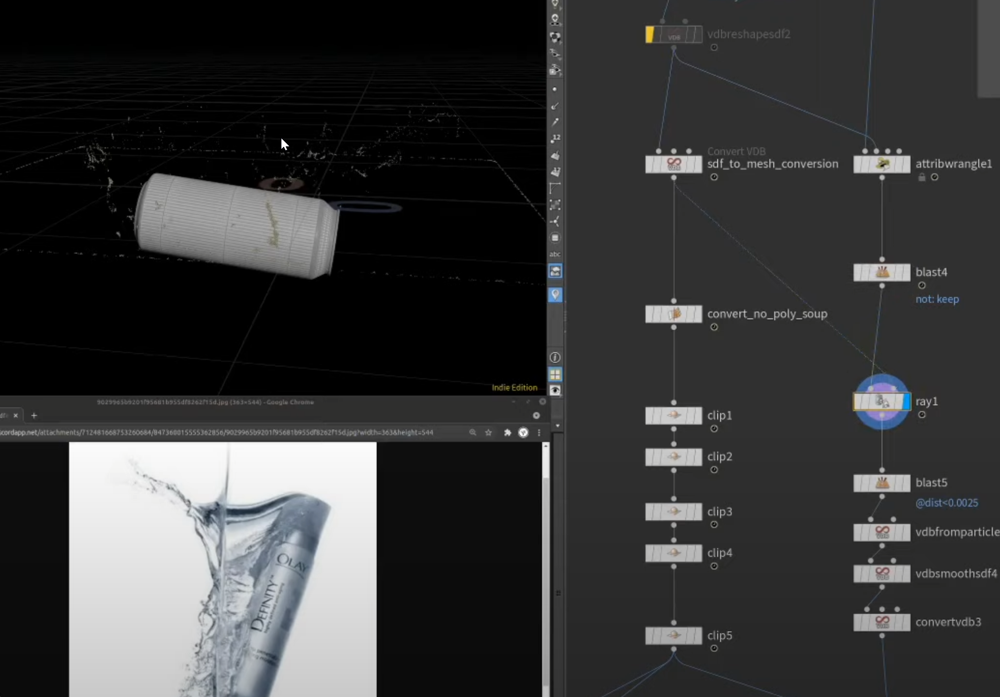
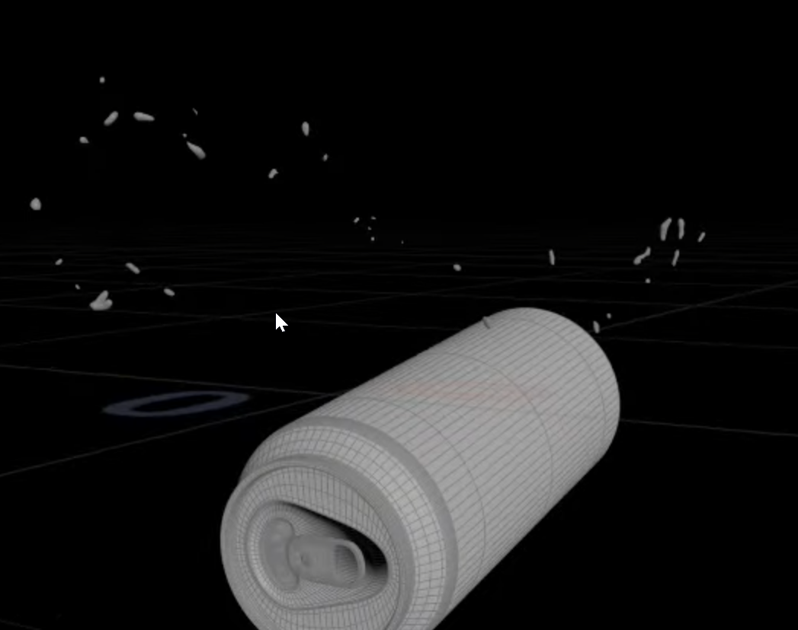

学习出处：[https://www.youtube.com/watch?v=3OGGFZS1R3Y&t=1436s](https://www.youtube.com/watch?v=3OGGFZS1R3Y&t=1436s)

[product_splash.v6.hiplc](attachments/WEBRESOURCEbf87b30356381a73ec3baf7309b2d5c5product_splash.v6.hiplc)

1.

光滑平面：用曲率方式 提取出运动快的作为mask

abs_curvature： f@density = abs(f@density);

remap_curvature：f@density = fit(f@density, 8.0, 28.5, 0, 1);

2.水下那层光滑的莫

自己弄了个体积场模糊的

3.可以提取出很远的那些粒子（细节）单独mesh

i@group_keep = volumesample(1,0,@P)*10>0.005;

