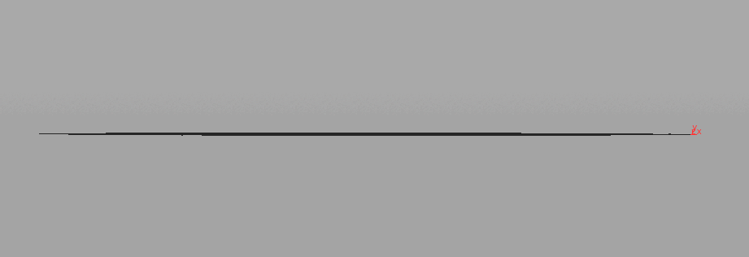
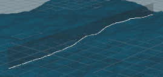
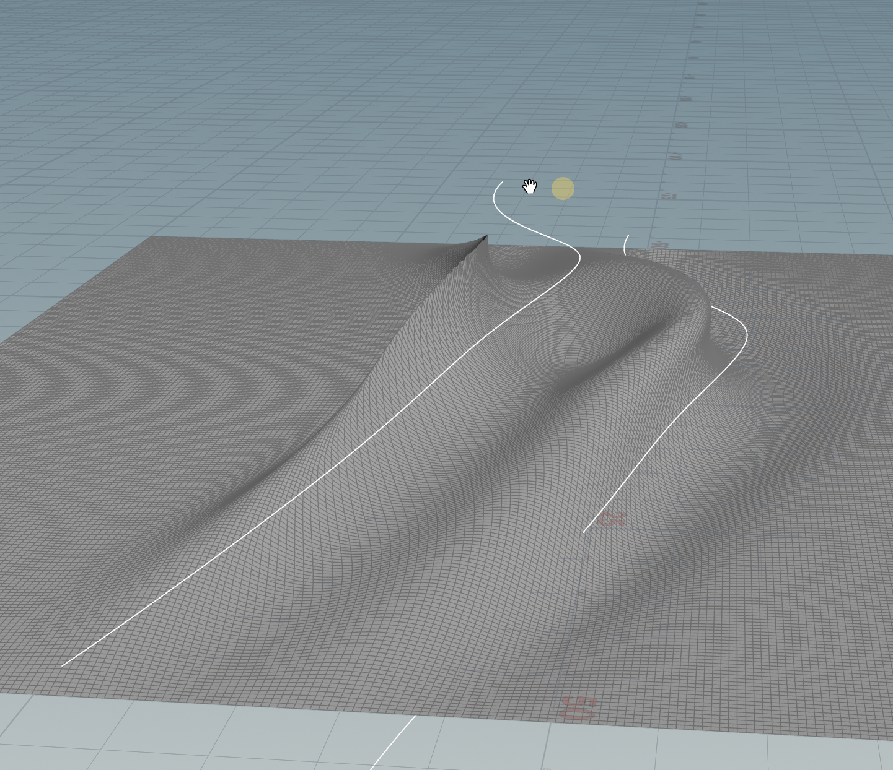
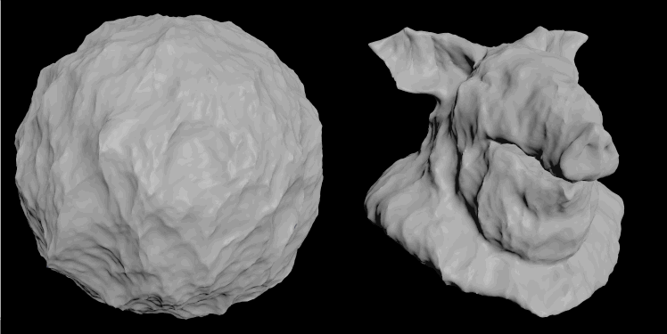

[https://forums.odforce.net/topic/45939-drawing-parametric-waves-and-learning-maths-with-it/#comment-215185](https://forums.odforce.net/topic/45939-drawing-parametric-waves-and-learning-maths-with-it/#comment-215185)

[https://forums.odforce.net/topic/44341-making-tidal-wave/#comment-208876](https://forums.odforce.net/topic/44341-making-tidal-wave/#comment-208876)

[wavelike_deformA.hipnc](attachments/WEBRESOURCE7b960827a6407957b00e8665c8ddb250wavelike_deformA.hipnc)

[ts_ocean_on_ball.hip](attachments/WEBRESOURCE2e06dfa02e5219a4ebd32a89d6d64c87ts_ocean_on_ball.hip)