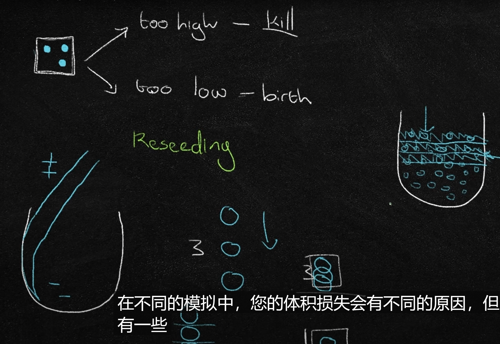
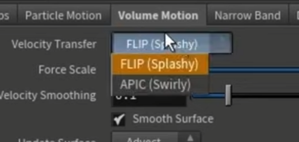
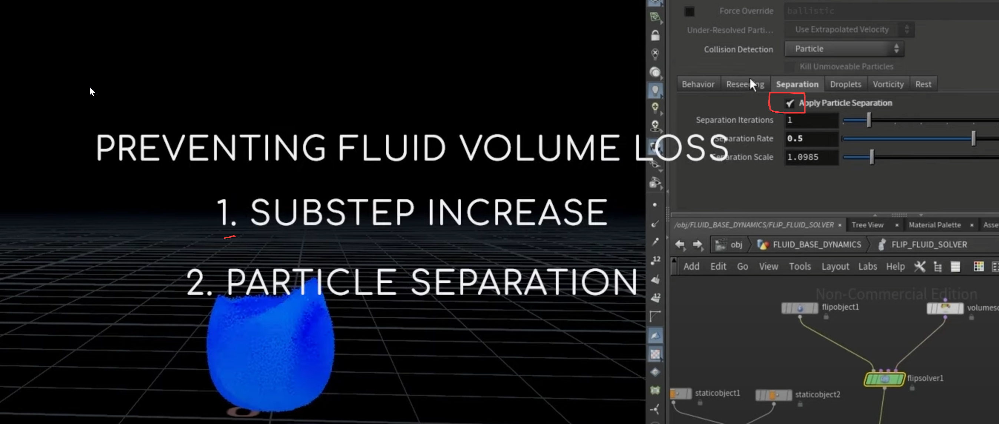
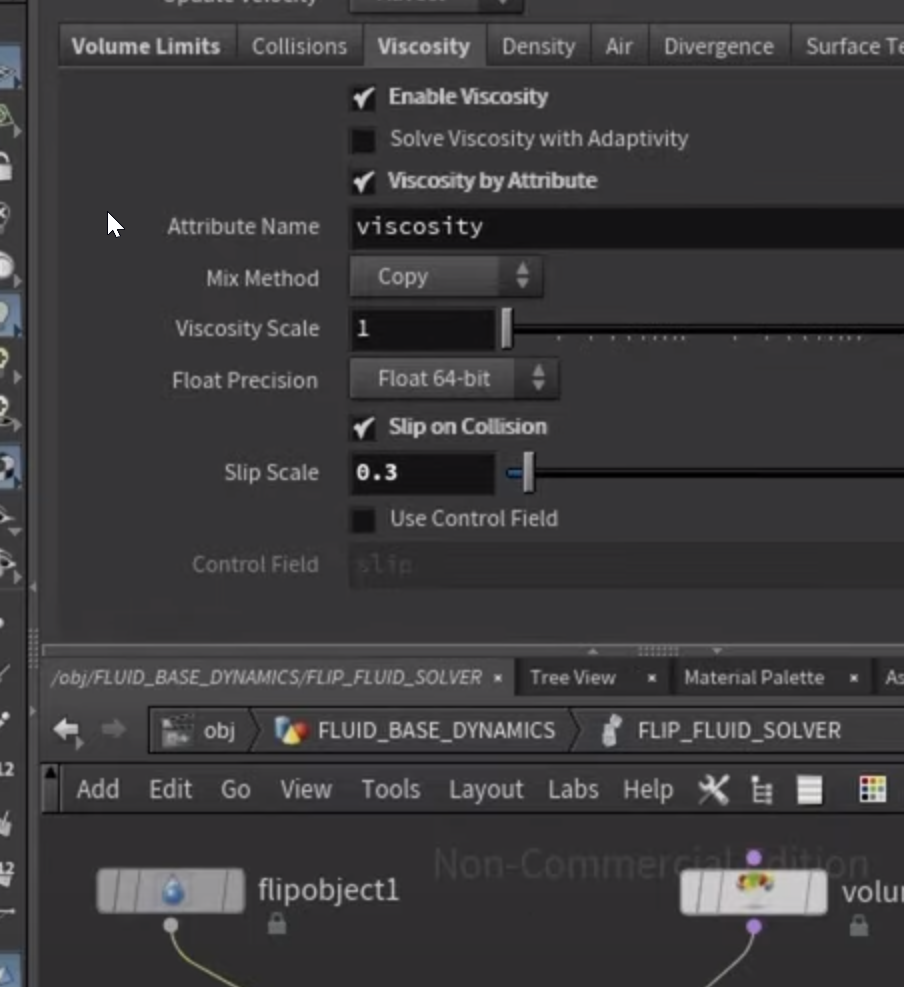
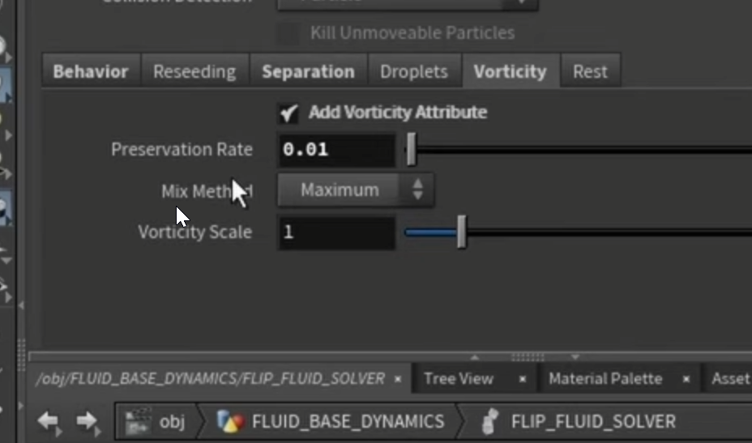
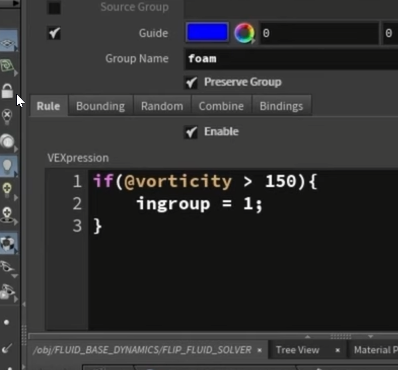
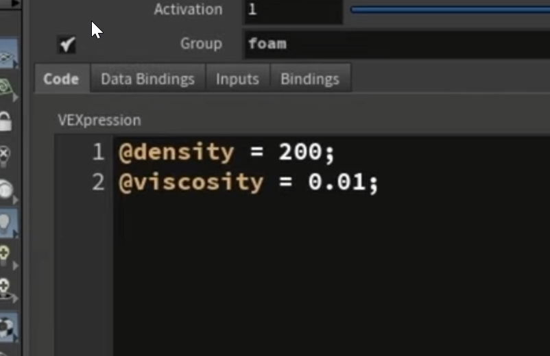

关于reseeding

视频教程地址：[https://www.youtube.com/watch?v=Xs2tHiVFKF0](https://www.youtube.com/watch?v=Xs2tHiVFKF0)

**1.  **

**2. **

**3.**

2.分裂粒子  

**4.**

particle *Grid  模拟场景大小

增加模拟内部流体密度

**5.**

6.Vorticity 涡流   rate可以理解为涡流存在时间长短

7.关于泡沫

用vorticity选出组——给不同属性，受力

