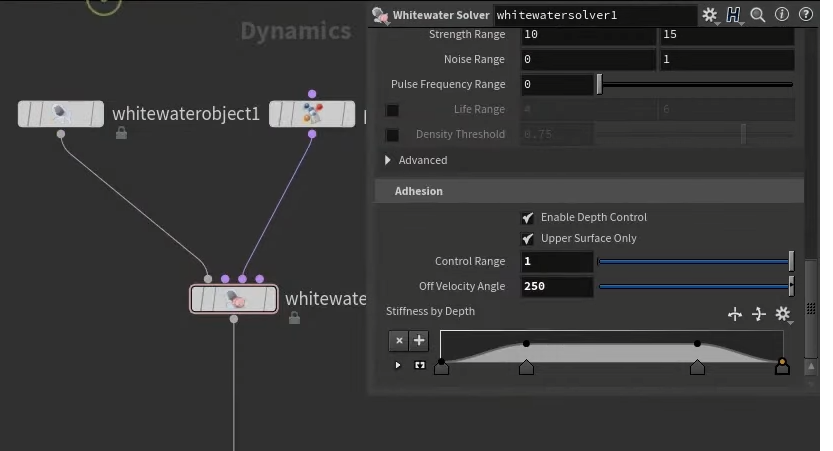
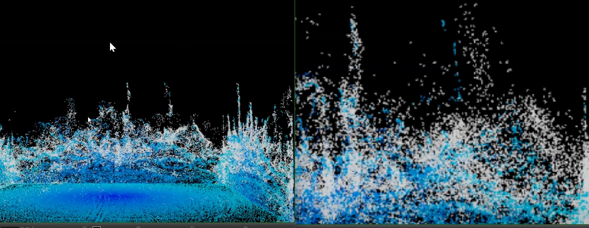

[https://www.youtube.com/watch?v=AoHt8PRy2VU&list=PLe2s57SAKpD_eM0zGpBtQeRTaOn1YISBv&index=4](https://www.youtube.com/watch?v=AoHt8PRy2VU&list=PLe2s57SAKpD_eM0zGpBtQeRTaOn1YISBv&index=4)

白水有3阶段

第一阶段：和水一样在谁当中有浮力等力影响

第二阶段：像在表面上 受耦合等力影响

第三阶段：溅起来变得像薄雾一样

off Velo Angle  脱离角速度影响 （飞出去———更像薄雾）

图一 30  图二 250

