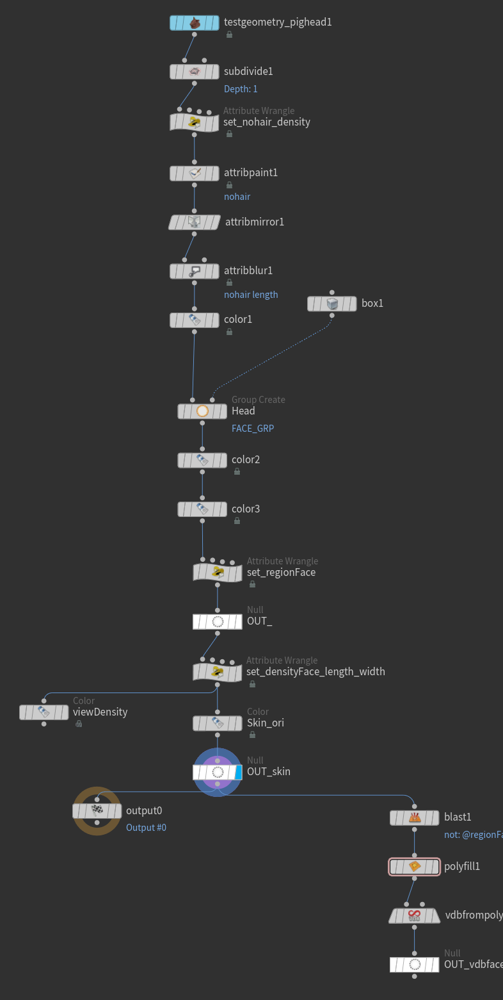
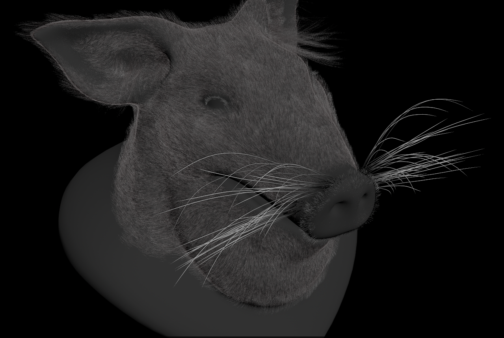
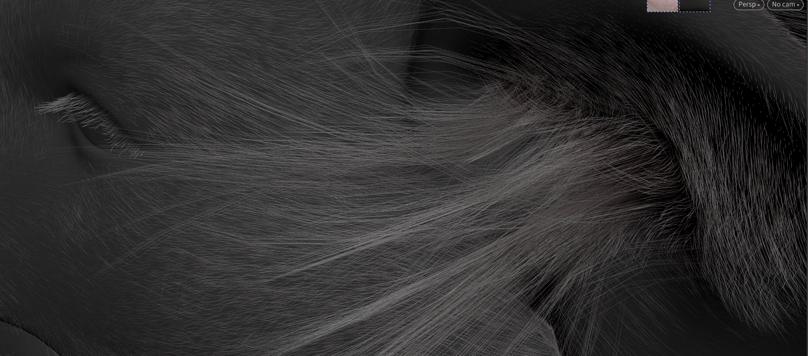

## Hair
* 学习地址出处：[链接](https://www.bilibili.com/video/BV15z421B7jS/?p=9&spm_id_from=333.1007.top_right_bar_window_history.content.click&vd_source=044ee2998086c02fedb124921a28c963)

### 1.首先是模型处理
* 1.细分(模型要足够的拓扑去分不同区域的毛)

* 2.设置毛发属性(eg：nohair、density、length、lift)可以用attribmirror 避免两边属性不对称

* 3.设置不用区域(eg：头 ，尾，身体)

* 4.设置vbd碰撞(避免毛发穿插进入内部)

### 2.制作案例
* 1.刷猪毛

<a href="/hip_files/test_pigHair.hip" target="_blank" download>📦 下载test_pigHair.hip</a>

