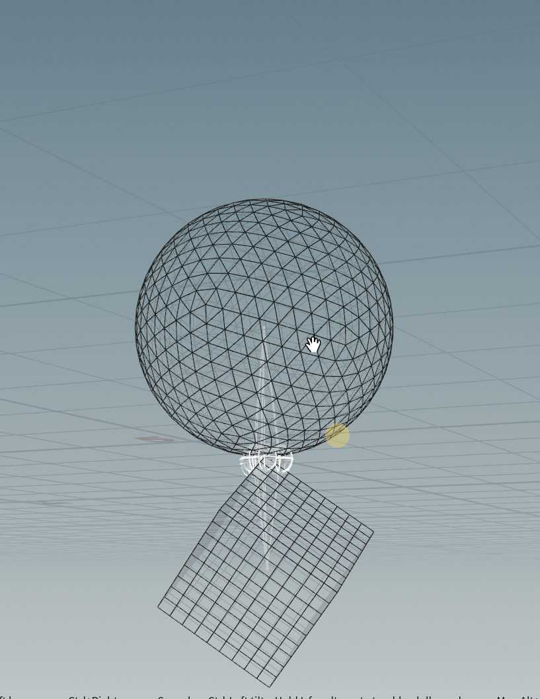

## rbd

- 1. #### self insert
可以用这个函数rbd自动算到不穿插
```python
i@found_overlap=1;
```
follow  ani
```python
v@v=-(@P-point(1,'P',i@idd))*ch('scale');
```

- 2. #### rbd constraint

<a href="/hip_files/animated_pin.hip" target="_blank" download>📦 下载animated_pin.hip</a>