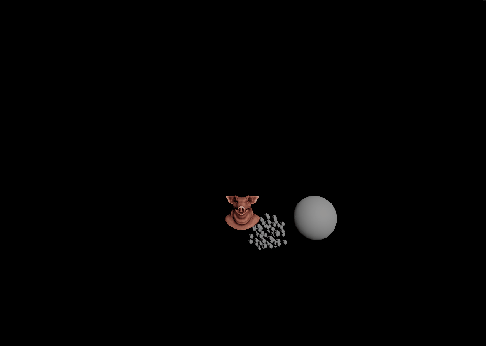
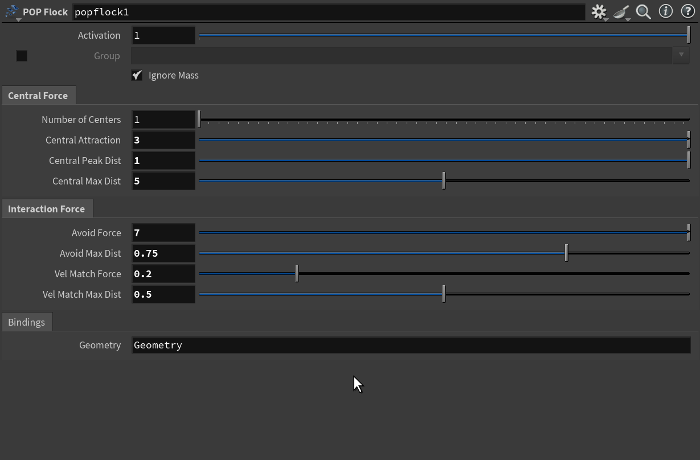

## solver

### 1.Fish_BaitBall

让ai写了个鱼群算法

<a href="/hip_files/Fish_BaitBall.hip" target="_blank" download>📦 下载Fish_BaitBall.hip</a>

houdini 中也内置了一个节点 popflock

* *  Number of Centers（中心数量）
    * 设定粒子群会聚集成多少个独立的子群体中心。
    * 影响：如果是 1，所有粒子都试图向一个中心靠拢；如果是多个（例如 3），粒子会自动分裂并向各自最近的中心聚集，形成几个独立的小群体。（注意：增加此值会明显降低仿真计算速度）。

* * Central Attraction（中心吸引力）
    * 粒子被拉向其群体中心的力量强度。
    * 影响：数值越大，粒子向中心收缩、抱团的趋势越强烈；数值太小，粒子群会显得非常松散。

* * Central Peak Dist（中心峰值距离）
    * 吸引力达到最大值时的中心半径距离。

Interaction Force（相互作用力）
这一组参数控制粒子与周围邻近粒子之间的互动，是让群体看起来有“灵性”且不会死板重叠的关键。

* * Avoid Force（排斥/避让力）
    * 粒子之间为了避免碰撞和重叠而产生的互相推开的力量。
    * 影响：数值越高，粒子之间保持的警惕性越高，不会挤成一团。对应鸟群算法中的“Separation（分离）”。

* * Avoid Max Dist（最大避让距离）
    * 粒子触发避让行为的安全社交距离（半径）。
    * 影响：当两个粒子的距离小于这个值时，它们就会开始产生 Avoid Force 互相排斥；如果大于这个距离，则互不干扰。

* * Vel Match Force（速度匹配力）
    * 粒子尝试与周围邻居保持相同运动方向和速度的力量。
    * 影响：数值越高，粒子群的动作越整齐划一，能做出非常丝滑的集体转弯、集体冲刺效果。对应鸟群算法中的“Alignment（对齐）”。

* * Vel Match Max Dist（速度匹配最大距离）
    * 粒子在寻找“谁是我的邻居”时的侦测半径。
    * 影响：粒子只会观察这个半径范围内的其他粒子并模仿它们的速度。如果设置得太大，粒子会试图和很远处的同伴对齐，导致整片粒子运动过于僵硬。

<a href="/hip_files/ff_bullet_fish_align.hiplc" target="_blank" download>📦 下载ff_bullet_fish_align.hiplc</a>
    