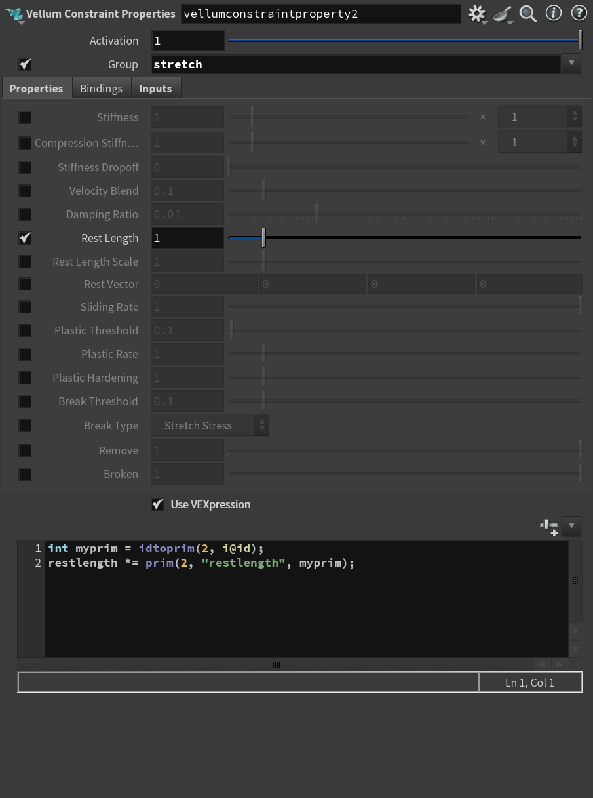

## Vellum

### 1.




```vex
int myprim = idtoprim(2, i@id);
restlength *= prim(2, "restlength", myprim);
```

* 这里为啥不能这样:`prim(2, "restlength", @primnum)`;

  用为vellum解算中,会一直迭代primnum,prim会变

* idtoprim && attributePromote区别

| 特性 | idtoprim(vex) | Attribute Promote(sop) |
| :--- | :--- | :--- |
| **核心目的** | **搜索/定位**：通过ID查找编号。 | **转换/聚合**：改变类的属性（点变面等）。 |
| **输入要求** | 需要唯一存在的 `id` 属性。 | 不需要ID，基于几何拓扑结构。 |
| **计算方式** | 一对一的精准指向。 | 多对一（聚合）或多对一（复制）。 |
| **比喻** | 在通讯录里通过姓名（ID）搜手机号。 | 出全班（点）的平均分给班级算（面）。 |

<a href="/hip_files/UpdatingConstraints_Teaser_v01.hiplc" target="_blank" download>📦 下载UpdatingConstraints_Teaser_v01.hiplc</a>
