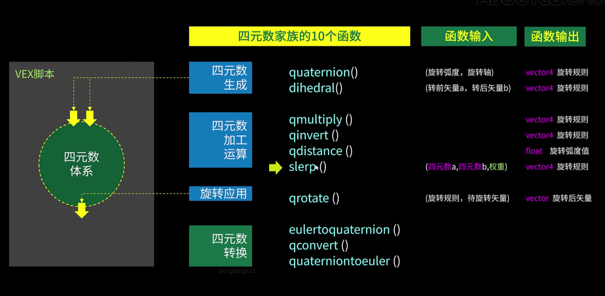
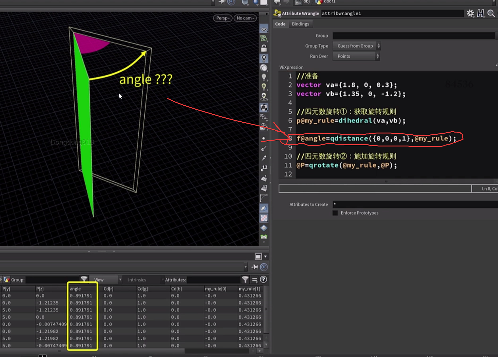
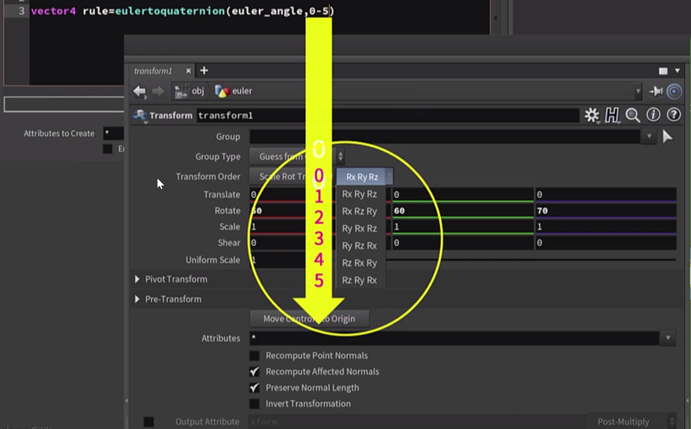

 





四元数转换




案例卷曲：

分析


过程稿1.

```python
float angle=radians(chf('angle'));
vector zhou={0,1,0};

//数组变量 p
vector myp[];

for(int k=0;k<@numpt;k++) {
    vector pose=point(0,'P',k);
    append(myp,pose);
    //printf("%s\n",myp);
    
    
    }
//大循环确定旋转中心

for(int t=0;t<@numpt;t++){    
    //1.读取旋转中心位置 
    vector xin =myp[t];
    
    
    
    
    //2.构建以此为中心的旋转规则（四元数）
    vector4 rot=quaternion(angle,zhou);
    
    
    //小循环。针对当前中心点，依次转动它后面的每个点
    for(int h=t+1;h<@numpt;h++){
        //读取旋转点的位置
        vector startp=myp[h];
        //归中心
        vector movep=startp-xin;
        //旋转
        vector rotatep=qrotate(rot,movep);
        //复位
        vector finalp=rotatep+xin;
        
        
        //把这个点写入、更新数组
        myp[h]=finalp;
     }
 
// //最后 把数组中最后的各点位置，给到对应每个点的位置p
 
     setpointattrib(0,'P',t,myp[t],'set');
 
 }
  

```


2.细化


优化

```python
float angle=radians(chf('angle'));
vector zhou={1,0,0};

//数组变量 p
vector myp[];

for(int k=0;k<@numpt;k++) {
    vector pose=point(0,'P',k);
    append(myp,pose);
    //printf("%s\n",myp);
    
    
    }
//大循环确定旋转中心

for(int t=0;t<@numpt;t++){    
    //1.读取旋转中心位置 
    vector xin =myp[t];
    
    
    
    
    //2.构建以此为中心的旋转规则（四元数）
    float maxrot=chf('maxrot');
    float myu=point(0,'curveu',t);
    float angle=chramp('rampangle',myu);
    angle=fit01(angle,0,maxrot);
    angle=radians(angle);
    
    vector4 rot=quaternion(angle,zhou);
    
    
    //小循环。针对当前中心点，依次转动它后面的每个点
    for(int h=t+1;h<@numpt;h++){
        //读取旋转点的位置
        vector startp=myp[h];
        //归中心
        vector movep=startp-xin;
        //旋转
        vector rotatep=qrotate(rot,movep);
        //复位
        vector finalp=rotatep+xin;
        
        
        //把这个点写入、更新数组
        myp[h]=finalp;
     }
 
// //最后 把数组中最后的各点位置，给到对应每个点的位置p
 
     setpointattrib(0,'P',t,myp[t],'set');
 
 }
  

```


[qrot.hip](attachments/WEBRESOURCEa0e6818a254ba3fa12ce37682fd68a7bqrot.hip)