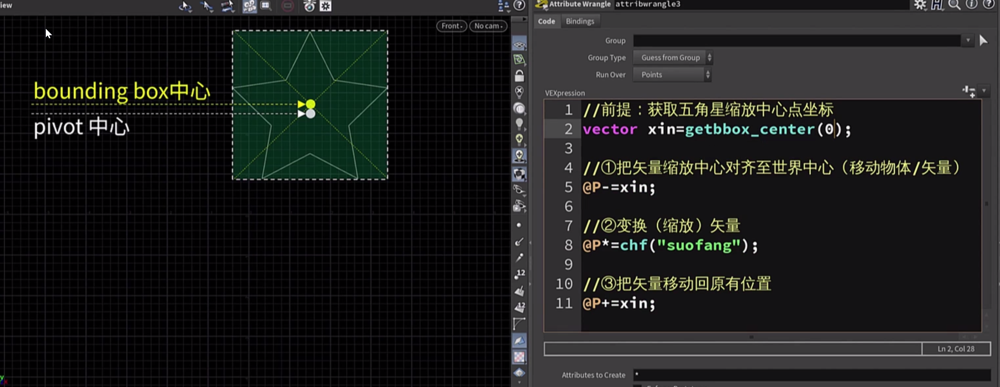
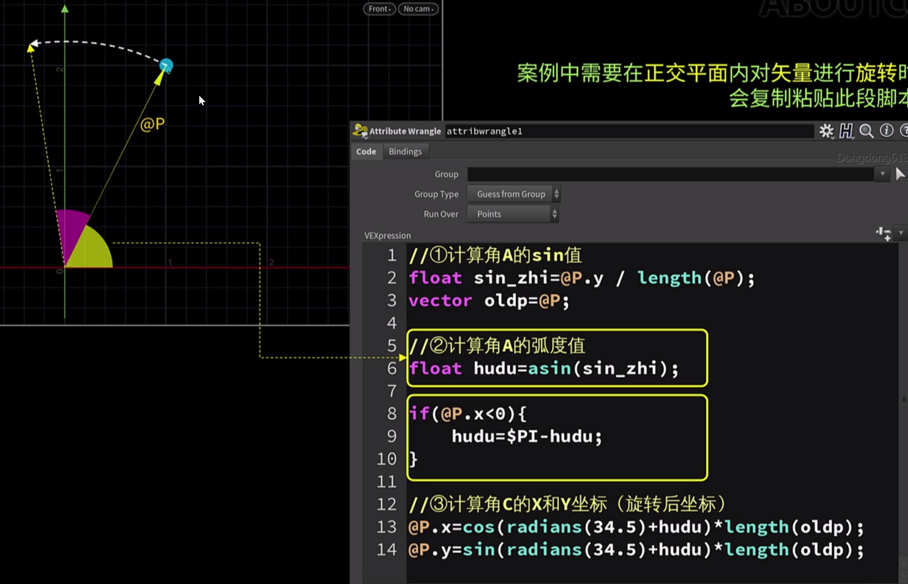
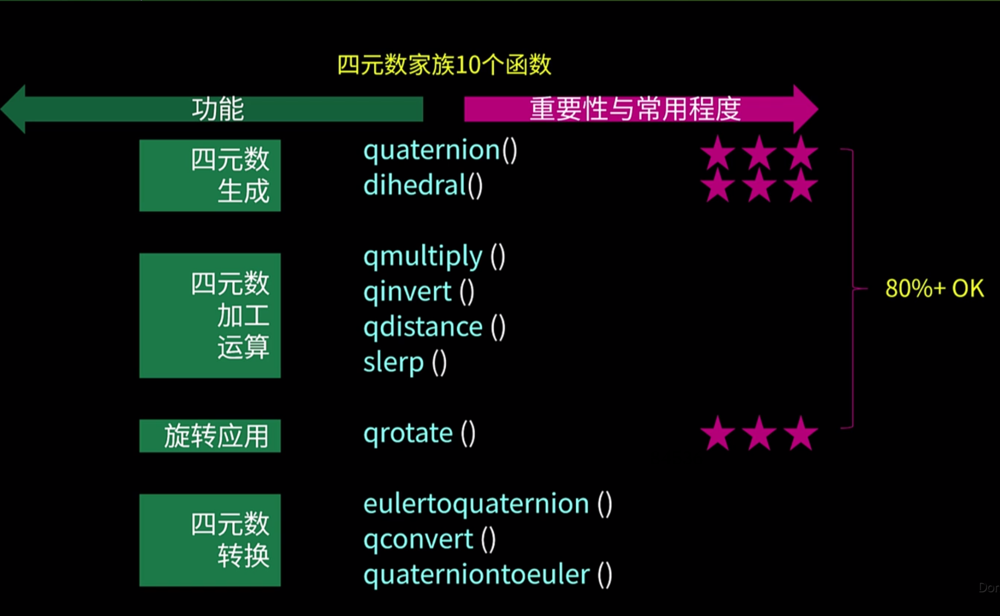
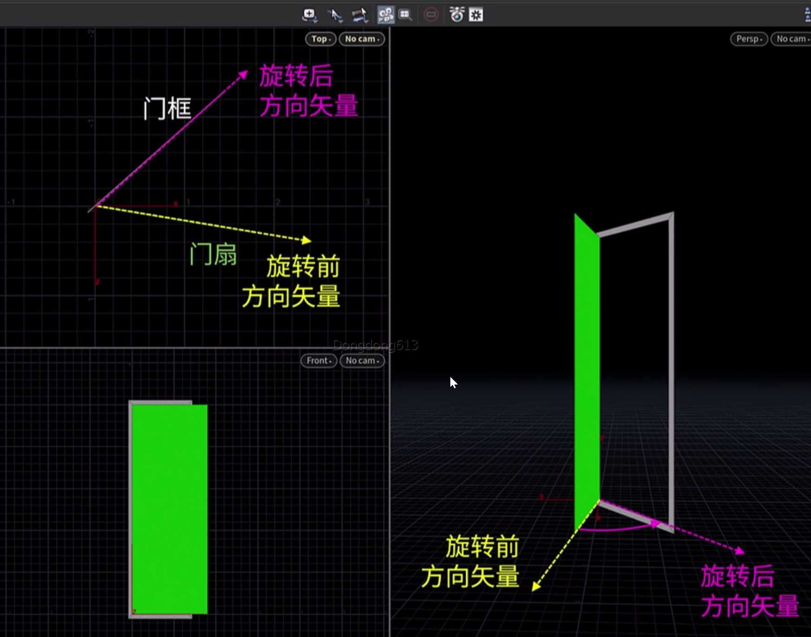
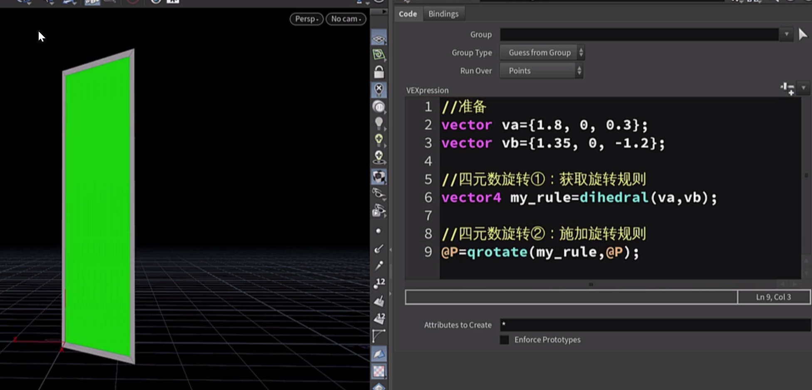
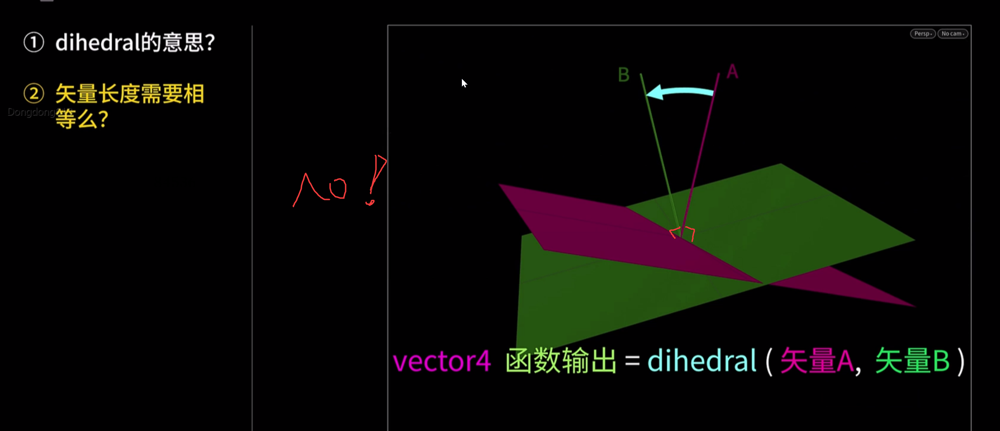
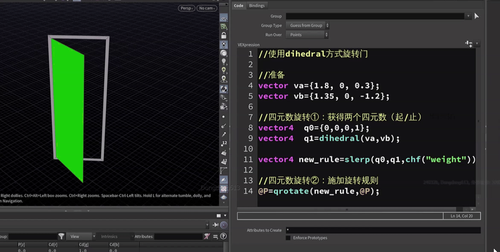
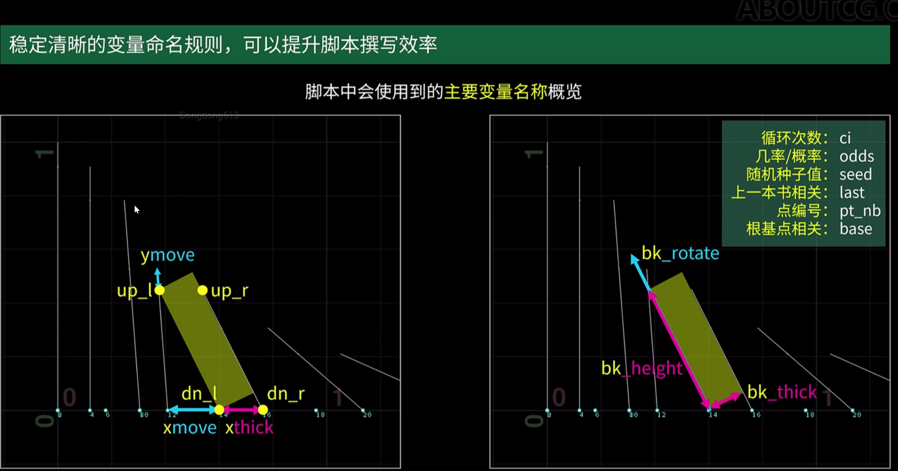
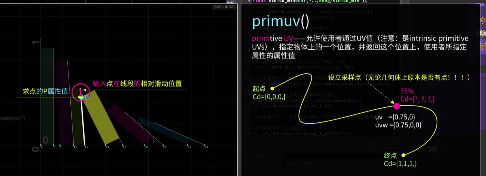

***三角函数  && 四元数 矩阵***

1.

tip：点有位置信息（

三角函数 旋转

2.

 

四元数的

dihedral

向量a -----向量b  （定义规则  再用qrotate旋转）

不需要归一下操作

eg：想获取关门的整个经过可以用函数 

q0 =0   q1=1  qt=0.5

 

书本堆叠案例

分析：

书本厚度

线变书

[qrot.hip](attachments/WEBRESOURCEef3d37996b208a16409816c00a73d290qrot.hip)