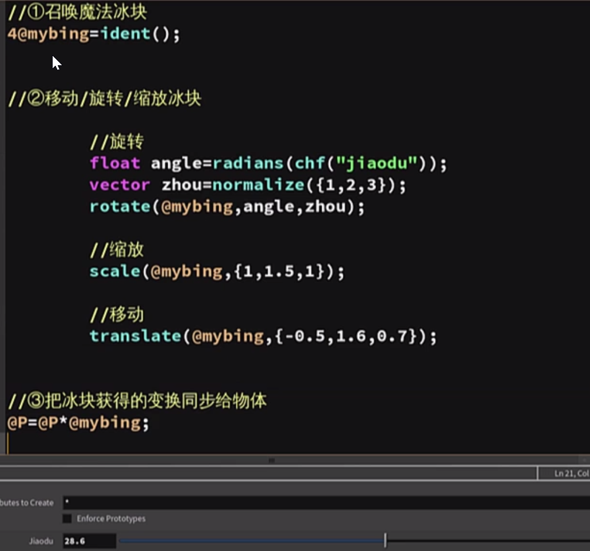
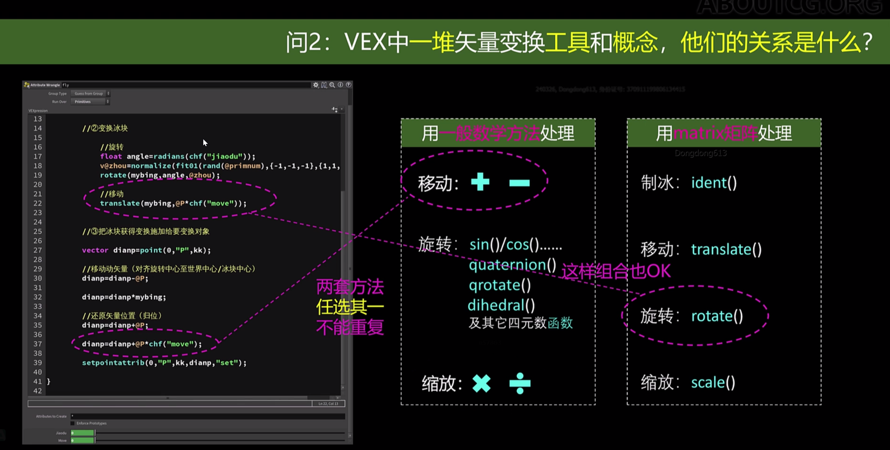

Part1  matrix能干什么用

移动.旋转.缩放

Part 2  如何使用




part 3  3类函数之间的关系

可以混合使用 并非一定是一类




** **


**可以参考之前自己的笔记**

[记矩阵基础概念-CSDN博客](https://blog.csdn.net/JACKLONGFX/article/details/135269163?spm=1001.2014.3001.5502)

```python
i[]@dian;
@dian=primpoints(0,@primnum);

matrix indx =ident();
    float angle=radians(chf('angle'));
    vector axis=normalize(fit01(rand(@primnum),{-1,-1,-1},{1,1,1}));
    rotate(indx,angle,axis);
    
    
    scale(indx,(1,2,1));
    
    
    translate(indx,@P*ch('move'));
foreach(int kk;@dian){

    vector dianp=point(0,'P',kk);
    dianp-=@P;
    dianp*=indx;
    dianp+=@P;
    //dianp+=@P*ch('move');

    setpointattrib(0,'P',kk,dianp,'set');


}
    
    


```

[matrix_01.hip](attachments/WEBRESOURCE8146224d612769e80c6977f9a2455b04matrix_01.hip)