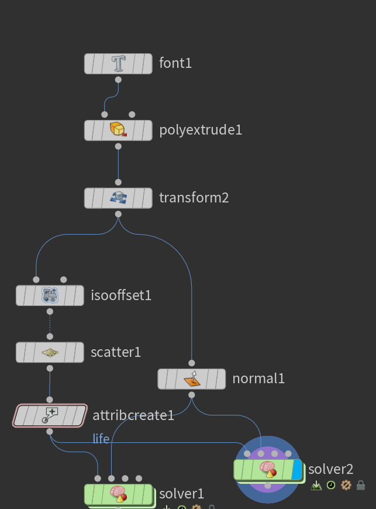

```python

float maxdist = chf("dist");
int pts[] = nearpoints(0, @P, maxdist);

vector vel = set(0,0,0);
float mindist = 999999;
for(int i=0; i<len(pts); i++){
    int pt = pts[i];
    if(@ptnum != pt){
        vector pos = point(0, "P", pt);
        
        vector dir = normalize(@P - pos);
        float dist = distance(@P, pos);
        float mult = fit(dist, 0, maxdist, 1.0, 0.0);
        dir *= mult;
        vel += dir;
        
        if(dist < mindist){
            mindist = dist;
        }
    }
}

vel /= float(len(pts));

vel *= chf("speed");

@P += vel;

// boundary(@ptnum, @P);

i@life += 1;

float next = fit(rand(@P + @ptnum * 3.435 + @Frame * 0.3463), 0.0, 1.0, 30, 150);
if(i@life > next && npoints(0) < chi("max_pt") && mindist > maxdist * 0.5){
    
    vector offsetv = normalize(vel);
    vector randv = rand(@P + @Frame * 5.352);
    randv = normalize(sample_sphere_uniform(randv)) * 0.25;
    offsetv += randv;
    
    vector offset = normalize(offsetv) * maxdist * 0.01;
    
    vector newpos = @P + offset;
    int newpt = addpoint(0, newpos);
    // boundary(newpt, newpos);
    
    setpointattrib(0, "life", newpt, 0);
    
    i@life = 0;
}

```

solver 中



```python
// 1. 获取参数和邻居点列表
float maxdist = chf("dist");                   // 从参数面板读取“dist”通道，作为最大搜索距离
int pts[] = nearpoints(0, @P, maxdist);        // 在输入几何（索引 0）中，以当前点 @P 为中心，查找半径为 maxdist 内的所有点

// 2. 初始化变量
vector vel = set(0,0,0);                       // 用于累计的速度向量，初始为零
float mindist = 999999;                        // 用来记录当前点到最近邻点的最小距离，初始设为一个很大值

// 3. 遍历所有邻居点，计算排斥／吸引向量
for(int i=0; i<len(pts); i++){
    int pt = pts[i];
    if(@ptnum != pt){                          // 排除自身
        vector pos = point(0, "P", pt);        // 读取邻居点的坐标

        // 3.1 计算方向与距离
        vector dir  = normalize(@P - pos);    // 方向：从邻居指向自己
        float dist  = distance(@P, pos);      // 两点间距离

        // 3.2 按距离做插值权重：离得越近权重越大（1→0）
        float mult  = fit(dist, 0, maxdist, 1.0, 0.0);

        dir *= mult;                           // 乘以权重后得到最终排斥（或吸引）向量
        vel += dir;                            // 累加到总速度

        // 3.3 更新最近邻距离
        if(dist < mindist){
            mindist = dist;
        }
    }
}

// 4. 归一化速度并应用速度参数
vel /= float(len(pts));                        // 对所有邻居方向求平均
vel *= chf("speed");                           // 再乘以“speed”参数，控制整体移动速度

// 5. 更新点的位置
@P += vel;                                     // 在当前点位置上加上计算出的速度偏移

// 6. 边界处理（用户自定义函数）
boundary(@ptnum, @P);                          // 调用 boundary 函数，可能用于限制点在某个区域内

// 7. 生命计数器
i@life += 1;                                   // 整型属性 life 每帧递增

// 8. 随机生成新点的逻辑
//    - 先根据当前点位置、点号和帧号生成一个随机生命周期阈值 next
float next = fit(
    rand(@P + @ptnum * 3.435 + @Frame * 0.3463),
    0.0, 1.0, 30, 150
);

//    - 当满足以下条件时，生成新点：
//      a. 当前寿命超过阈值 next
//      b. 点总数未超过“max_pt”参数限制
//      c. 与最近邻的距离大于 maxdist*0.5，避免聚得过密
if(i@life > next && npoints(0) < chi("max_pt") && mindist > maxdist * 0.5){
    
    // 8.1 计算新点的偏移方向：在当前速度方向上加上一点随机扰动
    vector offsetv = normalize(vel);
    vector randv   = rand(@P + @Frame * 5.352);                 // 产生一个随机向量种子
    randv = normalize(sample_sphere_uniform(randv)) * 0.25;    // 将随机向量归一化并缩小
    offsetv += randv;                                           // 合成最终偏移方向
    
    // 8.2 按 maxdist*0.01 缩放偏移向量，得到新点位置
    vector offset = normalize(offsetv) * maxdist * 0.01;
    vector newpos = @P + offset;

    // 8.3 添加新点，并初始化属性
    int newpt = addpoint(0, newpos);                            // 在几何上新增一个点
    boundary(newpt, newpos);                                    // 同样做一次边界限制
    setpointattrib(0, "life", newpt, 0);                        // 新点的 life 属性设为 0

    // 8.4 重置当前点的 life 计数
    i@life = 0;
}
整体思路
邻居检测：通过 nearpoints() 找到一定半径内的其它点。

排斥／吸引力计算：对每个邻居，按距离做线性插值，距离越近排斥力越强；再将所有排斥向量平均，得到当前点的速度增量。

位置更新：乘以速度参数后直接移动点的位置。

生命周期管理：给每个点维护一个 life 计数器，当超过随机阈值且条件允许时，会在附近“生”出一个新点，同时将自己的 life 重置。

边界限制：每次移动或新增都会调用 boundary()，通常用来把点固定在一定的形状或范围内（比如盒子、球体等）。
```