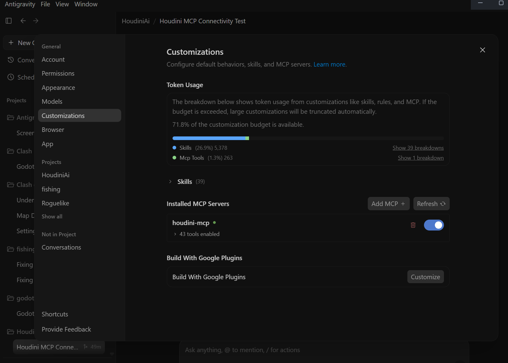
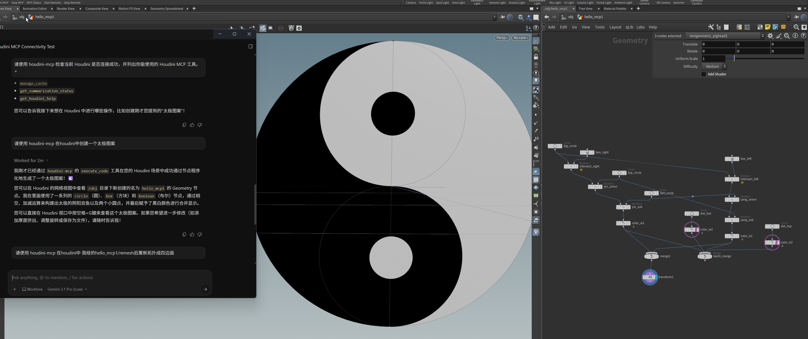

# 基础介绍

这是我学习 Houdini 时的笔记.

### 关于Houdini_mcp的安装

* 安装地址：https://github.com/oculairmedia/houdini-mcp
1. * 下载完后 复制该软件包的 JSON 格式数据到 
* —— C:\Users\ben.xue\Documents\houdini21.0\packages
* ```python
    {
        "env": [
            {
                "HOUDINI_MCP_ROOT": "D:/houdini-mcp/houdini_plugin"
            },
            {
                "PYTHONPATH": {
                    "value": "$HOUDINI_MCP_ROOT/python",
                    "method": "prepend"
                }
            }
        ],
        "hpath": "$HOUDINI_MCP_ROOT",
        "show": true
    }
    ```
* 上面只是把ui安装好了
2. * 现在安装FastMcp
* powerShell 管理员身份运行 —— 
* ```python
    cd "C:/Program Files/Side Effects Software/Houdini 21.0.440/bin/"
    ./hython.exe -m pip install fastmcp
    ```
* <mark> 如果在途中遇到不行，很可能是prism冲突 </mark>
    * C:\Program Files\Prism2\PythonLibs\Python311\
    * 在这个文件夹里，找到跟 win32 相关的文件夹（根据刚才的路径，至少有两个）：
    * 将 win32 文件夹重命名为 _win32_backup
    * 将 pywin32_system32 文件夹重命名为 _pywin32_system32_backup
    * (如果有 pythonwin 这个文件夹，也重命名为 _pythonwin_backup)

3. * 接下来配置ai的mcp
    * C:\Users\ben.xue\.gemini\config\mcp_config.json
    * ```python
        {
        "mcpServers": {
            "houdini-mcp": {
            "serverUrl": "http://127.0.0.1:3055/mcp"
            }
        }
        } 
        ```
    在运行    
    * ```python
        cd D:\houdini-mcp\
        py -m venv .venv
        .\.venv\Scripts\Activate.ps1
        pip install -r requirements.txt
        ```
    安装完毕之后
    * ```python
        $env:HOUDINI_HOST="127.0.0.1"
        $env:HOUDINI_PORT="18811"
        $env:MCP_PORT="3055"
        $env:MCP_TRANSPORT="http"

        python -m houdini_mcp
    ```
* 在anitigravity中刷新mcp



* 提问起手：请使用 houdini-mcp 在houdini中

