1. ### John Kunz Bubble FX  class
class:[https://www.youtube.com/watch?v=-2UkS_qvAFw](https://www.youtube.com/watch?v=-2UkS_qvAFw)

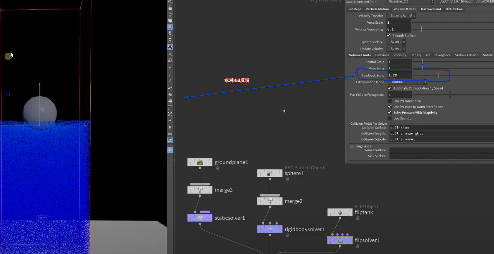
通过surface场给到颜色 
就能获取到体积内外(内是负数)做气泡的时候就可以颜色删除外面的
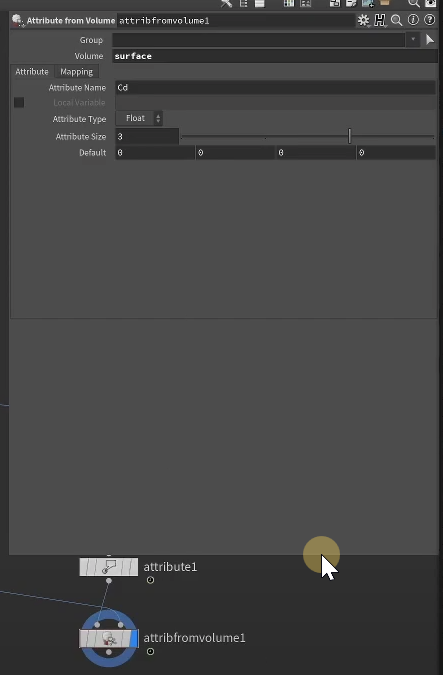

2. ### 海怪出水
class：https://www.bilibili.com/video/BV1vC411G77c?p=8&vd_source=044ee2998086c02fedb124921a28c963

1.自定义速度随机
好处:noise只会影响方向(不会影响大小,6指频率快慢)
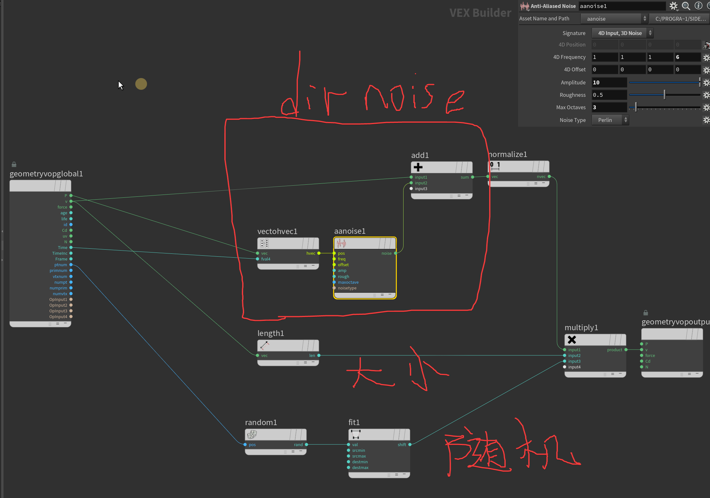

2.加粒子方向
管道更像粒子方向++还需要控制粒子量通过速度(静止的就不需要太多粒子)
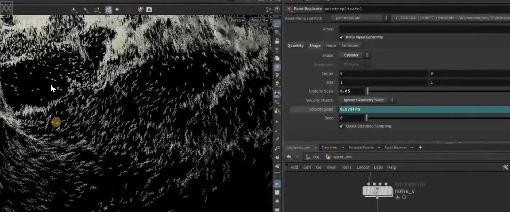
```vex
@replicate = clamp(length(@v)*0.1,1,ch('max_pts'));
@P += @v * 0.4/24;
```
3.noise+平滑
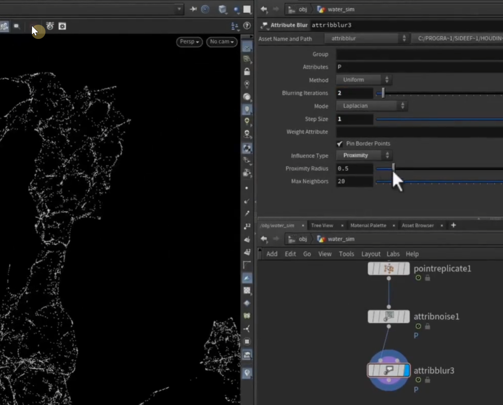
4.在复制并且添加life
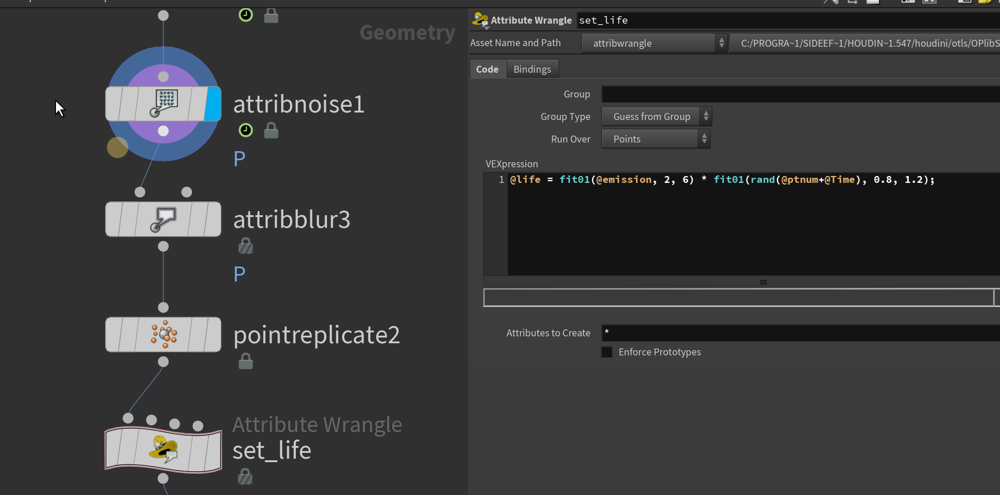
```vex
@life = fit01(@emission, 2, 6) * fit01(rand(@ptnum+@Time), 0.8, 1.2);
```
5.dop检测粒子浓度 ratio粒子稀疏
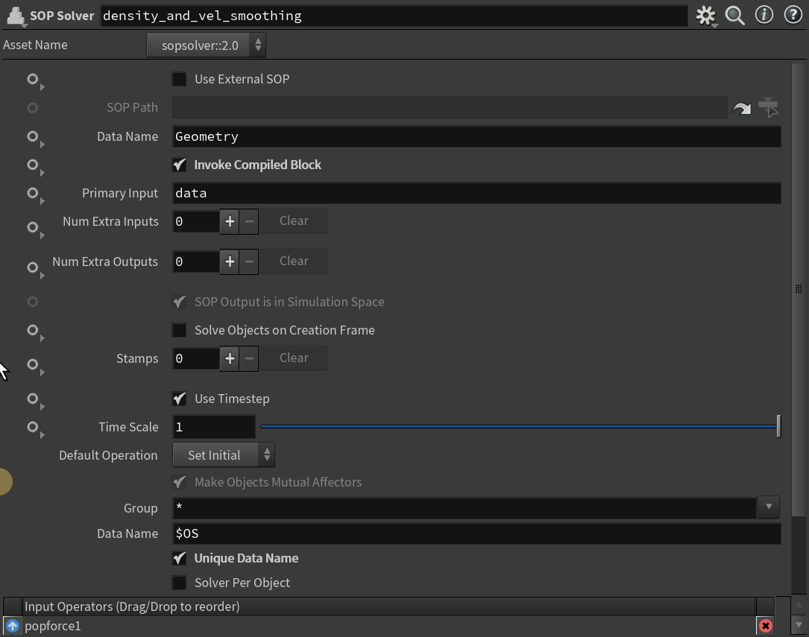
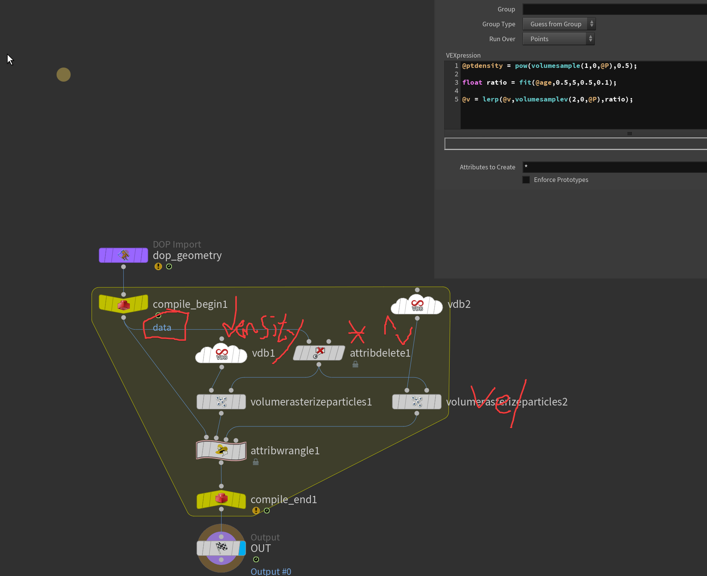
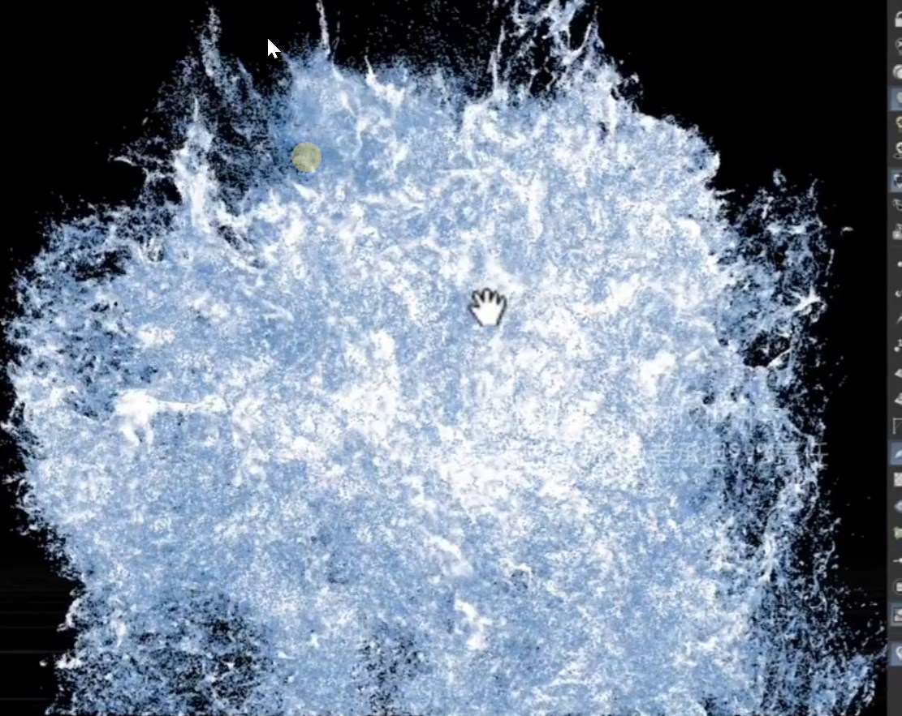
6.以此来控制不同力
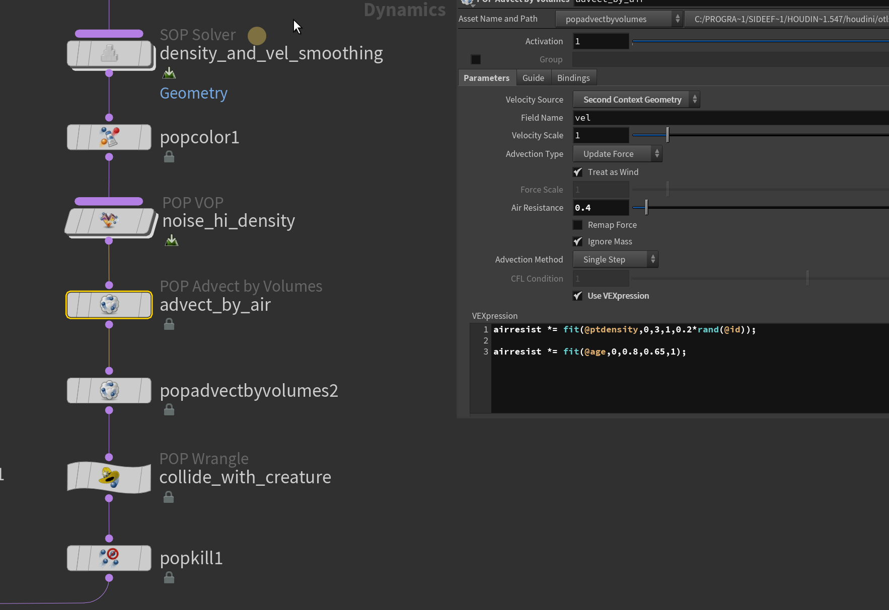
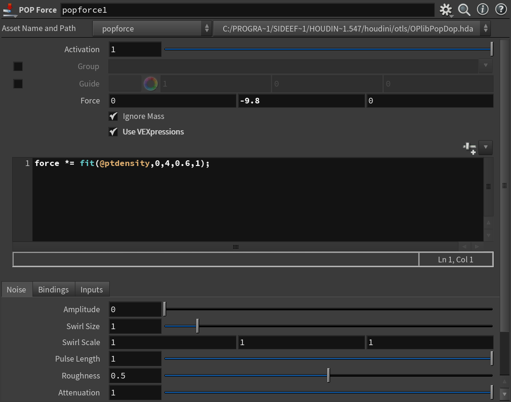
```vex
@depth = volumesample(0,'surface',@P-0.05);
if (@depth < 0){
vector grad = normalize(volumegradient(0,'surface',@P));
@P -= grad * @depth;
}
```

7.避免surface遮住,推出一些表面
第一端口为水面vdb
```vex
@depth = volumesample(0,'surface',@P-0.05);
if (@depth < 0){
vector grad = normalize(volumegradient(0,'surface',@P));
@P -= grad * @depth;
}
```

8.粘连
```vex
@depth = volumesample(0,'surface',@P-0.05);
if (@depth < 0){
vector grad = normalize(volumegradient(0,'surface',@P));
@P -= grad * @depth;
vector collisionvel = volumesamplev(0,'vel',@P); 
vector reflvel = reflect(@v,grad);
reflvel -= grad * dot(grad,reflvel) * 0.9;
float bias = fit01(rand(@id+145),0.05,0.15);
@v = lerp(reflvel,collisionvel,0.1);
}
```
09.以相机为mask删除物体背面的 
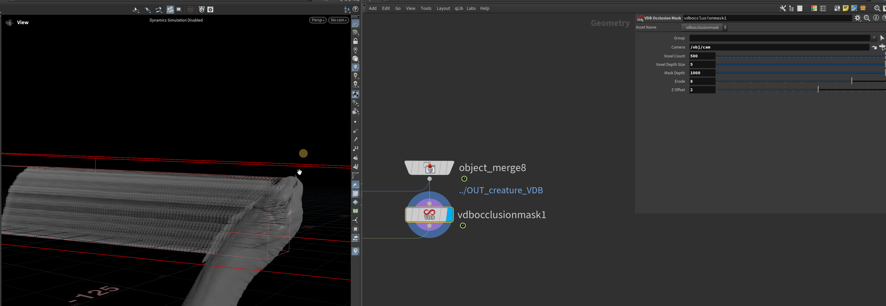

```vex
if (volumesample(1, 0, @P) < 0.001 || volumesample(2, 0, @P) > 0.001) @group_remove = 1;
@normalized_age = @age/@life;
```

<a href="/hip_files/SeaMonster_Pt_1.hip" target="_blank" download>📦 下载SeaMonster_Pt_1.hip</a>


3. ### 闪电

视频地址：【Houdini 高级魔法特效-拳头丨闪电 / 魔法 / 气浪 / 尾焰】 https://www.bilibili.com/video/BV1bM16BuE33/?p=7&share_source=copy_web&vd_source=987ac00c9778f6f4d5940dbd361c5b99

* 向量投影
* 在三维空间中，向量投影，简单来说就是将一个向量“投射”到另一个向量（或平面）上，观察它在那个方向上的“影子”有多长、指向哪里。
* 通常我们讨论的是点对点的向量投影，即向量 a 在向量 b 上的投影。
* 公式

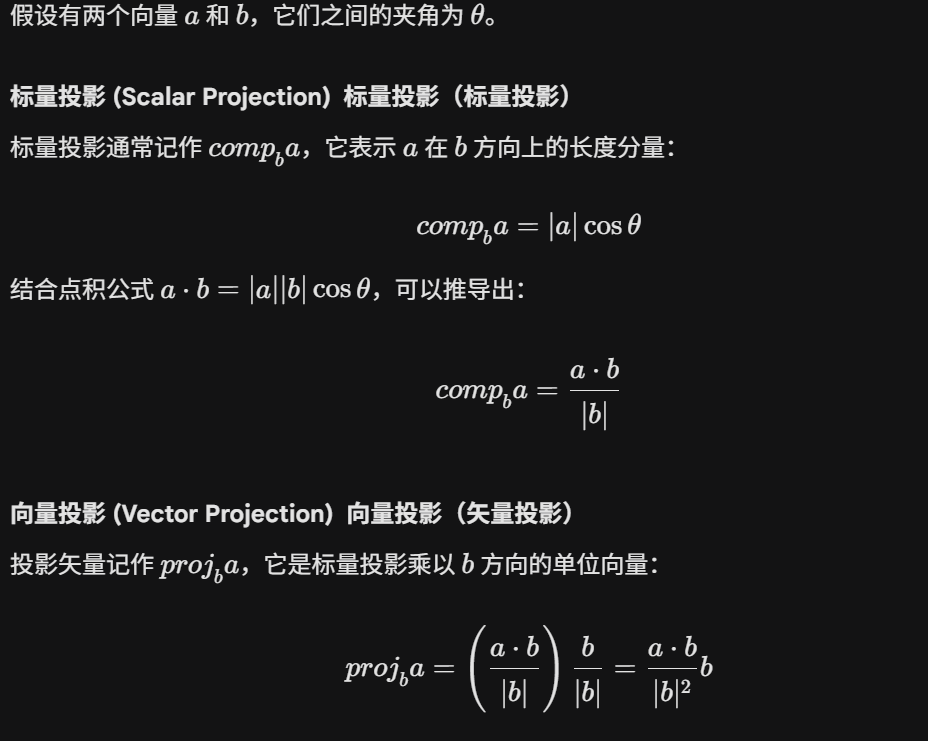

* gif

绿色为投影向量(y轴不是)

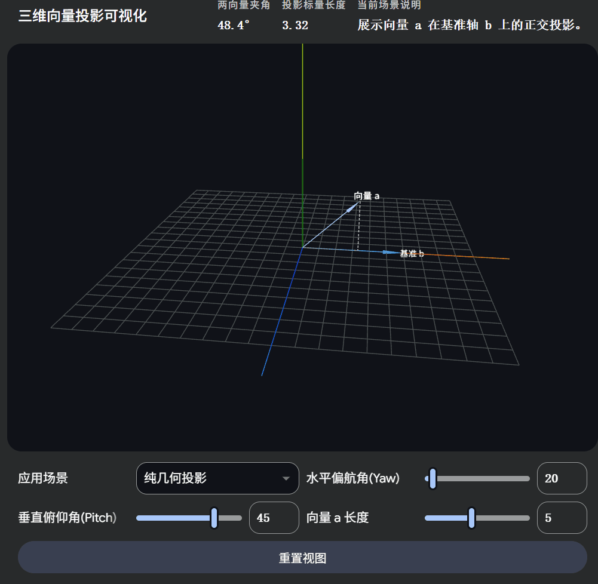

* 垂直性： 向量a与其投影proj_ba 之间的差向量（即 a-proj_ba）必然垂直于b。这在施密特正交化（Gram-Schmidt process）中非常关键。
* 方向性： 
    * 如果 $\theta < 90^\circ$，投影方向与 $\vec{b}$ 相同。
    * 如果 $\theta > 90^\circ$，投影方向与 $\vec{b}$ 相反。
    * 如果 $\theta = 90^\circ$，投影为一个零向量。

* 在houdini 中实现

houdini画一条线，求线的tan作为b向量，然后通过noise位置p，fit一下作为向量a.
那么我通过向量投影获得的投影矢量proj_ba 。

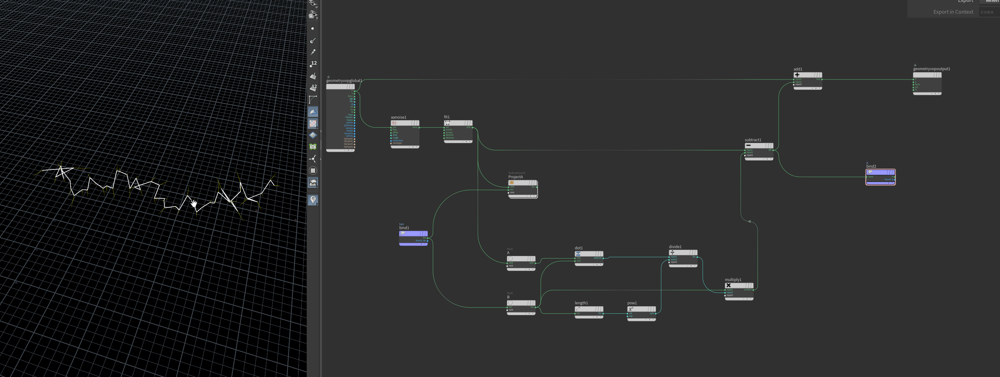

* 分析一下用不用投影向量区别
* 彻底明白“直接用向量a”和“减去投影”之间的致命区别，我们来看看它们在三维空间和实际特效制作中的不同表现

* 1.<mark>直接用向量a</mark>
    * 几何表现： 点会在三维空间中向四面八方乱跑。它不仅会向外鼓起（让你线变弯），还会顺着线本身的方向（切线方向）滑动。

    * 致命缺点： 线上原本均匀排列的点，会因为这种顺着线的随机滑动，变得有的地方挤在一堆，有的地方拉得很开。

    * Houdini 中的灾难： 如果你后续用 Sweep 节点在这条线上生成圆管，或者给这条线赋予 UV 贴图，你会发现圆管在点密集的地方挤压，在点稀疏的地方拉伸，UV 也会跟着严重扭曲。

* 2.<mark>加 Noise 并剔除切线投影</mark>
    * 几何表现： 点绝对不会沿着线的前后方向滑动，它们被死死限制在只能垂直于线的平面上向外推移。

    * 巨大优势： 无论 Noise 有多强烈，线在变得极其曲折的同时，线上所有的点在“轨道”上的相对距离和拓扑结构依然保持均匀。

    * Houdini 中的应用： 这是制作闪电、树枝、毛发卷曲等所有需要“保长/保参”位移（Displacement）的标准工业做法。后续的 Sweep 和 UV 操作都会非常完美、平滑。

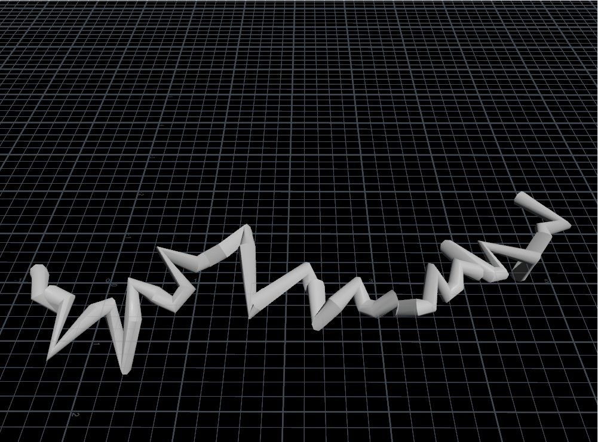


<a href="/hip_files/Lightning.hip" target="_blank" download>📦 下载Lightning.hip</a>

* 点在线上移动的三种办法（sop）

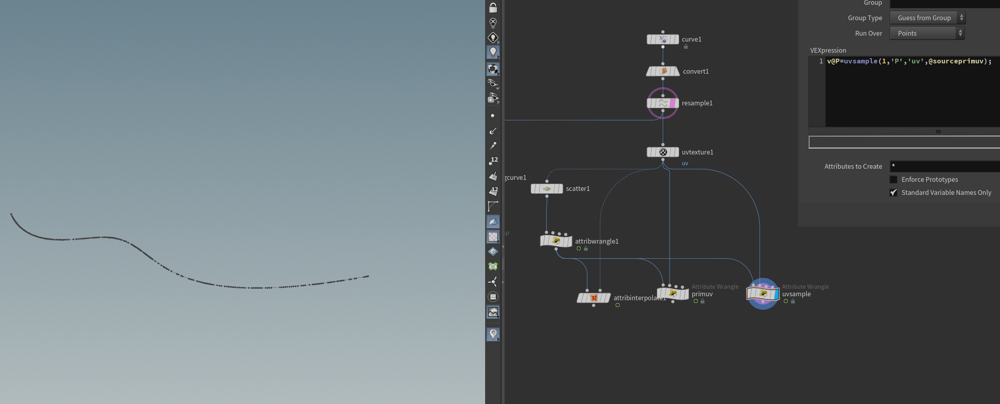

ani sourceprimuv

``` vex
v@sourceprimuv*=ch('ofst');
v@sourceprimuv%=5;
``` 

primuv

``` vex
v@P=primuv(1,'P',@sourceprim,@sourceprimuv);
```

uvsample

``` vex
v@P=uvsample(1,'P','uv',@sourceprimuv);
```

* 3.绕已知曲线旋转

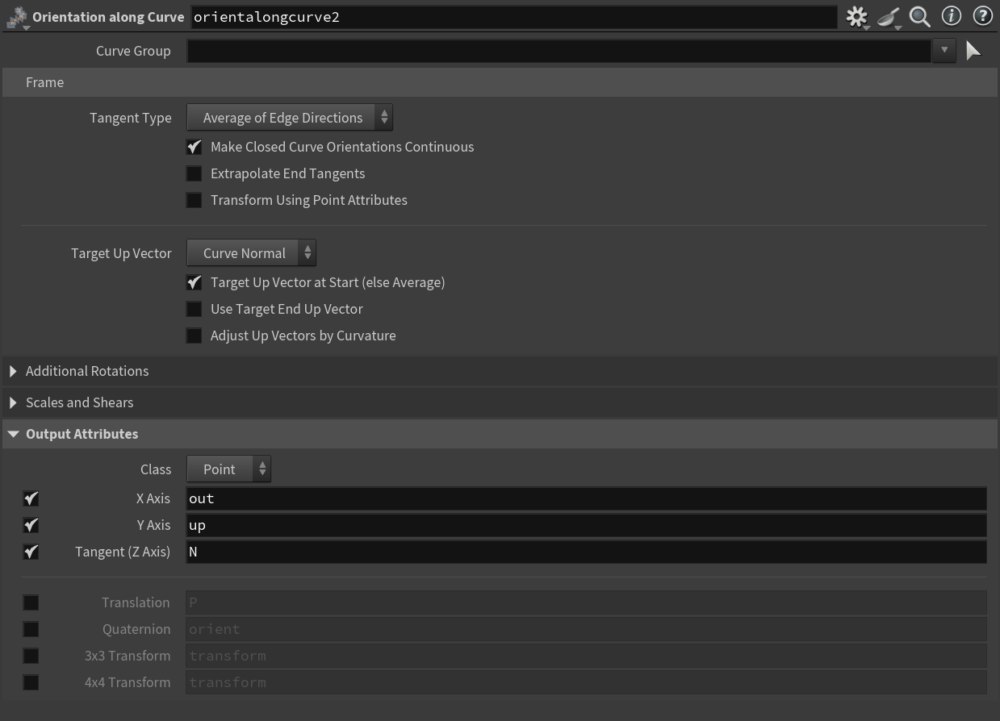


```vex
vector out =v@out;

vector tan=v@N;

float curveu =@curveu+chf('offset');

float angle =fit01(curveu%1.01,0,chf('twist_amount')); //%1.01防止猝陷

vector4 rotate=quaternion(angle,tan); //绕着tan(线)转的旋转规则

out =qrotate(rotate,out); //存到out里的旋转数据

@P+=out*ch('mult');

//v@out*=out;
```

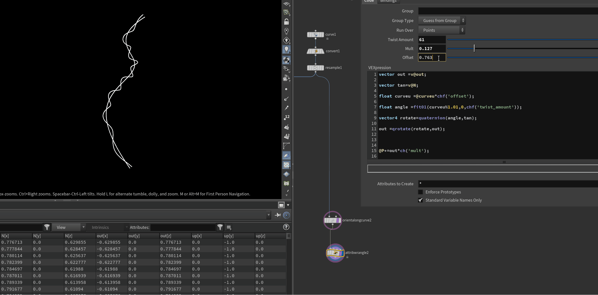


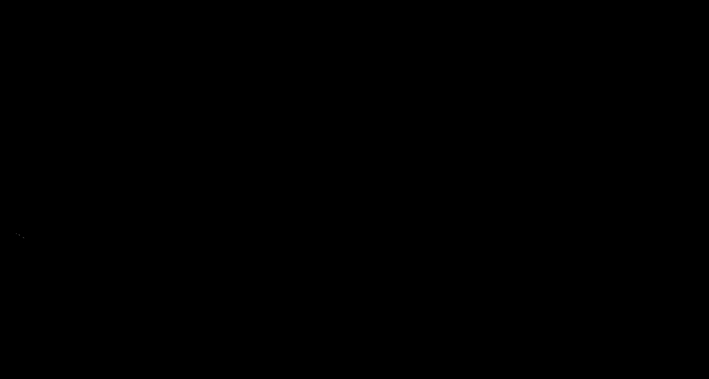

<a href="/hip_files/Lightning_plus.hip" target="_blank" download>📦 下载Lightning_plus.hip</a>


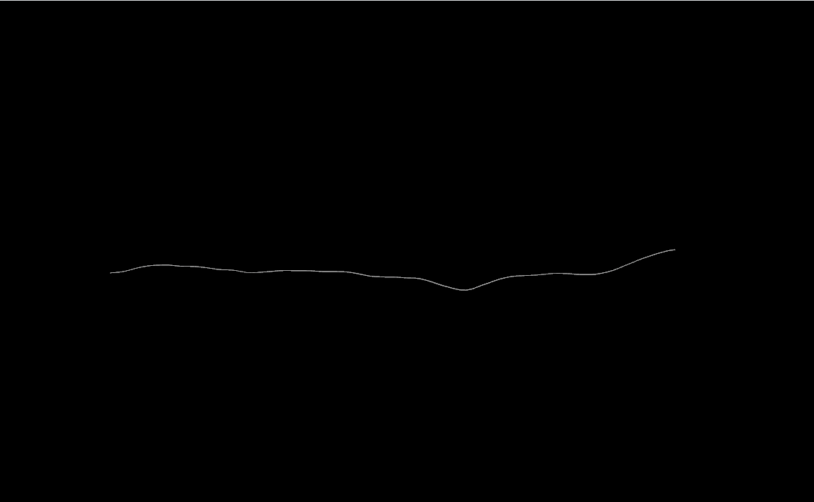

<a href="/hip_files/Lightning_fx.hip" target="_blank" download>📦 下载Lightning_fx.hip</a>


* 材质：

    * uv-u获得宽度渐变

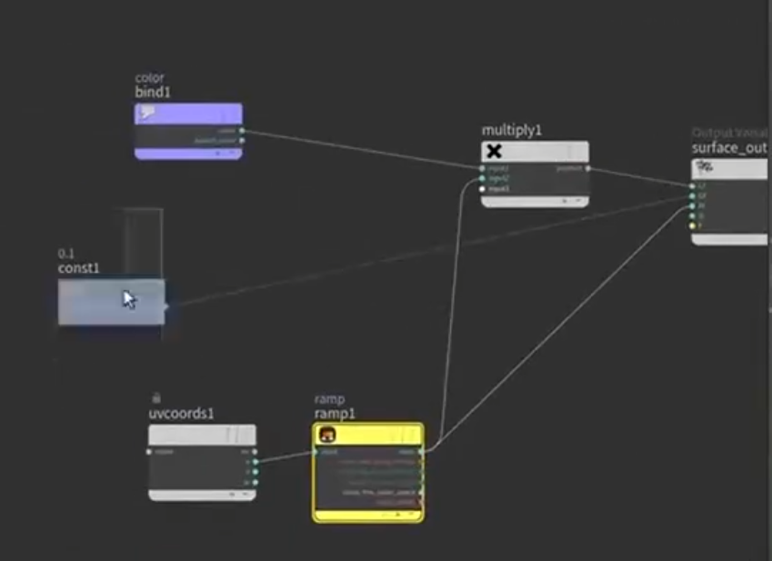


<a href="/hip_files/Lightning_otls.tar" target="_blank" download>📦 下载Lightning_otls.tar</a>
