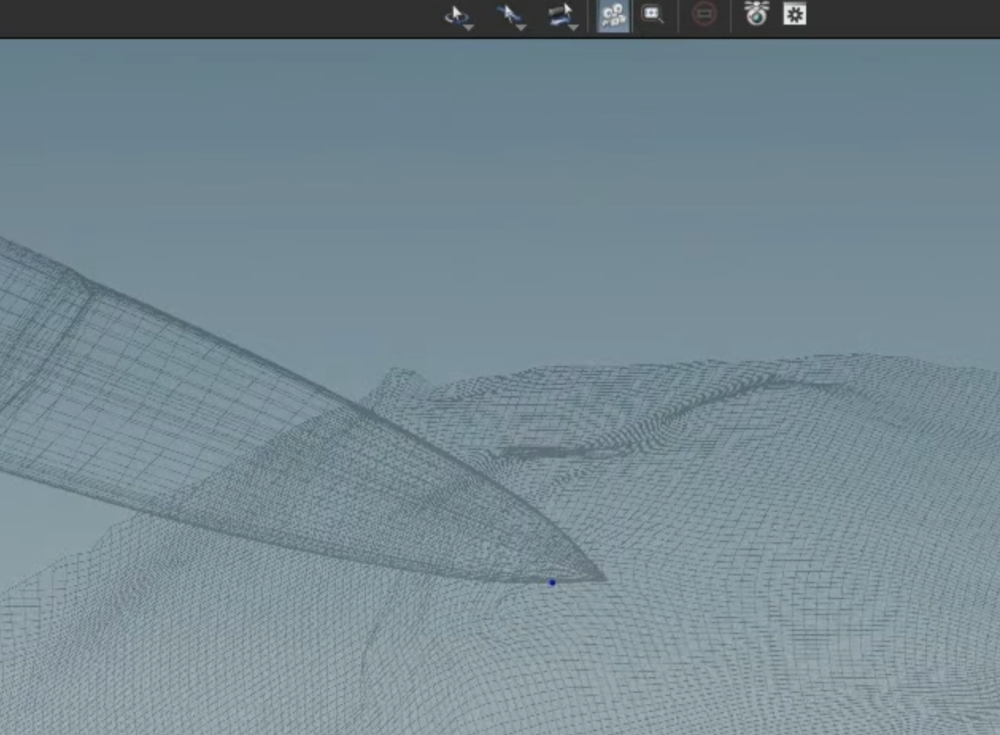
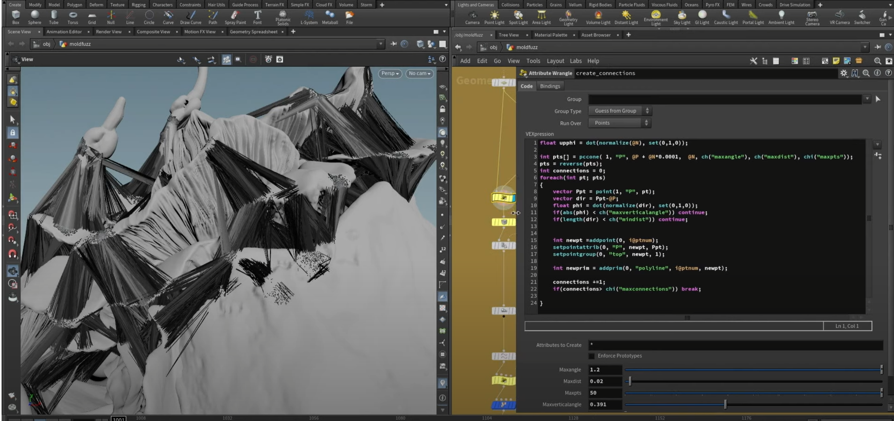
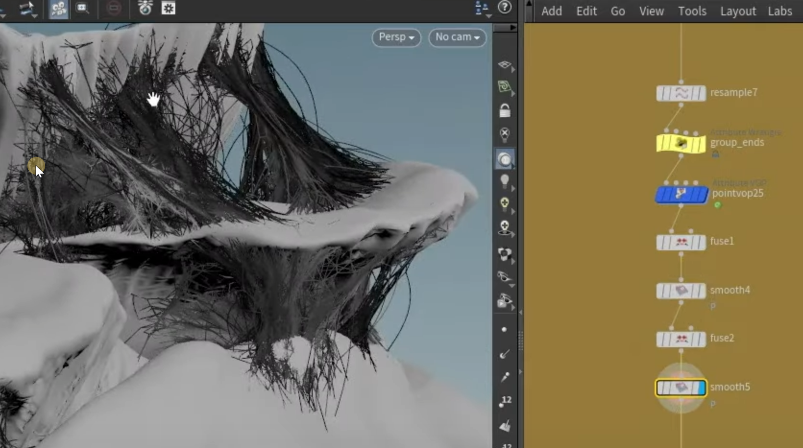
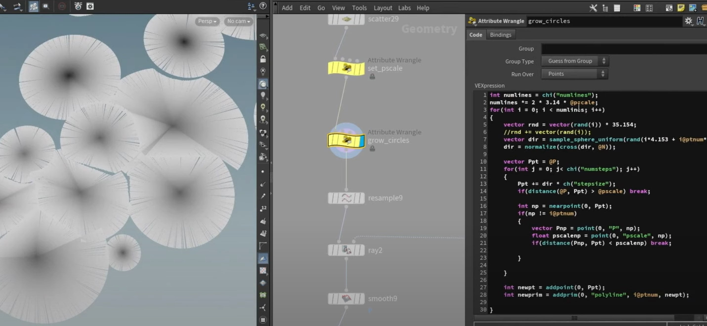

```python
int hitprim;
vector hituv;
f@dist=xyzdist(1,@P,hitprim,hituv);

v@rest=primuv(1,'rest',hitprim,hituv);
```

```python
if(@dist!=detail(0,'mindist',0))removepoint(0,@ptnum);
```

[zuidi.hip](attachments/WEBRESOURCE0347d0b82088a88056b5680d5240f9c9zuidi.hip)

   

[https://www.youtube.com/watch?v=3gzop14Ssrc](https://www.youtube.com/watch?v=3gzop14Ssrc)

菌丝：没仔细记录 得看原视频



```python
float upphi=dot(normalize(@N),set(0,1,0));

int pts[]= pccone(1,'P',@P+@N*0.0001,@N,ch('maxangle'),ch('maxdist'),chi('maxpts'));

pts =reverse(pts);

int connections=0;
foreach(int pt ; pts)
{
    vector Ppt=point(1,'P',pt);
    vector dir =Ppt-@P;
    float phi=dot(normalize(dir),set(0,1,0));
    if(abs(phi)<ch('maxverticalangle'))continue;
    if(length(dir)<ch('mindist'))continue;
    
    
    int newpt=addpoint(0,i@ptnum);
    setpointattrib(0,'P',newpt,Ppt);
    setpointattrib(0,'top',newpt,1);
    
    int newprim=addprim(0,'polyline',i@ptnum,newpt);
    
    connections+=1;
    
    if(connections>chi('maxconnections'))break;
}


```



