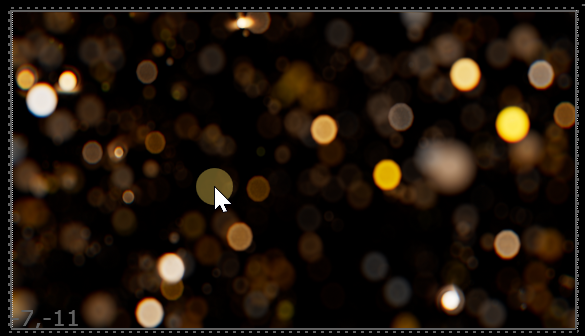
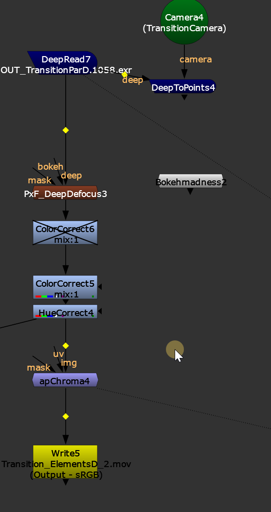
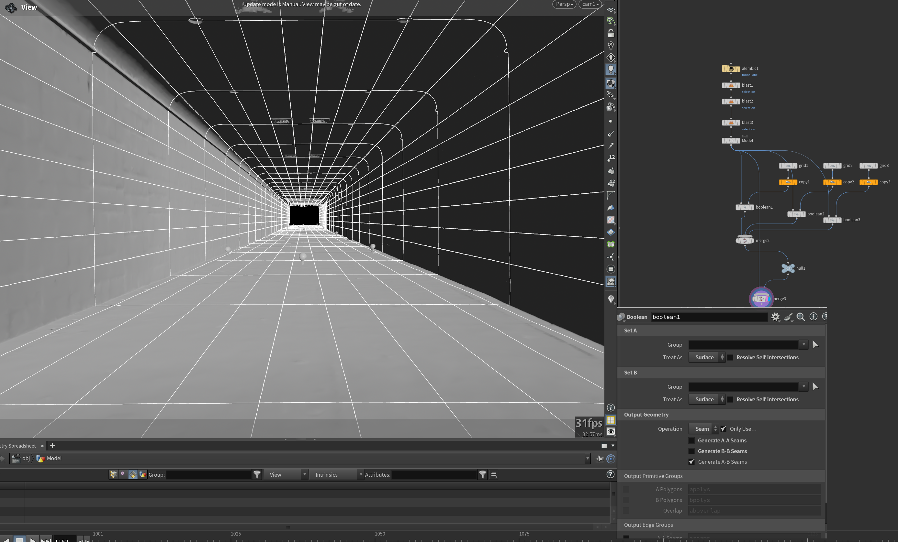

### 1.快捷键

F8 ——tip 图层

Ctrl E——分出aoe
### 2.粒子bokeh

渲染完的粒子在nuke 中加bokeh

pxf_deepdefocus(插件)

可以选择,对应相机/选择bokeh的样子等.

### 2.幕后
模型网格是切的

<a href="/nuke/muhou.nk" target="_blank" download>📦 下载muhou.nk</a>