1. ###  Module3 _04
- ### 1.如何自定义备注
- 1. 添加了一些可选项,目的当选到custom时会出现备注
- 2. 添加一个message(在之前的节点勾选上Horizontally join to next parameter(和下面选项水平关联))
- 3. 输入tips
1.
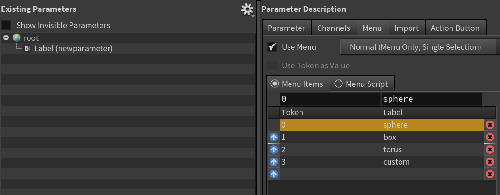
2.
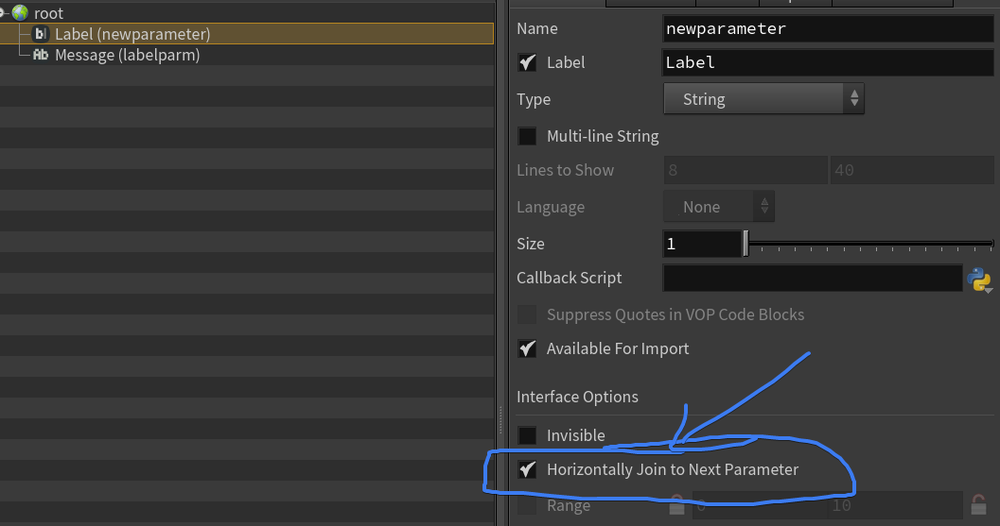
3.
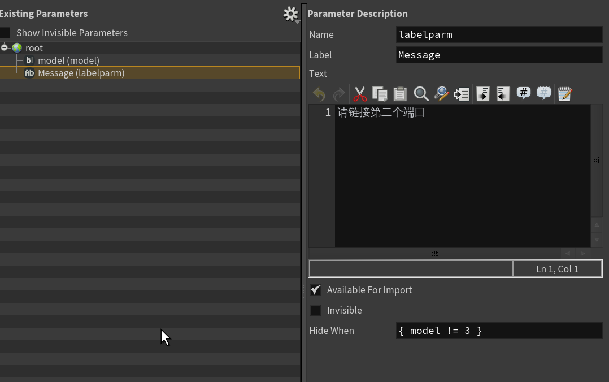
4.
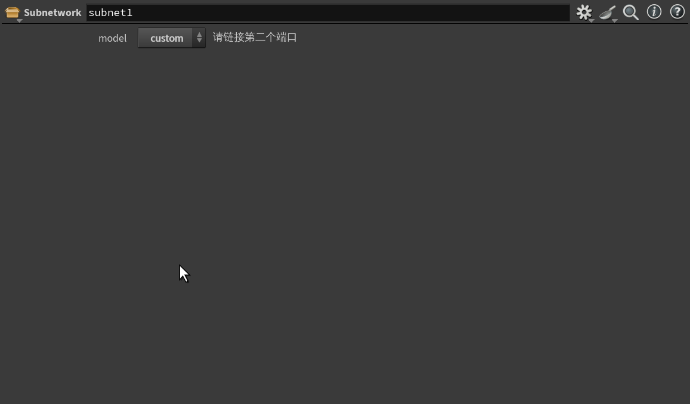
5.
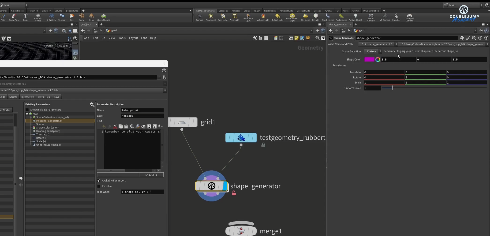
or 和并(2个写一个括号里,注意空格)
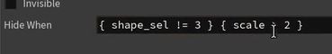

- ### 2.显示
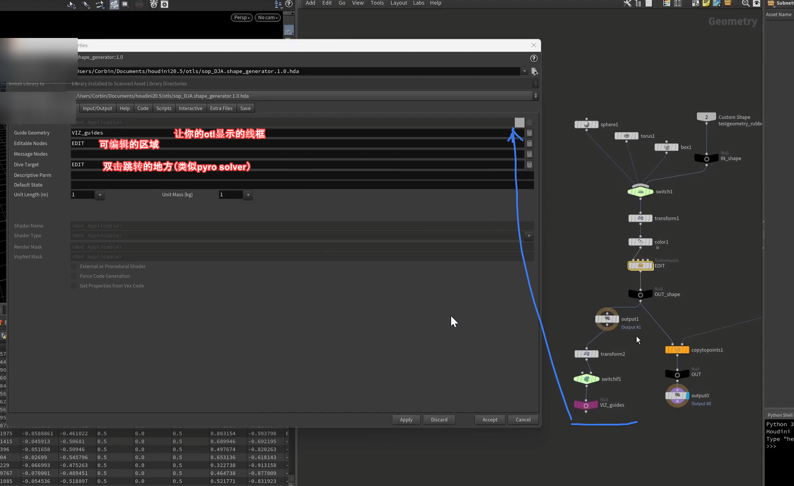

- ### 3.handle(控制手柄)
没刷新的话需要刷新下视图
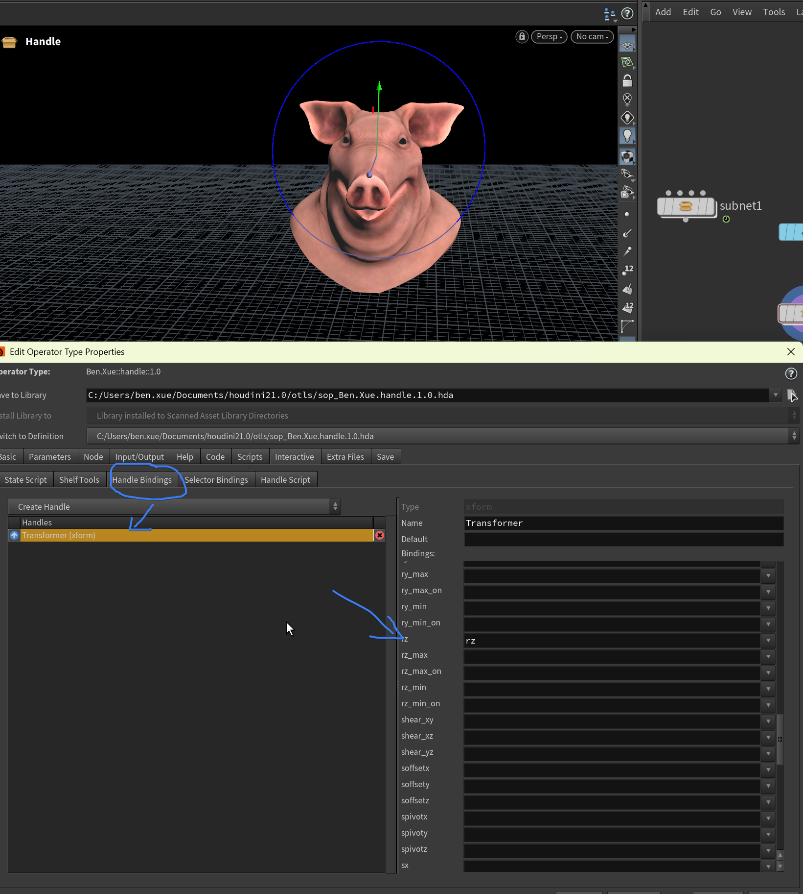

- ### 4.callback(回调函数)
随便定义一个函数-调用函数 hou.phm().mymethod("balabal")-tip ：hou.pwd().hm() 简写就是phm    
hou.pwd()调用自身.hm自定义的函数
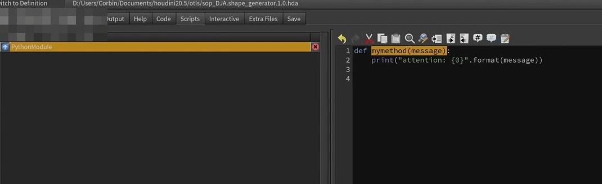

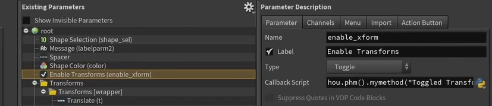

### Gas field force  
用a烟雾来影响b烟雾（类似模拟物体穿过烟雾 同时会扰动烟雾）
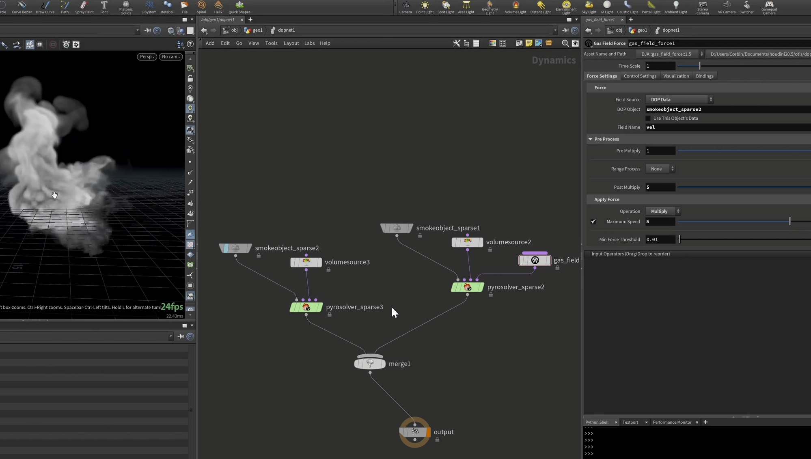