## 基础知识点
### 1.循环
- 1.continue:如图所示   continue表示不进行下面的内容了(返回上游执行)
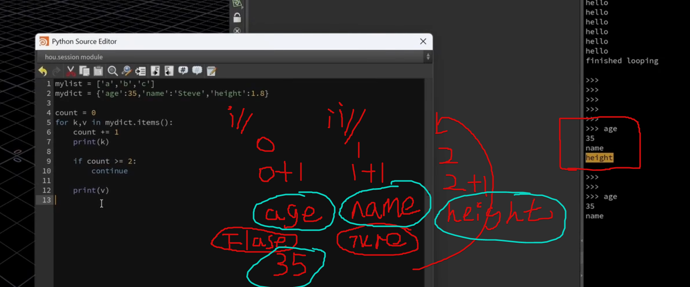

- 2.break：直接退出循环
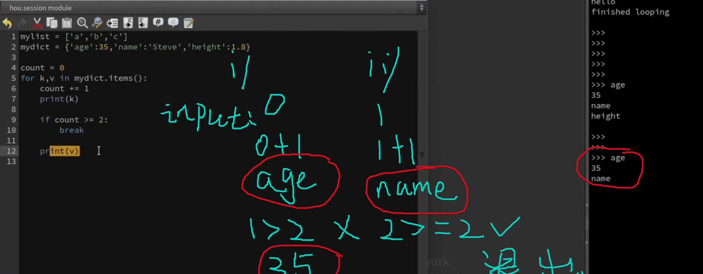

- 3.enumerate 枚举
```python
mylist = ['a','b','c'] 
for i,x in enumerate(mylist) : 
    print(i) 
    print(x)
```
结果：
> 0a

> 1b

> 2c

i:第几次,循环  x:结果

### 2.文档(houdini)


### 3. 类:模块:方法
大致
小字母没括号：模块
小字母带括号：方法
大写没括号：类
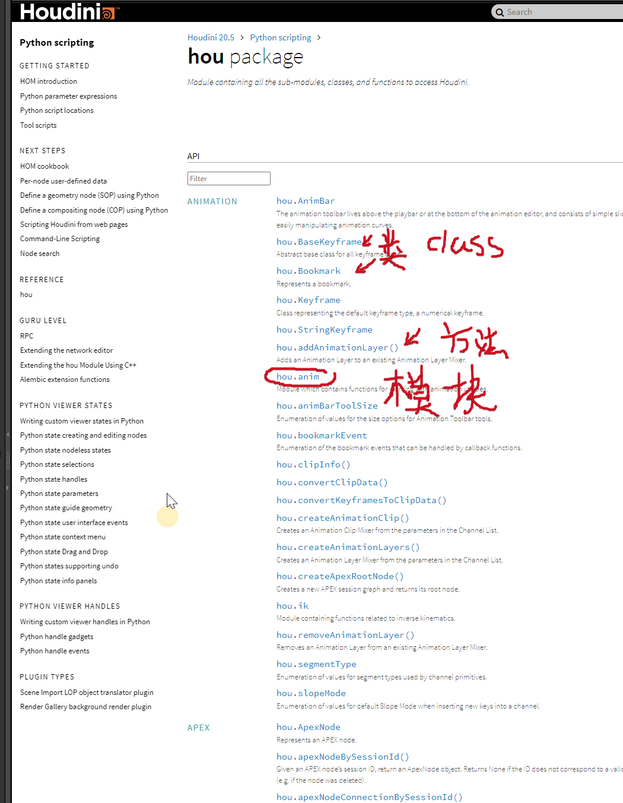
- **📌**一模块（Module）
> **一个 .py 文件就是一个模块**。里面可以放变量、函数、类，只要别空着。
- **📌** 二、类（Class）
> **类是一种蓝图，用来生成对象（实例）。**
- **📌**三、方法（Method）
> **方法 = 写在类内部的函数，并能操作对象数据（self）**

类比：

模块 = 房子 

类 = 房间
 
方法 = 房间里的工具

### 4.houdini中
- 1. #### exec

把对象字符当作代码处理,并执行
```python
exec(hou.pwd() .evalParm( '对象栏lab'))
```
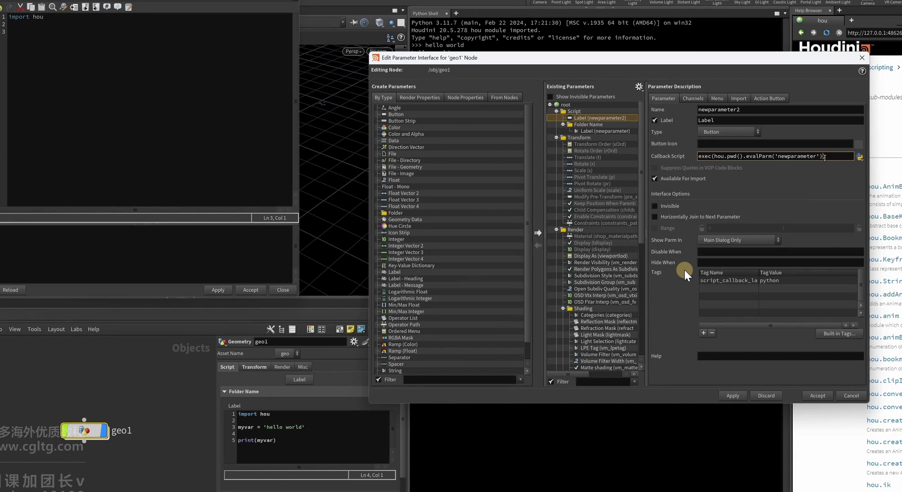

- 2. #### keyword 

keyword arguments 关键字参数(理解为怎么触发的?点击工具按了啥)
eg：

```python
import hou 

if(kwargs['ctrlclick']):
    print('ctrl')
if(kwargs['shiftclick'])：
     print('shift')

print ('hello')

```

- 3. #### hda 

回调函数
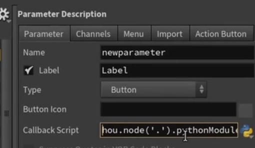

hou.node(".").pythonModule____(简写)hou.pwd().hm()
____(在简写)hou.phm()

tip:hm(houdini Module 这里吧pyton方法和hou方法并称了)
hou.phm().mymethod("aa")
函数指向的就是下图：
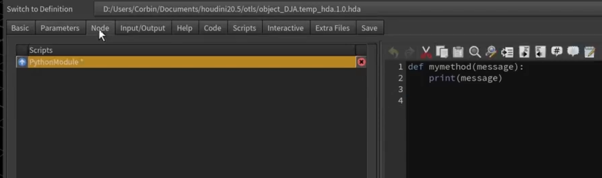

- 4. #### rop(wedge_old)

这样每次跑rop的时候他都根据 名字更新版本
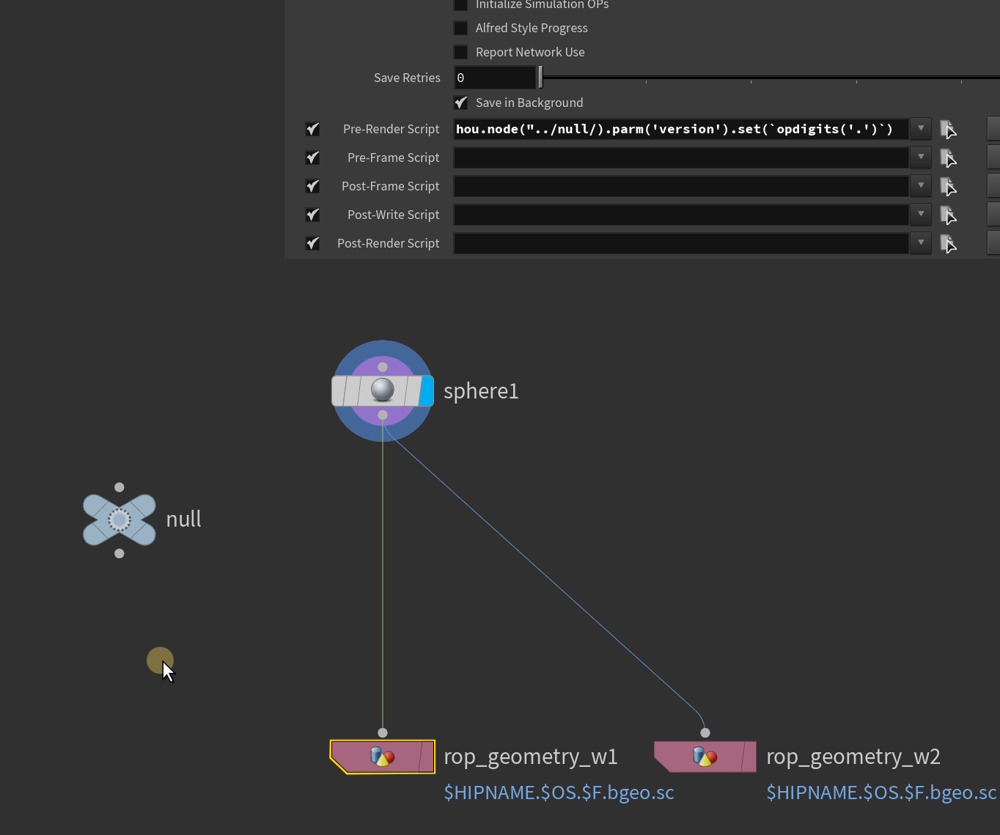

```python
hou.node("../null/).parm('version').set(opdigits('.'))
```
注意：在fliecache引用的时候 
这样是错误的❌为什么呢？
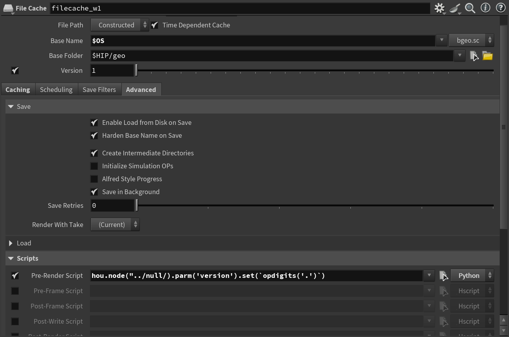
因为实际引用的是里面的render节点<mark>层级</mark>变了读取失败的

正确的是：hou.node("../../null/).parm('version').set(opdigits('.'))   或者绝对路径


- 5. #### format+
- - 1. 
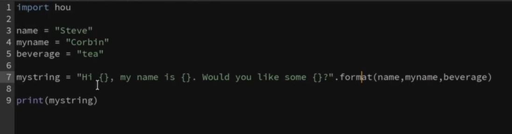

- - 2. ✔
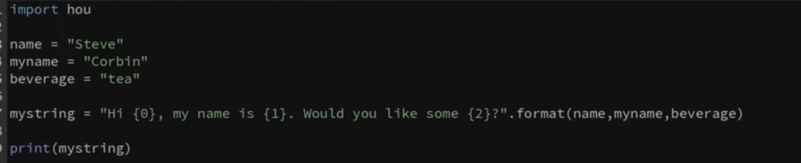

- - 3. 

字典 

tip：**是解包
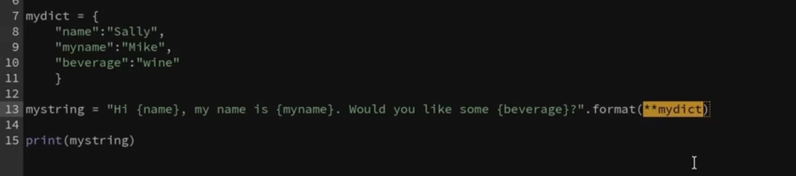

{}和{0}不能混用

这也不行的
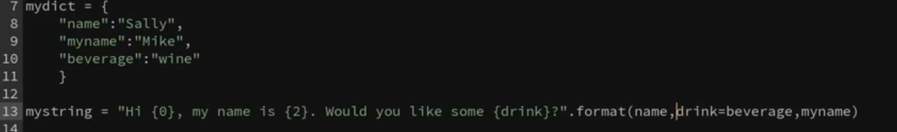
会报位置错了
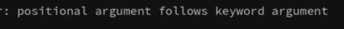
✔
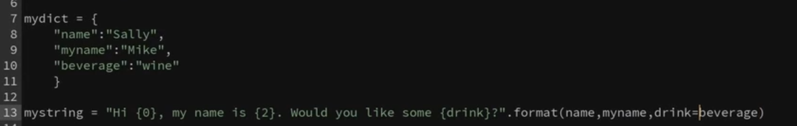

- - 4. 
关于路径
```python
import hou 
mystring = "{path}/{filename}.{frame:=010}.{ext}".format( 
    path="C: /some/location/on/disk", 
    filename='myfile',
    frame=-48,
    ext='bego.sc')
#[[fill]align] [sign] ["0"] [width] [thousand] ["." precision] [type] 
print(mystring) 
```
规则是这样的：
#[[fill][align] [sign] ["0"] [width] [thousand] ["." precision] [type] ]

-  align       对齐方式 (> < = 0 ^)

-  sign        + / - /空格

- 0            什么符号隔开(一般是0)

- width        隔开距离

- thousand     千为分格符  (,/_)

- "." precision    精度

- type    类型

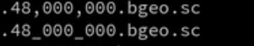

eg：.4f 小数点后4位  b2进制  o8进制    f不使用科学计数法  
eg: >:右对齐 <:左对齐  ^:中间对齐     =:数字右对齐     (0填充默认等号对齐，自动右对齐)

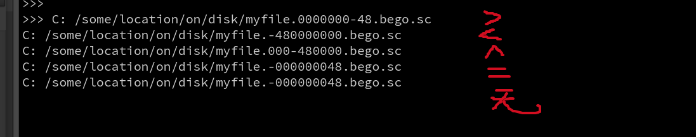

- 如果直接打印数字
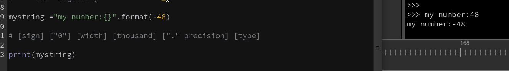

会发现结果 没有对齐的

那我们加个空格呢:mystring ="my number:{： }".format(-48)

上下对齐了

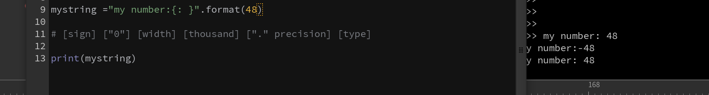


```python
import hou 

mystring ="{message:=^70}".format(message="Warning!Geo not selected!")
#[[fill]align] [sign] ["0"] [width] [thousand] ["." precision] [type] 
print(mystring) 
print('balabala')

print ("="*70)

#or 
#mystring = "\n{heading:=*70s}\n\t{message} \n{end:=*70s}".format( 
#heading="Warning! Geo not selected!", 
#Something went wrong",
#end=""
#)
#print(mystring)

```

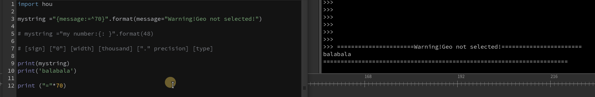

```python
import hou
test = "This is a test string. Use this to test how regex works on strings."\ 
"\n \tIt is a very powerful string searching tool."
print (test)
## \n 换行  t缩进
```

- 6. #### re
正则表达式
网站:正则测试
[https://regex101.com/](https://regex101.com/)  
待看M1_14 _15

- 7. #### hou.OpNode
hou. asCode (把节点变为pyhton代码)(类似可以实现之前可以不同用户复制节点的工具) 类似拖到上面

- 8. #### hou.FloatParmTemplate

eg:创建一个float:foo函数按钮
```python
import hou

node=hou.node('/obj/geo2')

group=node.parmTemplateGroup()

button=hou.FloatParmTemplate('foo','Foo',1)

group.append(button)

node.setParmTemplateGroup(group,True)
```

### 5.关于ai api调用
```python
import hou
import requests
import json
import re

def call_deepseek_api(node):
    # 获取参数值
    api_key = node.parm("api_key").eval()
    question = node.parm("question").eval()
    
    # API配置
    url = "https://api.deepseek.com/v1/chat/completions"
    headers = {
        "Content-Type": "application/json",
        "Authorization": f"Bearer {api_key}"
    }
    payload = {
        # "model": "deepseek-chat",
        "model": "deepseek-reasoner",
        "messages": [                  
            {
                        "role": "system",
                        "content":  "你是一个Houdini VEX专家，请：\n"
                        "1. 仅返回可运行的VEX代码\n"
                        "2. 使用@attribute语法\n"
                        "3. 不要包含任何解释\n"
                        "4. 代码要简洁高效\n"
                        "5.使用@变量语法"
                    },
                    {"role": "user", "content": question}
                ],
            
        "temperature": 0.0
    }

    try:
        # 发送请求
        response = requests.post(url, headers=headers, json=payload)
        response.raise_for_status()
        
        # 解析响应
        answer = response.json()["choices"][0]["message"]["content"]
        answer=re.search(r"```vex(.*?)```", answer, re.DOTALL)
        answer=answer.group(1).strip()
    except requests.exceptions.RequestException as e:
        answer = f"API请求失败: {str(e)}"
    except (KeyError, IndexError):
        answer = "响应解析错误，请检查API格式"

    # 更新答案参数
    node.parm("answer").set(answer)
```

button  按钮 CallBack:

```python
hou.pwd().hdaModule().call_deepseek_api(hou.pwd())
```

ai温度0-1-∞  理性——感性

<a href="/hda/sop_ai_vex.1.1.hda" target="_blank" download>📦 下载sop_ai_vex.1.1.hda</a>