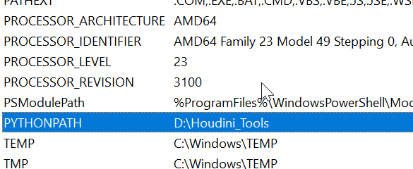
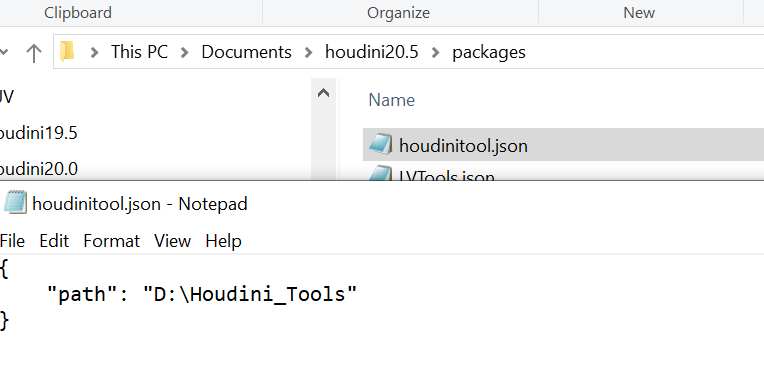
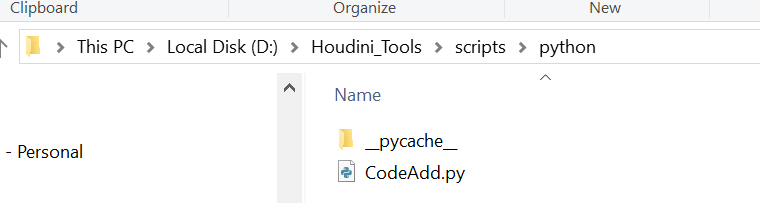

[Find these Tools](https://github.com/BenXue512/Houdini_tools2026)

- 1. ### blast node
```python
import hou
#currentNode
currentNodes = hou.selectedNodes()
#print(currentNode)
for i in currentNodes:
    #col = (0.5,0.5,0.5)
    #i.setColor(hou.Color(col))
    nodepath = i.path()
    root = i.parent().path()
    print(root)
    nodepos = i.position()
    print(nodepos)
    pathAttcode = i.geometry().findPrimAttrib("path")
    pathAtt = []
    if pathAttcode :
        for path in pathAttcode.strings() :
            #print(path)
            pathAtt.append(path)
        # print(pathAtt)
    for ib in range(len(pathAtt)):
        # print(ib)
        # print(pathAtt[ib])
        name = pathAtt[ib].split("/")
        # print(name[-1])
        blast = hou.node(root).createNode("blast","ExtraPath_" + name[-1])
        blast.setPosition(hou.Vector2(nodepos[0]+ib*3,nodepos[1]-1))
        blast.setInput(0, i)
        blast.parm("group").set("@path=" + pathAtt[ib])
        blast.parm("negate").set(1)
        null = blast.createOutputNode("null","Out_ExtraPath_" + name[-1])
        null.setGenericFlag(hou.nodeFlag.DisplayComment,True)
        null.setComment(name[-1])
```

- 2. ### CamSet
``` python
import hou 

def fix_camrea():
    nodes = hou.selectedNodes()
    
    camera_data = hou.ui.readMultiInput("输入相机分辨率参数&&相机近裁切参数",
                                input_labels=("Camera X Reslution", "Camera Y Reslution", "近裁切"),
                                buttons=("确定", "取消"),
                                severity=hou.severityType.ImportantMessage,
                                initial_contents=("2048", "872", "0.001"))
    if camera_data[0] == 1:
        pass
        
    else:
        reslution = hou.Vector2(int(camera_data[1][0]), int(camera_data[1][1]))
        
        for node in nodes:
            if node.type().name() == "alembicarchive":
                press_parm = node.parm("buildHierarchy")
                press_parm.pressButton()
                
                for camera in node.allNodes():
                    if camera.type().name() == "cam":
                        camera.parmTuple("res").set(reslution)
                        camera.parm("near").deleteAllKeyframes()
                        camera.parm("near").set(camera_data[1][2])  
                        
        hou.ui.displayMessage("相机分辨参设置完成！")   
    
fix_camrea()     
```

- 3. ### CreateNull
```python
import hou 
root =hou.node('/obj')
Control=root.createNode('null','CONTROL')
Control.setColor(hou.Color((1,0,0)))
geo =Control


ptg = geo.parmTemplateGroup()
def allParmTemplates(group_or_folder):
    for parm_template in group_or_folder.parmTemplates():
        yield parm_template
        if (parm_template.type() == hou.parmTemplateType.Folder and
        parm_template.isActualFolder()):
            for sub_parm_template in allParmTemplates(parm_template):
                yield sub_parm_template
for p  in allParmTemplates(ptg):
    ptg.hide(p,True)
    geo.setParmTemplateGroup(ptg)
##  上述为隐藏本来就存在的属性
ptg =Control.parmTemplateGroup() #哪个节点下创建
file_parm = hou.FolderParmTemplate("Control", "Control", folder_type=hou.folderType.Tabs)  #创建文件夹名字（仅仅创建）
#Path= hou.ParmTemplate('Cloth','Cloth');
Path=hou.StringParmTemplate("上衣",             "上衣", 1, default_value=('',), naming_scheme=hou.parmNamingScheme.Base1,string_type=hou.stringParmType.NodeReference)

file_parm.addParmTemplate(Path)

ptg.append(file_parm)
Control.setParmTemplateGroup(ptg)
```
- 4. ### CreateLight by Points
 Tip：粒子需要具备pscale &&Cd
```python
import hou
Tip = hou.ui.displayMessage('点必须要有Cd,pscale属性',buttons=('有','去创建'))
if Tip==0:
    root =hou.node('/obj')
    
    Control=root.createNode('null','CONTROL')
    
    Control.setColor(hou.Color((1,0,0)))
    
    geo =Control
    
    # get ParmTemplateGroup
    
    ptg = geo.parmTemplateGroup()
    
    # function straight from houdini docs
    
    def allParmTemplates(group_or_folder):
    
        for parm_template in group_or_folder.parmTemplates():
    
            yield parm_template
    
        # Note that we don't want to return parm templates inside multiparm
    
        # blocks, so we verify that the folder parm template is actually
    
        # for a folder.
    
            if (parm_template.type() == hou.parmTemplateType.Folder and
    
            parm_template.isActualFolder()):
    
                for sub_parm_template in allParmTemplates(parm_template):
    
                    yield sub_parm_template
    
    for p in allParmTemplates(ptg):
    
        ptg.hide(p,True)
    
        geo.setParmTemplateGroup(ptg)
    
    ## 上述为隐藏本来就存在的属性
    
    ptg =Control.parmTemplateGroup() #哪个节点下创建
    
    file_parm = hou.FolderParmTemplate("Control", "Control", folder_type=hou.folderType.Tabs) #创建文件夹名字（仅仅创建）
    
    Enable= hou.ToggleParmTemplate('Enable','Enable',1);
    
    intensity=hou.FloatParmTemplate('intensity','intensity',1);
    
    exposure=hou.FloatParmTemplate('exposure','exposure',1);
    
    file_parm.addParmTemplate(Enable)
    
    file_parm.addParmTemplate(intensity)
    
    file_parm.addParmTemplate(exposure)
    
    # ptg.append(file_parm,Enable,intensity,exposure)
    
    ptg.append(file_parm)
    Control.move((3,-3))
    
    Control.setParmTemplateGroup(ptg)
    def creatLights():
    
        root =hou.node('/obj')
    
        node=hou.node('/obj/Fx/Out')
    
        geo=node.geometry()
    
        subnet=root.node('Lights')
    
        if not subnet:
    
            subnet =root.createNode('subnet','Lights')
    
        children=subnet.children()
    
        if len(children)>0:
    
    # //如果subnet里面有东西就删除干净
    
            for c in children:
    
                c.destroy()
    
        for pt in geo.points():
    
    # //获取点的位置和颜色
    
            pos = pt.position()
    
            col=pt.attribValue('Cd')
            
            pscale=pt.attribValue('pscale')
    
            light= subnet.createNode('hlight')
    
            light.parmTuple('t').set(pos)
    
            light.parmTuple('light_color').set(col)
    
            light.parm('light_enable').setExpression("return hou.evalParm('/obj/CONTROL/Enable')\n",hou.exprLanguage.Python)
    
            light.parm('light_intensity').setExpression("return hou.evalParm('/obj/CONTROL/intensity')\n",hou.exprLanguage.Python)
    
            light.parm('light_exposure').setExpression("return hou.evalParm('/obj/CONTROL/exposure')\n",hou.exprLanguage.Python)
    
            light.parm('shadowmask').setExpression("return hou.evalParm('/obj/CONTROL/shadowmask')\n",hou.exprLanguage.Python)
    
            light.setColor(hou.Color(col))
    
            light.parm('iconscale').set(pscale)
    
            ## 解包节点 并且添加color节点在中间
    
            light.allowEditingOfContents()
    
            col_node=light.node('point_light1').createOutputNode('color')
    
            col_node.parmTuple('color').set(col)
    
            light.node('xform4').setFirstInput(col_node)
    
        subnet.layoutChildren()
    
        for n in subnet.children():
    
            n.move((10,-10))
        subnet.move((5,-5))
    creatLights()

```

- 5. ### ReferenceCopy
```python
import hou 

for n in hou.selectedNodes():

    new_n=n.parent().createNode(n.type().name(),'{0}_refcopy'.format(n.name())) ##parent 在n的父集下

    new_n.setPosition(n.position()) #以n作为初始位置(0,0)

    new_n.move((1,-1))

    new_n.setColor(hou.Color((1,0.2,0.5)))

    

    

    

    #创建要指认引用的栏

    group=new_n.parmTemplateGroup() #创建引用的端口

    helptext='要复制的对象'

    source=hou.StringParmTemplate('ref_source','Refrence Source',1,string_type=hou.stringParmType.NodeReference,help=helptext)

    group.insertBefore((0,),source)#insertBefore 插入模块（0,）指第一个最顶端

    new_n.setParmTemplateGroup(group)

    

    new_n.parm('ref_source').set(n.path())

    # 这里每个都要关联 先scale测试

    for p in new_n.parms():

        if p.name()=='ref_source':

            continue    

        if p.parmTemplate().type()==hou.parmTemplateType.Folder or p.parmTemplate().type()==hou.parmTemplateType.FolderSet:

            continue

    

        mode=kwargs['ctrlclick']

        if mode:

            #Hscript

            exp='ch'

            if p.parmTemplate().type()==hou.parmTemplateType.String:

                exp='chs'

            p.setExpression("{0}(chs('ref_source')+'/{1}')".format(exp,p.name()))

        else :

            #Python

            p.setExpression("hou.node(hou.pwd().evalParm('ref_source')).evalParm('{0}')".format(p.name()),language=hou.exprLanguage.Python)
```

## 关于如何调用自己的python库
- 1.需要把文件夹加入到houdini的 path库中
```python
## 如何检测是否有path 
import sys
for path in sys.path:
    print(path)

```
or判断
```python
import sys
print("D:/Houdini_Tools" in sys.path)
```
这个有许多方法:
- - 1.强制加入到pc的env里



- -  2.在 houdini 栏里

```python
import sys
import os

script_path = r"D:/Houdini_Tools"
if script_path not in sys.path:
    sys.path.append(script_path)
# 导入并运行脚本
```
这个每次需要手动点(但是铁有用)
- - 3. 在C:\Users\ben.xue\Documents\houdini20.5\scripts 123.py 中 
```python
import hou
import sys
sys.path.append('D:/Houdini_Tools')
```

- - 4. C:\Users\<你的用户名>\Documents\houdini20.5\pythonrc.py (此办法我也失败)
```python
import sys
custom_path = r'D:/Houdini_Tools'
if custom_path not in sys.path:
    sys.path.append(custom_path)
```
- 如果你想长期设置，推荐用 
pythonrc.py，但你必须确保它放在正确的文件夹(不是 scripts 子目录)。
- 如果一切设置正确仍然无效,可能是 Houdini 的启动流程被某些自定义配置覆盖了,此时用123 or 456.py更保险。
5.（目前使用的办法）
同时满足下面2 条件




如何调用：

```python
##package方法：
import CodeAdd
CodeAdd.show()
```
之前的：

```python
from UITool.AddTuple import CodeAdd
from imp import reload
reload(CodeAdd)
CodeAdd.show()
```